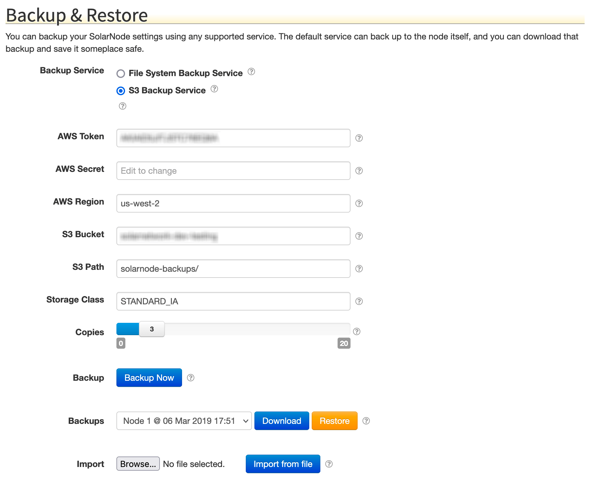

# SolarNode S3 Backup Service

This project provides a cloud-based backup service to SolarNode.



# Configuration

The service supports the following settings:

| Setting    | Default            | Description                               |
|------------|--------------------|-------------------------------------------|
| AWS Token  |                    | AWS access token for authentication.      |
| AWS Secret |                    | AWS access token secret.                  |
| AWS Region | us-west-2          | AWS service region.                       |
| S3 Bucket  |                    | S3 bucket name to save backups to.        |
| S3 Path    | solarnode-backups/ | A prefix to add to all backup data files. |

All values are required. The `S3 Path` value can be empty.

# S3 Structure

Backups are stored using a **shared** object structure, where individual backup
resources are named after the SHA256 digest of their content with a
`backup-data/` prefix added. Metadata about each backup (for example a
listing of the resources included in the backup) is then stored as an
object named with the node ID and backup timestamp with a `backup-meta/` prefix
added.

Here's a an example listing of the objects stored in S3 after a couple of
backups have finished:


The **shared** aspect of the backups means that individual `backup-data/`
objects can be referenced by multiple backups. Once a resource is backed
up to S3, it won't be uploaded to S3 again in future backups unless the
resource changes.

The **shared** aspect of the backups also means that multiple _nodes_ can
be configured to save backup data to the same S3 location. In that
situation the same resources across the nodes will only be stored once
in `backup-data/`, and referenced by their respective backup metadata.

# Metadata Structure

The backup metadata is a JSON document that defines some general information
about the backup along with a list of all resources included in the backup. Each
resource contains a SolarNode-specific `providerKey` representing the provider
of the resource, a `backupPath` defined by that provider, and an `objectKey`
that points to the S3 object that contains the data for that resource.

```json
{
  "complete": true,
  "date": 1507093749000,
  "key": "node-163-backup-20171004T180909",
  "nodeId": 163,
  "resourceMetadata": [
    {
      "backupPath": "net.solarnetwork.node.backup.FileBackupResourceProvider/app/main/net.solarnetwork.node.datum.samplefilter-1.1.0.jar",
      "modificationDate": 0,
      "objectKey": "solarnode-backups/backup-data/45a303aae39ad8e53fcf38162bf718cd7bc0b70d1344eaae619d7e9f665cc58d",
      "providerKey": "net.solarnetwork.node.backup.FileBackupResourceProvider"
    },
    {
      "backupPath": "net.solarnetwork.node.setup.impl.DefaultKeystoreService/node.jks",
      "modificationDate": 1471324554000,
      "objectKey": "solarnode-backups/backup-data/48b811a37e26ffba3743b2eb421c0c10d1772776c29ddceb83eb7b25c203b9b1",
      "providerKey": "net.solarnetwork.node.setup.impl.DefaultKeystoreService"
    },
    {
      "backupPath": "net.solarnetwork.node.settings.ca.CASettingsService/settings.csv",
      "modificationDate": -1,
      "objectKey": "solarnode-backups/backup-data/9754cb0ac2df3891fe1158905a307acc312dd2550fcb75926f7eaff2778afba5",
      "providerKey": "net.solarnetwork.node.settings.ca.CASettingsService"
    }
  ]
}
```
