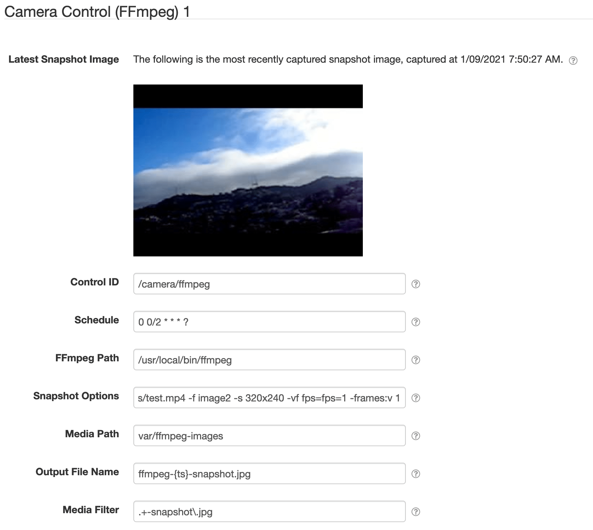

# SolarNode Camera Control via FFmpeg

This SolarNode plugin provides a component that can integrate with [ffmpeg][ffmpeg] to support
capturing snapshot images from a video stream. The captured images are stored on the local file 
system. The [Storage Service Upload][storge-service-upload] plugin can be used to watch for newly
created snapshots and upload them, creating a datum stream that references the uploaded images.

# Install

The plugin can be installed via the **Plugins** page on your SolarNode. It appears under the
**Control** category as **Camera Control via FFmpeg**. Once installed, a **Camera Control (FFmpeg)**
component will become available.

# Configuration

Each service configuration contains the following settings:

| Setting               | Description  |
|:----------------------|:-------------|
| Control ID            | The ID to use for the SolarNode control. |
| Schedule              | Either the frequency in seconds to capture snapshots at, or a [cron expression][cron-exp]. |
| FFmpeg Path           | The OS path to the `ffmpeg` program. |
| Snapshot Options      | All command line arguments to pass to `ffmpeg`. Can include a `{outputFile}` placeholder for the generated output file name, or else the name will be added as the last argument. |
| Media Path            | The path to the directory where motion is configured to save its captured images. |
| Output File Name      | A file name template to use for the captured snapshot output files. Accepts a `{ts}` placeholder for the timestamp of the snapshot. |
| Media Filter          | A regular expression to filter non-snapshot files in <b>Media Path</b>, so that only files matching the filter are considered as non-snapshot images. |

# Instruction support

This component supports the [`Signal` instruction][signal-instr]. A `snapshot` signal name requests
the control to capture a new snapshot image.

For example, to request a snapshot from control `/camera/1` the following instruction parameters
would be used:

| Parameter | Value |
| :-- | :-- |
| `parameters[0].name` | `/camera/1` |
| `parameters[0].value` | `snapshot` |

[cron-exp]: https://github.com/SolarNetwork/solarnetwork/wiki/SolarNode-Cron-Job-Syntax
[ffmpeg]: https://www.ffmpeg.org/
[signal-instr]: https://github.com/SolarNetwork/solarnetwork/wiki/SolarUser-API-enumerated-types#signal
[storge-service-upload]: ../net.solarnetwork.node.upload.resource/
