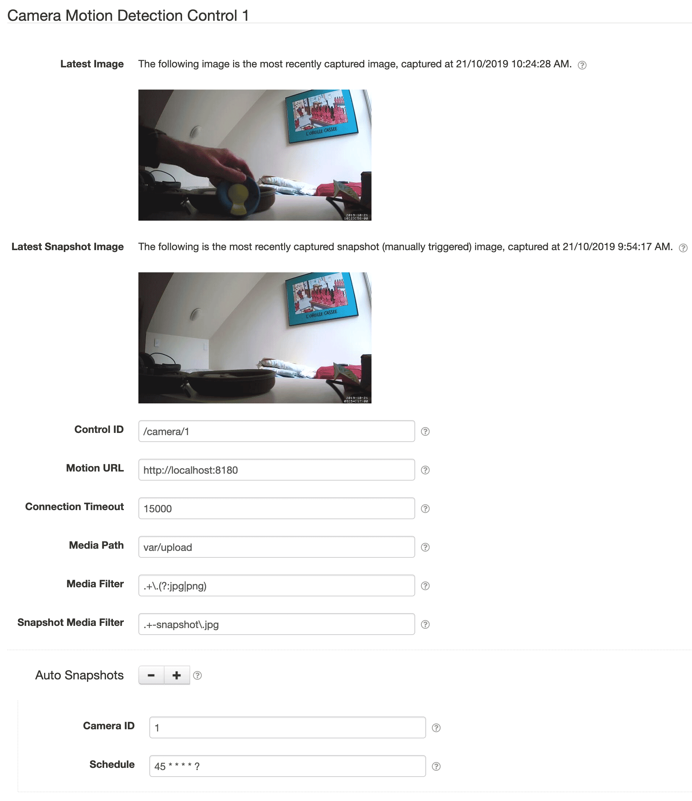

# SolarNode Camera Control via Motion

This SolarNode plugin provides a component that can integrate with [motion][motion] to support
controlling a monitored camera.

# Install

The plugin can be installed via the **Plugins** page on your SolarNode. It
appears under the **Control** category as **Camera Control via Motion**. Once installed,
a **Camera Motion Detection Control** component will become available.

# Configuration

Each service configuration contains the following settings:

| Setting         | Description  |
|:----------------|:-------------|
| Control ID            | The ID to use for the SolarNode control. |
| Motion URL            | The base URL to the [motion web control API][motion-webcontrol] to integrate with. |
| Connection Timeout    | A connection timeout to use for the motion web control API, in milliseconds. |
| Media Path            | The path to the directory where motion is configured to save its captured images. |
| Media Filter          | A regular expression to filter non-snapshot files in <b>Media Path</b>, so that only files matching the filter are considered as non-snapshot images. |
| Snapshot Media Filter | A regular expression to filter snapshot files in <b>Media Path</b>, so that only files matching the filter are considered as snapshot images. |

## Configuration notes

The <b>Media Path</b> setting allows this plugin to display the latest motion-detection and snapshot
images created by the configured [motion][motion] service, as long as that service is running on the
same device as SolarNode and the path is accessible to the SolarNode runtime.

# Instruction support

This component supports the [`Signal` instruction][signal-instr]. A `snapshot` signal name requests
[motion][motion] to capture a new snapshot image. Besides the required control ID parameter, an
optional `cameraId` parameter can be included to request the snapshot from a specific
[motion][motion] camera. If no `cameraId` parameter is provided, a default of `1` is assumed.

For example, to request a snapshot from control `/camera/1` camera ID `2` the following instruction
parameters would be used:

| Parameter | Value |
| :-- | :-- |
| `parameters[0].name` | `/camera/1` |
| `parameters[0].value` | `snapshot` |
| `parameters[1].name` | `cameraId` |
| `parameters[1].value` | `2` |

[motion]: https://motion-project.github.io/
[motion-webcontrol]: https://motion-project.github.io/motion_config.html#OptDetail_Webcontrol
[signal-instr]: https://github.com/SolarNetwork/solarnetwork/wiki/SolarUser-API-enumerated-types#signal
