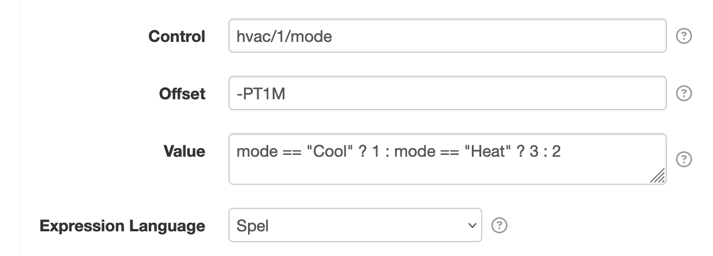

# Control Conductor

This project provides SolarNode plugin that can schedule a set of control changes in response to an
`OrchestrateControls` instruction. For example this could be used to execute a hot-water load shift
scenario like:

> * _in 1 hour turn the hot water thermostat up by 10℃_
> * _in 2 hours turn the hot water cylinder off_
> * _in 4 hours turn the hot water thermostat down by 10℃ and turn the hot water cylinder on_

At a high level, the Control Conductor is configured with a set of _tasks_ that each specify a
control to update and when to update it, relative to an _orchestration date_.  The
`OrchestrateControls` instruction specifies which Control Conductor component to execute and the
orchestration date to execute at.

 

# Use

Once installed, a new **Control Conductor** component will appear on the **Settings** page on your
SolarNode. Click on the **Manage** button to configure components. Each component can be configured
with any number of _tasks_.

# OrchestrateControls instruction

The `OrchestrateControls` instruction is used to execute the task schedule defined in a Control
Conductor component. It requires the following parameters:

| Parameter | Description |
|:----------|:------------|
| `service` | The **Service Name** of the Control Conductor to execute. |
| `date`    | The _orchestration date_ to execute the task schedule at. |

The `date` parameter can be specified as an Unix millisecond epoch integer like `1680664200000` or
an ISO-8601 instant like `2023-04-05T03:10:00Z`.

## OrchestrateControls instruction extra parameters

Any parameter included in the  `OrchestrateControls` instruction will then be available as a
placeholder for use in any configured task **Control**, **Offset**, and **Value** settings. If
**Value** is configured as an expression, then the parameters will be available directly within the
expression.

# Overall settings

Each component configuration contains the following settings:

| Setting             | Description |
|:--------------------|:------------|
| Service Name        | A **required** unique name to identify this component with. |
| Service Group       | An optional group name to associate this component with. |
| Task Configurations | A list of control task-specific settings. Any number of task configurations can be added. |

# Task settings

You must configure settings for each control you want to change when the `OrchestrateControls`
instruction in handled. You can configure as many property settings as you like, using the
<kbd>+</kbd> and <kbd>-</kbd> buttons to add/remove configurations.

 

Each property configuration contains the following settings:

| Setting         | Description |
|:----------------|:------------|
| Control         | The ID of the control to change. Parameters provided by the `OrchestrateControls` instruction can be used as placeholders.|
| Offset          | The [time offset](#task-settings-offset-syntax), relative to the _orchestration date_, to change the control value at. Negative values are supported and represent an offset _before_ the orchestration date. Parameters provided by the `OrchestrateControls` instruction can be used as placeholders. |
| Value           | The control value to set. Parameters are supported. If **Expression Language** configured then treat as an [expression](#expressions) to evaluate. Parameters provided by the `OrchestrateControls` instruction can be used as placeholders, as normal placeholders or if an expression is used then in the expression directly. |
| Expression Language | The expression language to write **Value** in. If not configured then **Value** will not be treated as an expression. |

## Task settings Offset syntax

The **Offset** setting accepts duration values that can be specified in a couple of different ways:

 * an integer millisecond value, for example `60000` for 1 minute after or `-10000` for 10 seconds before
 * an [ISO-8601 duration][duration] value in the form `PnDTnHnMn.nS`, where `n` is a number, for
   example `PT1H30M` for 90 minutes after or `-PT0.5S` for 0.5 seconds before

# Expressions

The task **Value** can be defined as an [expressions][expr] if the **Expression Language** setting
is also configured. Although this component is not itself a datum data source, the expression is
treated as a [datum expression][datum-expr] and has access to all the parameters provided by the
`OrchestrateControls` instruction as well as the [datum stream functions][datum-stream-fn] for
accessing whatever datum streams are available on the node in general.

[datum-expr]: https://github.com/SolarNetwork/solarnetwork/wiki/SolarNode-Expressions#datum-expressions
[datum-stream-fn]: https://github.com/SolarNetwork/solarnetwork/wiki/SolarNode-Expressions#datum-stream-functions
[duration]: https://docs.oracle.com/en/java/javase/11/docs/api/java.base/java/time/Duration.html#parse(java.lang.CharSequence)
[expr]: https://github.com/SolarNetwork/solarnetwork/wiki/Expression-Languages
