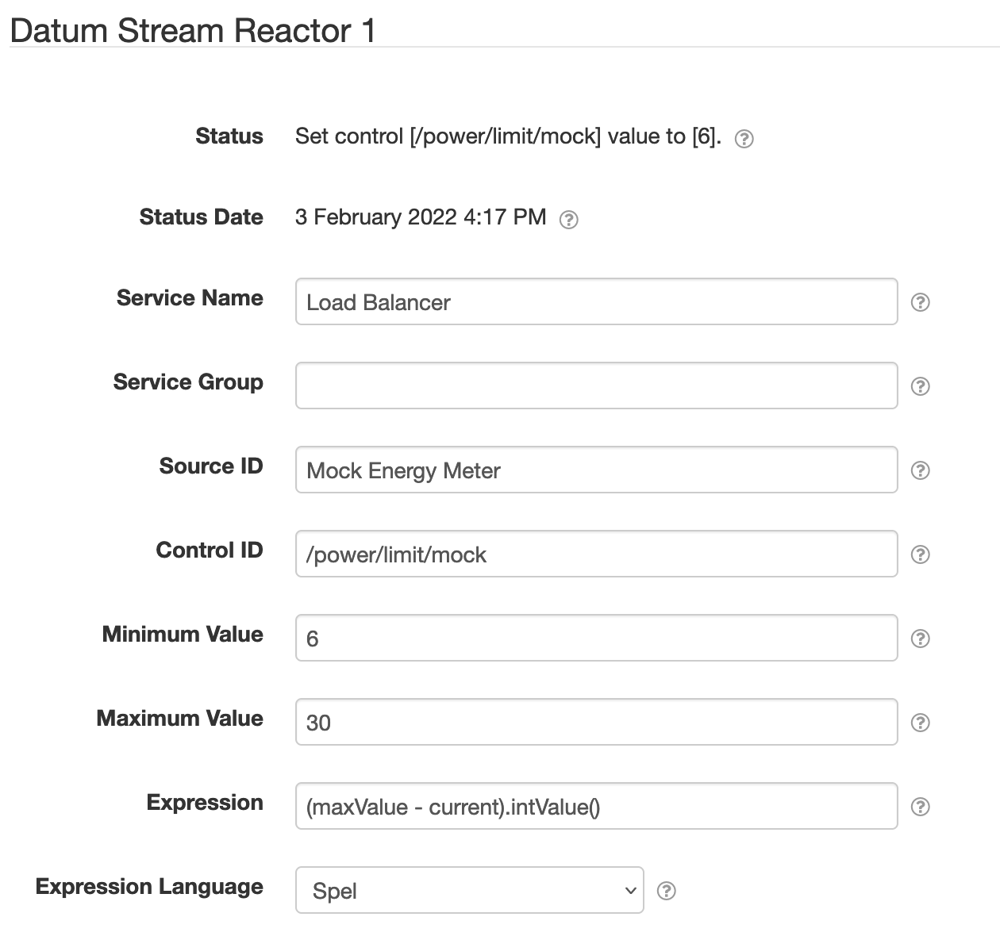

# Datum Stream Reactor

This SolarNode plugin provides a component that can monitor one or more datum streams and set a
control value in response, via an expression.

# Install

The plugin can be installed via the **Plugins** page on your SolarNode. It appears under the
**Control** category as **Datum Stream Reactor**. Once installed, a **Datum Stream Reactor**
component will become available.

# Use

Once configured, this component will monitor the configured datum stream(s) and evaluate the
configured **Expression** on each datum generated in the stream(s). The expression must return a
number or `null`. If the expression returns a non-`null` result, a
[`SetControlParameter`][SetControlParameter] instruction will be generated for the configured
control, with a value of the expression result.

**Note** that boolean (switch) control types can also be managed, as long as the expression 
evaluates to `1` for "on" and `0` for "off".

# Configuration

Each service configuration contains the following settings:

| Setting             | Description  |
|:--------------------|:-------------|
| Service Name        | A unique name to identify this data source with. |
| Service Group       | A group name to associate this data source with. |
| Source ID           | A regular expression to match the source ID(s) of the datum stream(s) to monitor. |
| Control ID          | The control ID to manage. |
| Minimum Value       | An optional minimum value to enforce, applied after the expression evaluation. |
| Maximum Value       | An optional maximum value to enforce, applied after the expression evaluation. |
| Expression          | The expression to evaluate. See [below](#expressions) for more info. |
| Expression Language | The [expression language][expr] to write **Expression** in. |

# Expressions

The expression input is a `Datum` and is expected to evaluate to a number value. The root object is
a [`DatumExpressionRoot`][DatumExpressionRoot] that lets you treat all datum properties, and
additional parameters, as expression variables directly.

The following additional parameters will be available as variables:

| Parameter | Type | Description |
|:----------|:-----|:------------|
| `minValue` | Number | The **Minimum Value** configured on this component. |
| `maxValue` | Number | The **Maximum Value** configured on this component. |

The following additional variables are available:

| Property | Type | Description |
|:---------|:-----|:------------|
| `datum` | `Datum` | A [`Datum`][Datum] object, populated with data from all property and virtual meter configurations. |
| `props` | `Map<String,Object>` | Simple Map based access to the properties in `datum`, and transform parameters, to simplify expressions. |

The following methods are available:

| Function | Arguments | Result | Description |
|:---------|:----------|:-------|:------------|
| `has(name)` | `String` | `boolean` | Returns `true` if a property named `name` is defined. |
| `hasLatest(source)` | `String` | `boolean` | Returns `true` if a datum with source ID `source` is available via the `latest(source)` function. |
| `latest(source)` | `String` | [`DatumExpressionRoot`][DatumExpressionRoot] | Provides access to the latest available datum matching the given source ID, or `null` if not available. |

[expr]: https://github.com/SolarNetwork/solarnetwork/wiki/Expression-Languages
[DatumExpressionRoot]: https://github.com/SolarNetwork/solarnetwork-common/blob/develop/net.solarnetwork.common/src/net/solarnetwork/domain/DatumExpressionRoot.java
[Datum]: https://github.com/SolarNetwork/solarnetwork-common/blob/develop/net.solarnetwork.common/src/net/solarnetwork/domain/datum/Datum.java
[SetControlParameter]: https://github.com/SolarNetwork/solarnetwork/wiki/SolarUser-API-enumerated-types#setcontrolparameter
