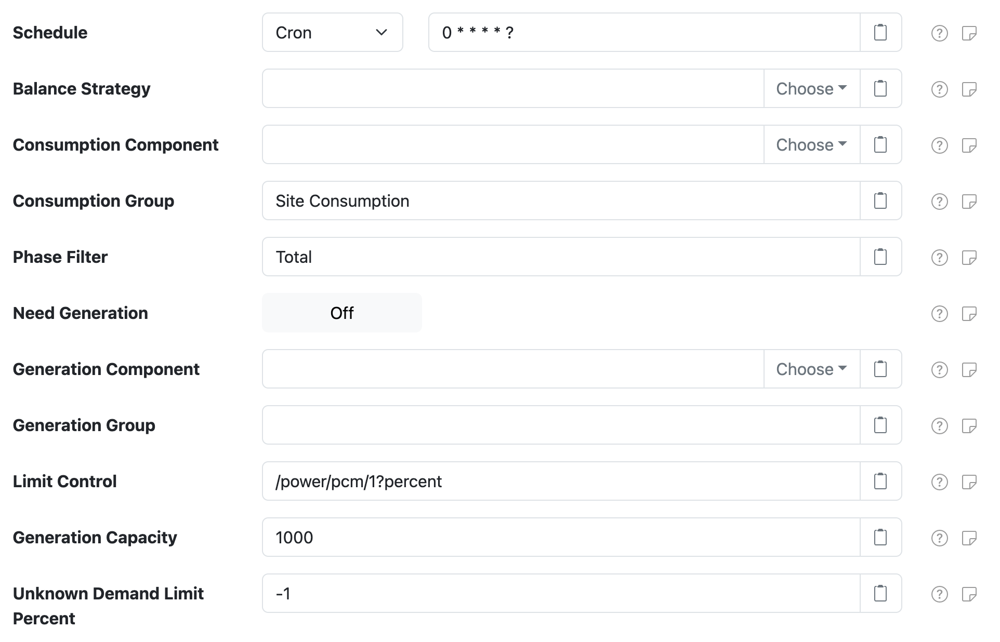

# Demand Balancer Control

This project provides SolarNode plugin that can be used to monitor demand conditions (consumption)
and generation (power) and send out [`DemandBalanceGeneration`][DemandBalanceGeneration]
instructions to a specific control to limit generation to an amount that keeps generation at or
below current consumption levels.

# Use

Once installed, a new **Demand Balancer** component will appear on the **Settings** page on your
SolarNode. Click on the **Manage** button to configure controls. You'll need to add one
configuration for each control you want to manage.

# Control settings

Each device configuration contains the following overall settings:

| Setting            | Description                                             |
|:-------------------|:--------------------------------------------------------|
| Schedule           | A cron schedule that determines when data is collected. |
| Balance Strategy   | The **Service Name** of a deployed **Balance Strategy** to use for deciding how to respond to demand and generation conditions. If not configured a default strategy will be used. |
| Consumption Component | The **Service Name** of the consumption data source to use for collecting active consumption levels from. |
| Consumption Group     | The **Service Group** of the consumption data sources to use for collecting active consumption levels from. If this is configured, this value _and_ the configured **Consumption Component** will be used to determine which data sources to use. To use all sources within a group, leave **Consumption Component** empty. |
| Phase Filter          | A comma-delimited set of AC Phase values to limit the energy sources used during the demand calculation. The possible values are: `PhaseA`, `PhaseB`, `PhaseC`, and `Total`. Set to an empty value to not restrict sources to specific phases. |
| Need Generation       | If the configured **Balance Strategy** does not need active power generation data to make its decisions, then turning this off can speed up the execution of this service as it will no longer collect generation data from any generation data sources. |
| Generation Component  | The **Service Name** of the generation data source to use for collecting active generation levels from. |
| Generation Group      | The **Service Group** of the generation data sources to use for collecting active generation levels from. If this is configured, this value _and_ the configured **Generation Component** will be used to determine which data sources to use. To use all sources within a group, leave **Generation Component** empty. |
| Limit Control         | The **Control ID** of the control to both read and set the desired generation limit on. This control is expected to report and accept an integer percentage value (0 - 100). |
| Unknown Demand Limit Percent  | If the demand is unknown, for example from being unable to read the current demand conditions from devices, force the limit to this value (an integer from 0-100). Set to `-1` to not force any change (and leave the current limit unchanged). |

[DemandBalanceGeneration]: https://github.com/SolarNetwork/solarnetwork/wiki/SolarUser-API-enumerated-types#demandbalancegeneration
