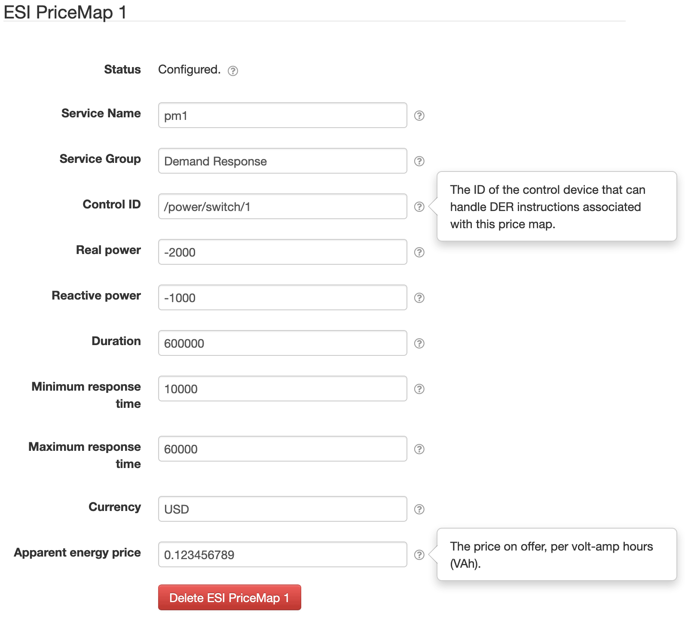

# SolarNode ESI Facility Integration

This project provides a SolarNode plugin that provides integration with the [DER Challenge
Prototype][der-prototype] Energy Services Interface (ESI) [SolarNetwork Facility][esi-fac-sn]
application.

The plugin can be installed via the **Plugins** page on your SolarNode. It appears under the
**Control** category as **ESI Facility Integration**. Once installed, several new **ESI** components
will appear on the **Settings** pageon your SolarNode. Click on the **Manage** button to configure
price maps.

# ESI PriceMap

The **ESI PriceMap** component allows you to configure price maps and associate them with a
specific control that can respond to instructions issued by an ESI facility.




## ESI PriceMap configuration

Each ESI PriceMap component contains the following overall settings:

| Setting               | Description |
|:----------------------|:------------|
| Service Name          | A unique name to associate this price map with. This name must be provided, and will be used as a top-level metadata key for publishing the price map information to SolarNetwork as node metadata. |
| Service Group         | A group name to associate this data source with. |
| Control ID            | The ID of the SolarNode control that should respond to ESI instructions related to this price map. |
| Real power            | The real power component to add, if positive, or reduce, if negative, in **watts** (W). |
| Reactive power        | The reactive power component to add, if positive, or reduce, if negative, in **volt-amps-reactive** (VAR). |
| Duration              | The time duration offered by this price map, in **milliseconds**. |
| Minimum response time | The expected minimum response time to start executing load or supply changes, in **milliseconds**. |
| Maximum response time | The expected maximum response time to finish executing load or supply changes, in **milliseconds**. |
| Currency              | A 3-letter currency code defined in ISO 4217, for example `USD`. |
| Apparent energy price | The price on offer, in the defined _Currency_ **per volt-amp hours** (VAh). |

## ESI PriceMap node metadata

The price map information is published to SolarNetwork as [node metadata][sn-meta]. This metadata is
used by the SolarNetwork Facility application to identify the price maps available for registering
with the ESI Exchange it is connected with. All price map metadata is published as a JSON object
under a property metadata key `esi-pricemap`. Each price map is published as a JSON object in the 
the `esi-pricemap` JSON object, using a JSON property named after the configured **Service Name**.

The structure looks like this:

```json
{
  "pm": {
    "esi-pricemap": {
      "PRICE MAP SERVICE NAME": {
        ...
      }
    }
  }
}

```

Here's an example of the metadata published by this component, where the **Service Name** is `pm1`:

```json
{
  "pm": {
    "esi-pricemap": {
      "pm1": {
        "controlId": "/power/switch/1", 
        "groupUid": "Demand Response", 
        "priceMap": {
          "durationMillis": 600000, 
          "powerComponents": {
            "reactivePower": -1000, 
            "realPower": -2000
          }, 
          "priceComponents": {
            "apparentEnergyPriceValue": "0.123456789", 
            "currencyCode": "USD"
          }, 
          "responseTime": {
            "maxMillis": 60000, 
            "minMillis": 10000
          }
        }
      }
    }
  }
}
```


[der-prototype]: https://github.com/SolarNetwork/der-challenge-prototype/
[esi-fac-sn]: https://github.com/SolarNetwork/der-challenge-prototype/tree/develop/facility-solarnet-cli
[instr-api]: https://github.com/SolarNetwork/solarnetwork/wiki/SolarUser-API#queue-instruction
[sn-meta]: https://github.com/SolarNetwork/solarnetwork/wiki/SolarNet-API-global-objects#metadata
[set-control-param]: https://github.com/SolarNetwork/solarnetwork/wiki/SolarUser-API-enumerated-types#setcontrolparameter
