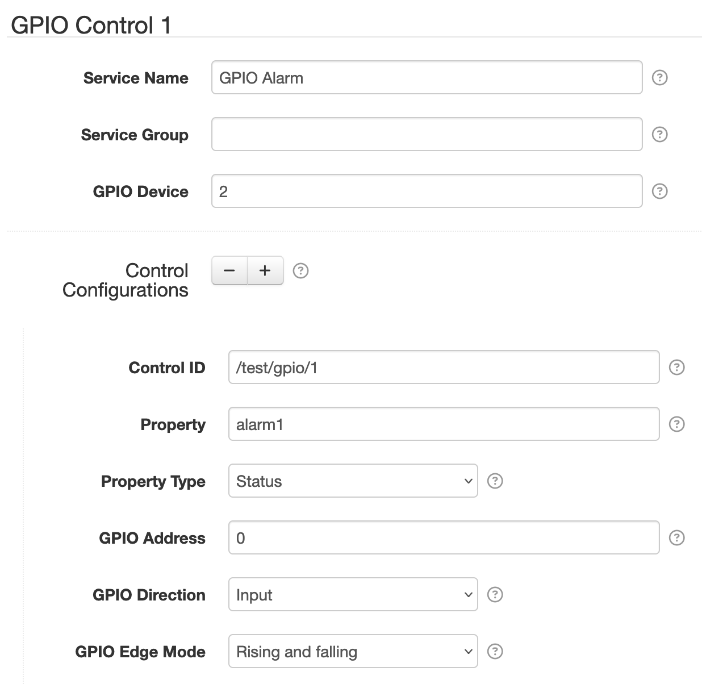

# SolarNode GPIO Control

This SolarNode plugin provides a component that can read and write to Linux GPIO character devices,
which are **digital** input/output (GPIO) connections widely available on SolarNode devices like the
Raspberry Pi.

To turn the GPIO lines into a datum stream you can use the [Control Event Datum
Logger](../net.solarnetwork.node.datum.control/) plugin.

> :warning: This plugin requires the [sn-gpiod][sn-gpiod] package to work properly in SolarNodeOS.

# Configuration

Each service configuration is specific to a single GPIO device. You can configure SolarNode controls
for any of the GPIO lines supported by the device. The configuration contains the following overall
settings:

| Setting                | Description  |
|:-----------------------|:-------------|
| Service Name           | A unique name to identify this data source with. |
| Service Group          | A group name to associate this data source with. |
| GPIO Device            | The GPIO device. Can be specified as a number, starting at `0`, or a full system device path. |
| Control Configurations | A list of [Control Settings](#control-settings). |

## Control Settings

A control configuration maps a GPIO line to a SolarNode control. The control will be a **Boolean**
type, where the value is either `true` or `false`, encoded as `1` and `0`. Each control
configuration contains the following settings:

| Setting                | Description  |
|:-----------------------|:-------------|
| Control ID            | The ID to use for the SolarNode control. This should be unique amongst all control IDs configured on a single node. [Placeholders][placeholders] are supported. |
| Property              | The name of the control property to save the GPIO line value to. |
| Property Type         | The property type to use. |
| GPIO Address          | The GPIO line address, starting from `0`. |
| GPIO Direction        | The I/O direction of the GPIO address. |
| GPIO Edge Mode        | When to report changes in digital IO lines. See [GPIO Edge Mode](#gpio-edge-mode). |

> :warning: A **GPIO Address** can only be configured on a **single** control configuration. An
> `ERROR` log will be generated if you configure more than one control configuration with the same
> GPIO Address value.
>
> Similarly, a **Control ID** can only be configured on a **single** control configuration. An
> `ERROR` log will be generated if you configure more than one control configuration with the same
> Control ID value.

## GPIO Edge Mode

The **GPIO Edge Mode** setting allows you to configure when to capture changes in digital **input**
lines. The default mode is **Rising and falling** so the control will capture both when the line
turns "on" (the control value will be `1`) and when the line turns "off" (the control value will be
`0`).

| Mode | Description |
|:-----|:------------|
| Rising             | When voltage changes from low to high (turns "on"). |
| Falling            | When voltage changes from high to low (turns "off"). |
| Rising and falling | Capture both Rising and Falling events. |

[placeholders]: https://github.com/SolarNetwork/solarnetwork/wiki/SolarNode-Placeholders
[sn-gpiod]: https://github.com/SolarNetwork/solarnode-os-packages/tree/develop/gpiod/debian
