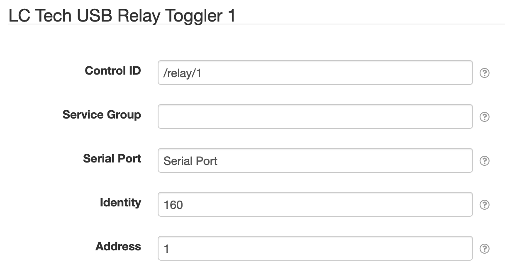

# SolarNode LC Tech USB Relay Toggle Control

This project provides SolarNode plugin that can toggle a LC Tech USB relay open and closed.

# Install

The plugin can be installed via the **Plugins** page on your SolarNode. It appears under the
**Control** category as **LC Tech Relay Toggle Control**.

# Configuration

Once installed, a new **LC Tech USB Relay Toggler** component will appear on the **Settings** page
on your SolarNode. Click on the **Manage** button to configure devices. You'll need to add one
configuration for each Modbus switch you want to control.

## Overall device settings

Each device configuration contains the following overall settings:

| Setting       | Description |
|:--------------|:------------|
| Control ID    | The ID to use for the SolarNode control. |
| Service Group | A group name to associate this data source with. |
| Serial Port   | The service name of the Serial port to use. |
| Identity      | The identity of the Modbus device to control. |
| Address       | The one-based address for relay to toggle. |

## Overall device settings notes

<dl>
	<dt>Control ID</dt>
	<dd>This should be unique amongst all control IDs deployed on the SolarNode. By convention,
	control IDs are grouped into a hierarchy via slash characters, for example `/modem/power/1`.
	This ID will also be used as the datum source ID when the control value is posted to
	SolarNetwork.</dd>
	<dt>Identity</dt>
	<dd>This does not typically need to be changed from the default value.</dd>
	<dt>Address</dt>
	<dd>Note this value is the one-based address to toggle. For devices with a single relay this
	is always <code>1</code>. For multi-relay devices, this goes up 1 for each relay.</dd>
</dl>

# Use

Once configured each relay can be toggled on/off on the node itself or via the SolarNetwork API. A
value of `true` sets the relay to **open** and `false` sets the relay to **closed**.

## Local SolarNode control

You can toggle the switch using the SolarNode GUI once the device is configured. Visit the
**Controls** page, then tap the **Manage** button for the control ID of the switch you want to
toggle. You'll see a form where you can toggle the switch by entering `true` or `false`.

## SolarNetwork control

The [SolarUser Instruction API][instr-api] can be used to toggle the switch from anywhere in the
world, by requesting the SolarNode to perform a [`SetControlParameter`][set-control-param]
instruction and passing a single instruction parameter named the **Control ID** you configured for
the switch and `true` or `false` as the parameter value.

[instr-api]: https://github.com/SolarNetwork/solarnetwork/wiki/SolarUser-API#queue-instruction
[set-control-param]: https://github.com/SolarNetwork/solarnetwork/wiki/SolarUser-API-enumerated-types#setcontrolparameter
