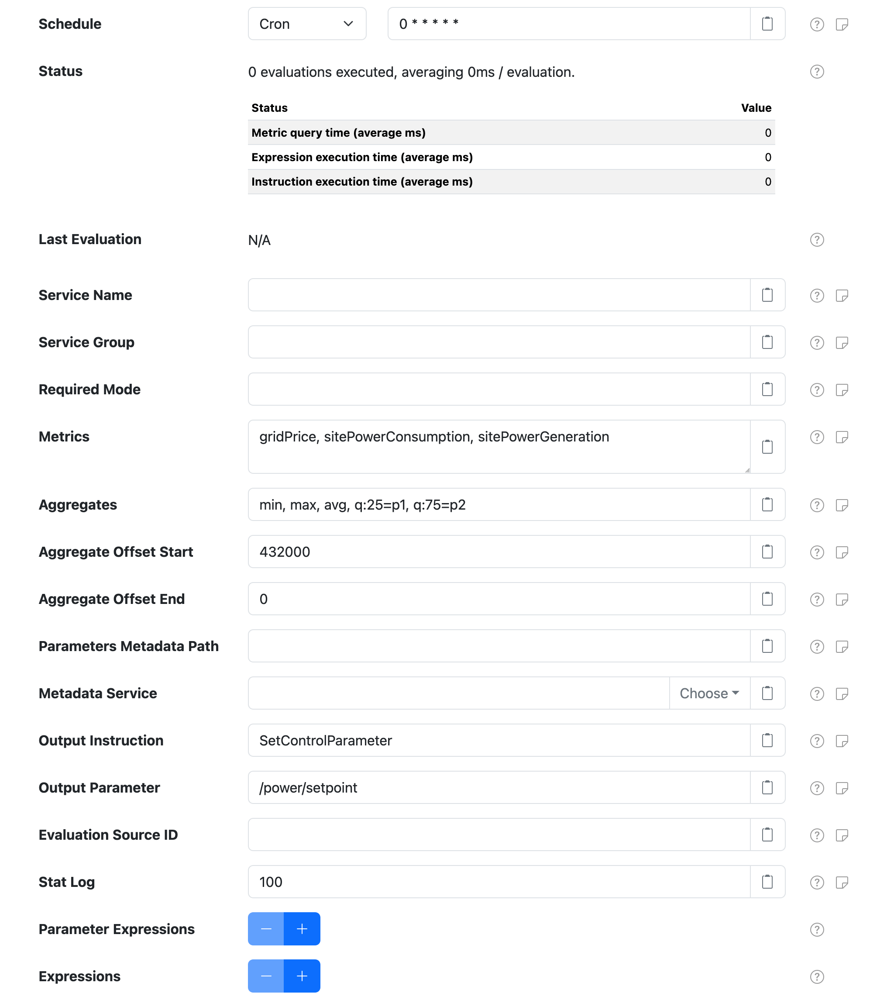
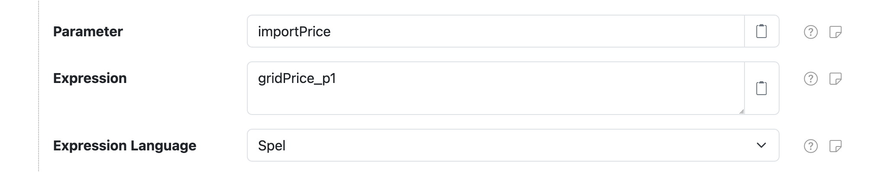

# SolarNode Metric Evaluator

This project provides SolarNode plugin that can be used to evaluate a set of dynamic expressions
against a set of [metrics][metrics], and issue a control instruction with the result.

# Use

Once installed, a new **Metric Evaluator** component will appear on the **Settings > Components**
page on your SolarNode. Click on the **Manage** button to configure instances. You'll need to add
one configuration for each logical evaluation you want to perform.

Each instance is configured with a schedule at which to run the evaluation. For each evaluation,
the following steps are performed:

 1. a set of **metrics aggregates** are queried to serve as **input parameters** to the evaluation
    expressions
 2. a set of optional **parameter expressions** are evaluated, each resulting in another
    **input parameter**
 3. a set of [static input parameters](#static-input-parameters) are added as additional
    **input parameters**
 4. the configured **expressions** are evaluated in the order defined
 5. the **first** expression that returns a non-null result will stop the evaluation and the
    configured **instruction** will be executed, passing the result as an instruction parameter.

In this way the expressions are like a series of _if-then_ logical steps, resulting in an instruction.

> :bulb: The [Metric Harvester][metric-harvester] filter provides a way to collect metrics from
> datum sources configured in SolarNode.

For example, a set of expressions could be used to monitor price, load, and generation metrics and
issue a [`SetControlParameter`][SetControlParameter] instruction to update a target energy flow in
a hybrid solar inverter/battery system to optimise when to take/provide energy from/to the grid.

# Static input parameters

The following input parameters are added automatically to each evaluation:

| Parameter | Description |
|:----------|:------------|
| `minuteOfDay` | A number representing the current minute of the day of the evaluation time, in the system's time zone. The range is `0 - 1439`. |

# Settings

Each instance configuration contains the following settings:

| Setting            | Description                                          |
|:-------------------|:-----------------------------------------------------|
| Service Name       | A name to associate this control configuration with. |
| Service Group      | A group name to associate this control configuration with. |
| Required Mode      | Require an active [operational mode][op-modes] to execute the output instruction. Can be prefixed with `!` to require the operational mode to **not** be active. |
| Metrics     | A comma-delimited list of metric names to use as inputs to the configured expressions. |
| Aggregates | A comma-delimited list of metric aggregate keys to query: including `min`, `max`, `avg`, `sum`, `cnt` (count), and `q:X` (X percentile, where X is from 1 - 99). A key can be assigned a name by including `=N` where N is the desired name. For example `q:25=p1` assigns the name `p1` to the 25th percentile aggregate. |
| Aggregate Offset Start | The **seconds** offset start (backwards from evaluation time) to aggregate metrics over. |
| Aggregate Offset End | The **seconds** offset end (backwards from evaluation time) to aggregate metrics over. Use `0` for the evaluation time. |
| Parameters Metadata Path | A metadata path that will resolve a mapping of input parameters from the configured **Metadata Service**, to include in each evaluation. For example: `/pm/power/params`. |
| Metadata Service | The **Service Name** of the Metadata Service to obtain parameters from. |
| Output Instruction | The instruction topic to use for handling the evaluation result. For example `SetControlParameter`. |
| Output Parameter | The **Output Instruction** parameter name to use for passing the evaluation result. Typically this is the **Control ID** you want to handle the instruction, for example `/power/manager/target`. |
| Evaluation Source ID | An optional source ID to generate evaluation datum on. A datum will be generated each time the metrics are evaluated, populated with properties for all the input parameters and the result. |
| Stat Log | The frequency at which to emit statistic log messages. |
| Parameter Expressions | A list of expression configurations that are evaluated before **Expressions** with each result added as an additional input parameter. See [Parameter settings](#parameter-settings). |
| Expressions | A list of expression configurations that are evaluated to calculate the desired outcome control value. The first expression that produces a number value will be used as the result, and any subsequent expressions will not be evaluated. See [Expression settings](#expression-settings). |

## Parameter settings

Parameter settings are expressions that generate additional **input parameters** for the configured
expressions. These can be used to simplify the expressions with "helper variables" or provide
additional values from non-metric sources of data.

Each parameter setting configuration contains the following settings:

| Setting             | Description                                          |
|:--------------------|:-----------------------------------------------------|
| Parameter           | The input parameter name to store the expression result in. |
| Expression          | The [expression][expressions] to evaluate. |
| Expression Language | The expression language to write **Expression** in. |

The expressions will be executed in the order defined, and provided with all queried metric
aggregates as parameters as well as all previous parameter expressions  (and thus everything can be
referenced as variables in the expression).

## Expression settings

Expression settings are expressions that generate the overall result of the evaluation. The
expressions are evaluated in order, and the **first** to return a non-null result will be used as
the overall result (ignoring any further expressions).

Each expression setting configuration contains the following settings:

| Setting             | Description                                          |
|:--------------------|:-----------------------------------------------------|
| Expression          | The [expression][expressions] to evaluate. |
| Expression Language | The expression language to write **Expression** in. |

The expressions will be executed in the order defined, and provided with all queried metric
aggregates as parameters, as well as the result of any parameter expressions (and thus both can be
referenced as variables in the expression).

# Expressions

The expressions in both the [parameter](#parameter-settings) and [expression](#expression-settings)
settings support normal node [expressions][expressions], but there is no datum available, so
[other variables][expr-other-vars] like `datum`, `meta`, `sourceId`, and `props` are not available.
All metrics, [static input parameters](#static-input-parameters), and [parameters](#parameter-settings)
are available as variables or via the `parameters` variable.

[expressions]: https://solarnetwork.github.io/solarnode-handbook/users/expressions/
[expr-other-vars]: https://solarnetwork.github.io/solarnode-handbook/users/expressions/#other-variables
[SetControlParameter]: https://github.com/SolarNetwork/solarnetwork/wiki/SolarUser-API-enumerated-types#setcontrolparameter
[metrics]: https://solarnetwork.github.io/solarnode-handbook/users/metrics/
[metric-harvester]: https://solarnetwork.github.io/solarnode-handbook/users/datum-filters/metric-harvester/
[op-modes]: https://solarnetwork.github.io/solarnode-handbook/users/op-modes/
