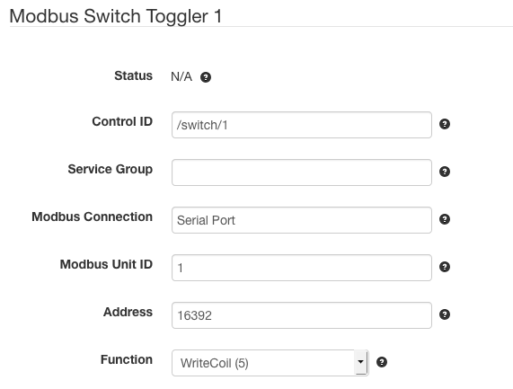

# SolarNode Modbus Toggle Control

This project provides SolarNode plugin that can toggle a switch via the
Modbus protocol by flipping a Modbus "coil" type register on and off.

# Install

The plugin can be installed via the **Plugins** page on your SolarNode. It
appears under the **Control** category as **Modbus Toggle Control**.

# Configuration

Once installed, a new **Modbus Switch Toggler** component will appear on the
**Settings** page on your SolarNode. Click on the **Manage** button to configure
devices. You'll need to add one configuration for each Modbus switch you want to
control.

A status indicator will appear at the top of the device settings, which will
display `true` (switch closed) or `false` (switch open).

## Overall device settings

Each device configuration contains the following overall settings:

| Setting            | Description                                                                      |
|--------------------|----------------------------------------------------------------------------------|
| Control ID         | The ID to use for the SolarNode control.                                         |
| Service Group      | A group name to associate this data source with.                                 |
| Modbus Connection  | The service name of the Modbus port to use.                                      |
| Modbus Unit ID     | The ID of the Modbus device to control, from 1 - 255.                            |
| Address            | The zero-based Modbus address for the coil type switch to toggle.                |

## Overall device settings notes

<dl>
	<dt>Control ID</dt>
	<dd>This should be unique amongst all control IDs deployed on the SolarNode. By convention,
	control IDs are grouped into a hierarchy via slash characters, for example `/modem/power/1`.
	This ID will also be used as the datum source ID when the control value is posted to
	SolarNetwork.</dd>
	<dt>Address</dT>
	<dd>Note this value is the zero-based address to read. Sometimes documentation for Modbus
	devices list the addresses in one-based notation. If that is the case for your device,
	simply subtract one from the documented address here.</dd>
</dl>

# Use

Once configured each switch can be toggled on/off on the node itself or via the
SolarNetwork API.

## Local SolarNode control

You can toggle the switch using the SolarNode GUI once the device is configured.
Visit the **Controls** page, then tap the **Manage** button for the control ID
of the switch you want to toggle. You'll see a form where you can toggle the
switch by entering `true` or `false`, like this:

## SolarNetwork control

The [SolarUser Instruction API](https://github.com/SolarNetwork/solarnetwork/wiki/SolarUser-API#queue-instruction)
can be used to toggle the switch from anywhere in the world, by requesting the
SolarNode to perform a [`SetControlParameter`](https://github.com/SolarNetwork/solarnetwork/wiki/SolarUser-API-enumerated-types#setcontrolparameter)
instruction and passing a single instruction parameter named the **Control ID** you
configured for the switch and `true` or `false` as the parameter value.
