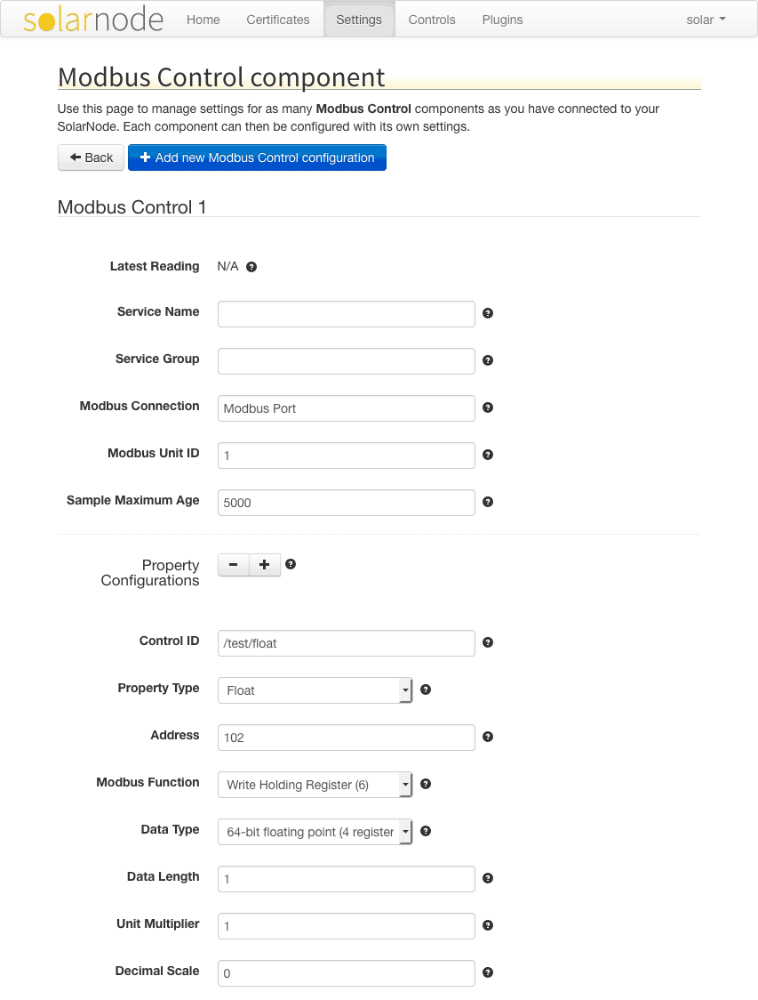
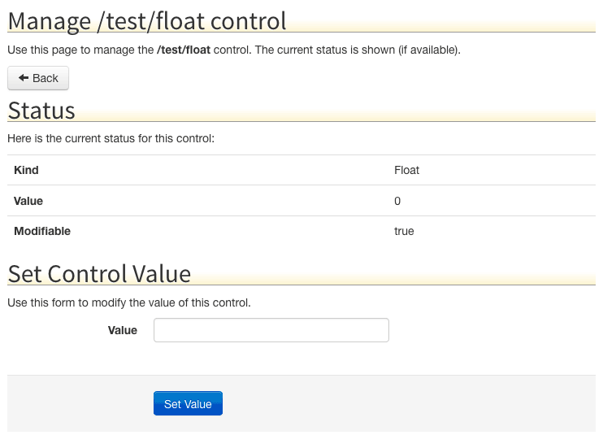

# SolarNode Modbus Control

This project provides SolarNode plugin that can be used to set arbitrary
Modbus register values, such as numbers or strings.

# Install

The plugin can be installed via the **Plugins** page on your SolarNode. It
appears under the **Control** category as **Modbus Control**.

# Configuration

Once installed, a new **Modbus Control** component will appear on the
**Settings** page on your SolarNode. Click on the **Manage** button to configure
devices. You'll need to add one configuration for each Modbus device you want to
control.

Using this plugin you'll define one SolarNode control per Modbus register
(or registers, for data types that require more than one). For example you
might define a `/thermostat/temp/comfort` control that writes a temperature
value as a 32-bit floating point value to two Modbus registers.

A status indicator will appear at the top of the device settings, which will
display the latest readings obtained from the configured Modbus registers.

Each Modbus Control component is specific to one Modbus device. You can add
as many components as you like, if you want to control multiple devices.

## Overall device settings

Each device configuration contains the following overall settings:

| Setting            | Description                                                                      |
|--------------------|----------------------------------------------------------------------------------|
| Service Name       | A name to associate this control configuration with.                             |
| Service Group      | A group name to associate this control Configuration with.                       |
| Modbus Connection  | The service name of the Modbus connection to use.                                |
| Modbus Unit ID     | The ID of the Modbus device to control, from 1 - 255.                            |
| Sample Maximum Age | A minimum time to cache captured Modbus data, in milliseconds.                   |

### Overall device settings notes

<dl>
	<dt>Modbus Port</dt>
	<dd>This is the <i>service name</i> of the Modbus component configured elsewhere
	in SolarNode. You must configure that component with the proper connection settings
	for your Modbus network, configure a unique service name on that component, and then
	enter that same service name here.</dd>
	<dt>Sample Maximum Age</dt>
	<dd>SolarNode will cache the data collected from the Modbus device for at least
	this amount of time before refreshing data from the device again. Some devices
	do not refresh their values more than a fixed interval, so this setting can be
	used to avoid reading data unnecessarily. This setting also helps in highly
	dynamic configurations where other plugins request the current values from
	the device frequently.</dd>
</dl>

## Property settings

Property configurations define a mapping between the SolarNode control and a
Modbus register (or set of registers). You can configure as many property
settings as you like, using the <kbd>+</kbd> and <kbd>-</kbd> buttons to
add/remove property configurations (and thus, add/remove controls).

Each property configuration contains the following settings:

| Setting         | Description                                                                                             |
|-----------------|---------------------------------------------------------------------------------------------------------|
| Control ID      | A name to associate this control configuration with.                                                    |
| Property Type   | The SolarNode control type to use.                                                                      |
| Address         | The starting register address to read Modbus data from (zero-based).                                    |
| Modbus Function | The Modbus write function to execute.                                                                   |
| Data Type       | The type of data to write to the Modbus register(s).                                                    |
| Data Length     | For variable length data types such as strings, the number of Modbus registers to write.                |
| Unit Multiplier | For numeric data types, a multiplier to apply to the Modbus value to normalize it into a standard unit. |
| Decimal Scale   | For numeric data types, a maximum number of decimal places to round decimal numbers to.                 |

### Property settings notes

<dl>
	<dt>Control ID</dt>
	<dd>This should be unique amongst all control IDs deployed on the SolarNode. By convention,
	control IDs are grouped into a hierarchy via slash characters, for example `/modem/power/1`.
	This ID will also be used as the datum source ID when the control value is posted to
	SolarNetwork.</dd>
	<dt>Property Type</dt>
	<dd>Each property must be categorized as <code>Boolean</code> (on/off), <code>Float</code>
	(decimal number), <code>Integer</code> (whole number), <code>Percent</code> (decimal
	number between 0 and 1), or <code>String</code>.</dd>
	<dt>Address</dt>
	<dd>Note this value is the zero-based address to read. Sometimes documentation for Modbus
	devices list the addresses in one-based notation. If that is the case for your device,
	simply subtract one from the documented address here.</dd>
	<dt>Data Type</dt>
	<dd>The data type to interpret the values captured from the Modbus registers as.
	<b>Note</b> that only the <b>Status</b> property type can accept non-numeric
	data types such as strings.</dd>
	<dt>Unit Multiplier</dt>
	<dd>The property values stored in SolarNetwork should be normalized into standard
	base units if possible. For example if a power meter reports power in <i>kilowattts</i>
	then a unit multiplier of <code>1000</code> can be used to convert the values into
	<i>watts</i>. When writing values to Modbus, the value will be <i>divided</i> by this
	amount first.</dd>
	<dt>Decimal Scale</dt>
	<dd>This setting will round decimal numbers to at most this number of decimal places. Setting
	to <code>0</code> rounds decimals to whole numbers. Setting to <code>-1</code> disables
	rounding completely.</dd>
</dl>

# Use

Once configured each control can be changed on the node itself or via the
SolarNetwork API.

## Local SolarNode control

You can set a control value using the SolarNode GUI once the device is configured.
Visit the **Controls** page, then tap the **Manage** button for the control ID
of the switch you want to toggle. You'll see a form where you can enter the
desired value, like this:

## SolarNetwork control

The [SolarUser Instruction API](https://github.com/SolarNetwork/solarnetwork/wiki/SolarUser-API#queue-instruction)
can be used to change the control from anywhere in the world, by requesting the
SolarNode to perform a [`SetControlParameter`](https://github.com/SolarNetwork/solarnetwork/wiki/SolarUser-API-enumerated-types#setcontrolparameter)
instruction and passing a single instruction parameter named the **Control ID** you
configured for the control and the desired value as the parameter value.
