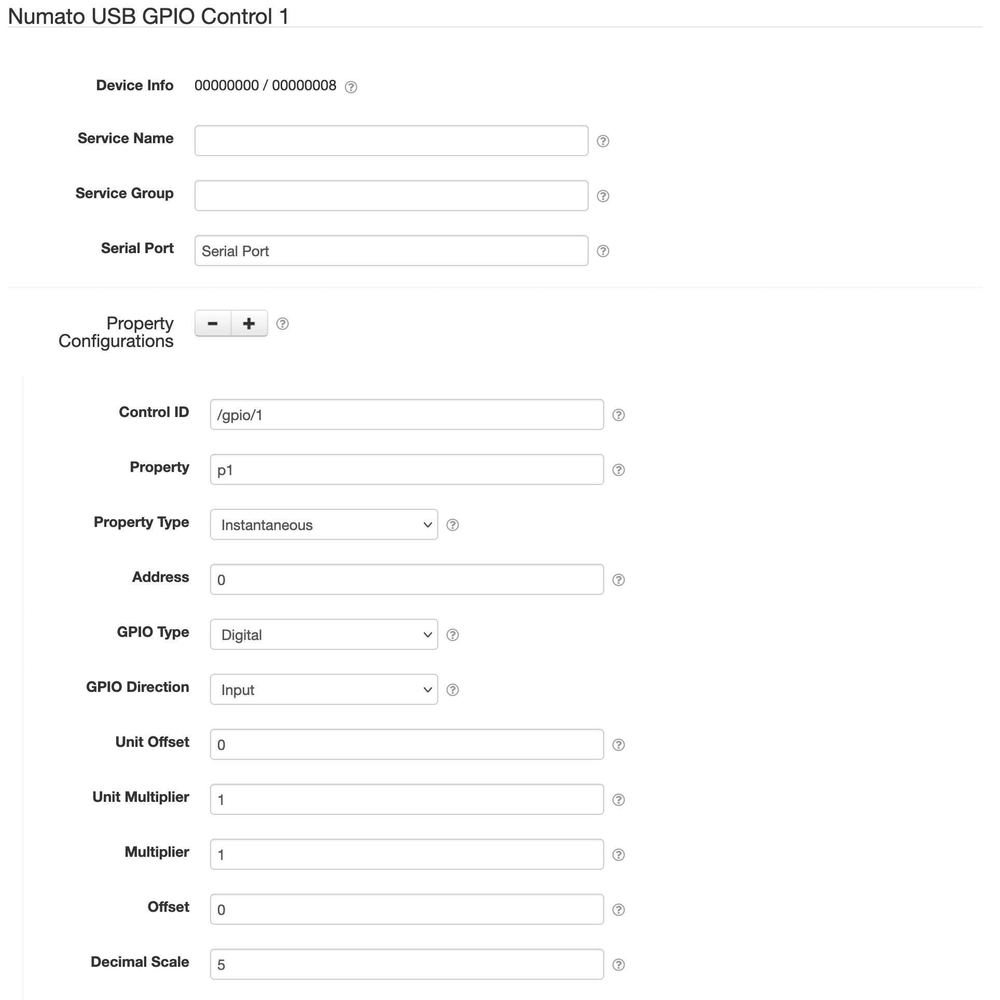

# Numato USB GPIO Control

This SolarNode plugin provides a component that can manage a Numato USB GPIO device as a SolarNode
control. The GPIO addresses can be read as digital on/off values or analog voltages, as supported
by the device. GPIO addresses can also be set.

# Install

The plugin can be installed via the **Plugins** page on your SolarNode. It appears under the
**Datum** category as **Control Datum Source**. Once installed, a **Numato USB GPIO Control**
component will become available.

# Configuration

Each service configuration contains the following settings:

| Setting               | Description  |
|:----------------------|:-------------|
| Service Name          | A unique name to identify this data source with.                                 |
| Service Group         | A group name to associate this data source with.                                 |
| Control ID            | A regular expression to filter control ID values by, or left blank to generate datum for all control IDs. |
| Mode                  | A control event type to filter by. |

> :warning: **Note** that the serial port should have any receive buffering disabled. To do this
> the **Receive threshold** property can be set to `-1`.
