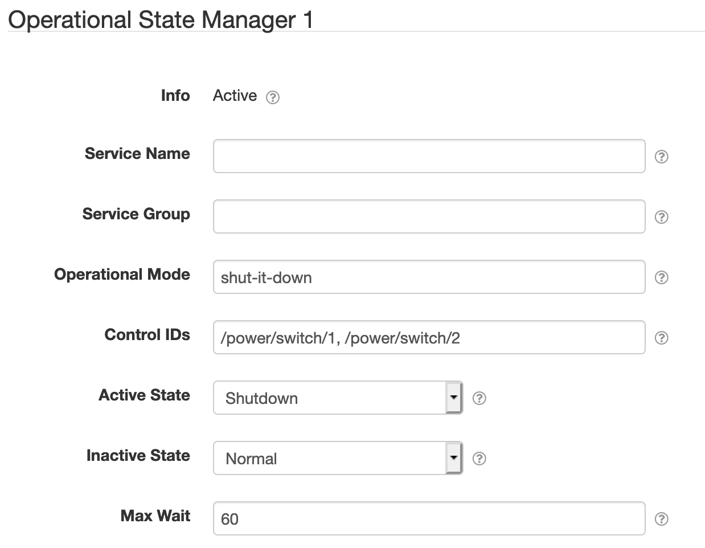
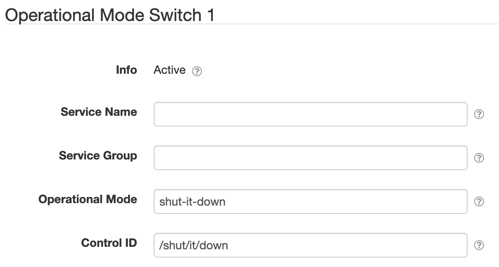

# SolarNode Operational Mode Controls

This plugin provides two components to help manage devices in relation to [operational
modes][op-modes].

# Operational State Manager

The Operational State Manager listens for changes to operational modes, and can change the
[operating state][op-states] of other controls by issuing [`SetOperatingState`][set-op-state]
instructions. This can be used, for example, to turn devices on/off.

## Operational State Manager settings

Each Operational State Manager component includes the following settings:

| Setting          | Description |
|:-----------------|:------------|
| Service Name     | A name to associate this control configuration with. |
| Service Group    | A group name to associate this control configuration with. |
| Operational Mode | The [operational mode][op-modes] to listen for. |
| Control IDs      | The control IDs to issue [`SetOperatingState`][set-op-state] instructions to when the configured mode changes. |
| Active State     | The [operating state][op-states] to apply when the mode is **enabled**. |
| Inactive State   | The [operating state][op-states] to apply when the mode is **disabled**. |
| Max Wait         | The maximum number of seconds to wait for all controls' state change to be applied. |

# Operational Mode Switch

The Operational Mode Switch acts as a boolean switch control that binds a control to an operational
mode. Setting the control on/off via a [`SetControlParameter`][set-control-param] instruction
enables/disables an operational mode, and vice-versa. This can be combined with the [Operational
State Manager](#operational-state-manager) component, for example, to turn devices on/off via the
control API.

## Operational Mode Switch settings

Each Operational Mode Switch component includes the following settings:

| Setting          | Description |
|:-----------------|:------------|
| Service Name     | A name to associate this control configuration with. |
| Service Group    | A group name to associate this control configuration with. |
| Operational Mode | The [operational mode][op-modes] to manage as a boolean switch control. |
| Control ID       | The control ID to expose. |

[op-modes]: https://github.com/SolarNetwork/solarnetwork/wiki/SolarNode-Operational-Modes
[op-states]: https://github.com/SolarNetwork/solarnetwork/wiki/SolarNet-API-global-objects#standard-device-operating-states
[set-control-param]: https://github.com/SolarNetwork/solarnetwork/wiki/SolarUser-API-enumerated-types#setcontrolparameter
[set-op-state]: https://github.com/SolarNetwork/solarnetwork/wiki/SolarUser-API-enumerated-types#setoperatingstate
