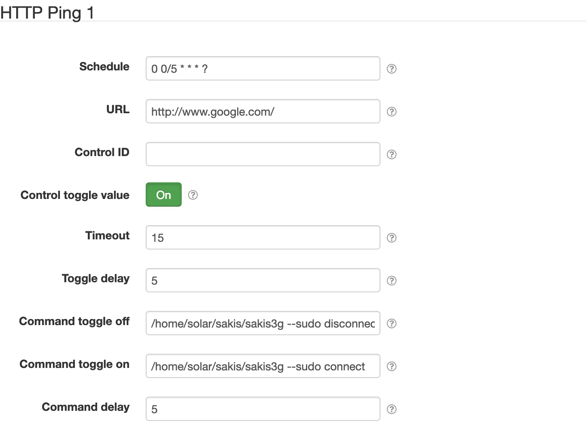

# HTTP Ping control

This project provides a SolarNode plugin that can periodically check that a HTTP URL can be reached,
thus verifying network connectivity to that host. If a network problem is detected, another control
can be toggled and/or a script can be executed. This can be useful to deal with unreliable network
connections, such as wireless connections that do not automatically reconnect after they go down.

# Install

The plugin can be installed via the **Plugins** page on your SolarNode. It appears under the
**Control** category as **Network Ping Control**.

# Use

Once installed, a new **HTTP Ping** component will appear on the **Settings** page on your SolarNode.
Click on the **Manage** button to configure controls. You'll need to add one configuration for each
URL you want to test.

The plugin can respond to network outages in a few ways, any of which can be configured separately
or together:

 1. Toggle some other SolarNode control value back/forth when an outage occurs
 2. Execute an OS command when an outage occurs
 3. Execute an OS command when the network is restored after an outage

## Overall device settings

Each device configuration contains the following overall settings:

| Setting              | Description |
|----------------------|-------------|
| Schedule             | A cron schedule that determines when data is collected. |
| Service Name         | A unique name to identify this data source with. |
| Service Group        | A group name to associate this data source with. |
| URL                  | The absolute HTTP URL to test, e.g. `http://www.google.com/`. |
| Control ID           | The ID of another SolarNode control to toggle when a network problem is detected. This control must allow toggling its value between `true` (on) and `false` (off). May be omitted if only **Command toggle on/off** is desired. |
| Control toggle value | The value to set the configured control to if the ping is considered a failure. After the control is toggled to this value, it will be toggled back to the opposite value after the configured delay. |
| Timeout              | The number of seconds to wait for the HTTP response to come back within. If the response is not received by this time, the attempt will be considered unsuccessful and the control will be toggled.      |
| Toggle delay         | The number of seconds to wait after toggling the control before toggling the control back again. |
| Command toggle off   | An OS-specific command that, if configured, will be executed when the HTTP request fails. This can be used with or without the **Control ID** and **Command toggle on** settings. |
| Command toggle on    | An OS-specific command that, if configured, will be executed after the configured **Toggle delay** after a HTTP request fails. This can be used with or without the **Control ID** and **Command toggle off** settings. |
| Command delay        | The number of seconds to wait after executing either of the configured OS commands successfully. |

# `SystemConfigure` instruction support

The `SystemConfigure` instruction topic can be used to test the HTTP connection, which can be used
to verify SolarNode's network connectivity status. If no **Service Name** is configured, the
instruction `service` parameter must be `/setup/network/ping`. Otherwise the `service` parameter
must be `/setup/network/ping/{service name}` where `{service name}` is the **Service Name** value.
The instruction will return the `Completed` state regardless if the ping test is successful or not.
A `message` result parameter will contain a description of the outcome. If the ping test fails for
any reason, a `result` result parameter will contain either the ping requests's returned status
code, or `-1` if the request could not be completed, e.g. the connection could not be established.
