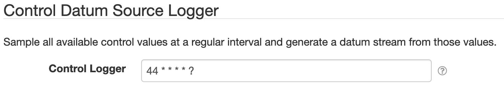

# SolarNode Simple Control Datum Logger

This SolarNode plugin enables logging of SolarNode control values as a datum stream.

# Install

The plugin can be installed via the **Plugins** page on your SolarNode. It appears under the
**Control** category as **Core Control Datum DataSource**. Once installed, a **Control Datum Source
Logger** service will become available.

# Configuration

Each service configuration contains the following settings:

| Setting               | Description  |
|:----------------------|:-------------|
| Control Logger        | A [cron expression][cron-exp] to sample control values at. |

[cron-exp]: https://github.com/SolarNetwork/solarnetwork/wiki/SolarNode-Cron-Job-Syntax
