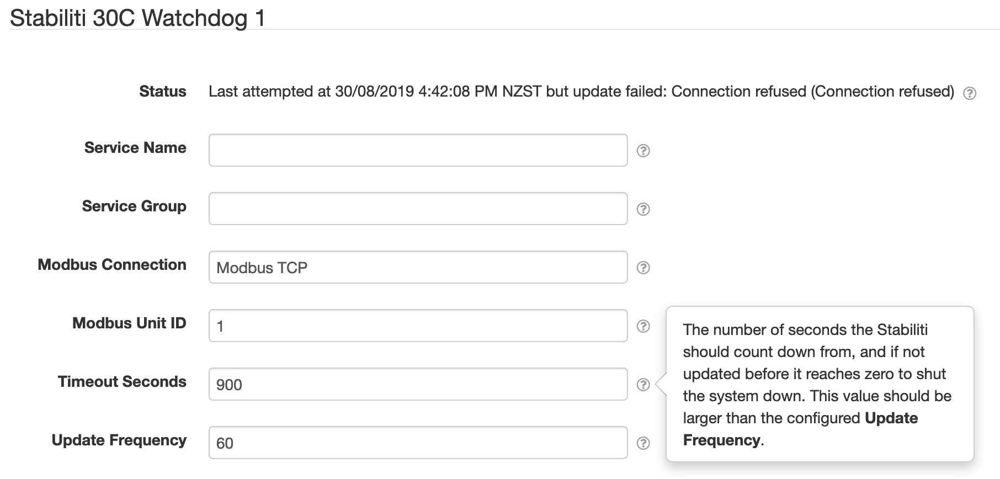

# SolarNode Stabiliti 30C Power Control System Integration

This project provides a SolarNode plugin that provides integration with the [Ideal
Power][ideal-power] Stabiliti 30C Power Control System.

The plugin can be installed via the **Plugins** page on your SolarNode. It appears under the
**Control** category as **Stabiliti 30C Power Control**. Once installed, several new **Stabiliti**
components will appear on the **Settings** pageon your SolarNode. Click on the **Manage** button to
configure price maps.

# Stabiliti 30C Watchdog

The **Stabiliti 30C Watchdog** component allows you to configure a watchdog task that manages the
safety count down timer available on the power control system.

## Stabiliti 30C Watchdog configuration

Each Stabiliti 30C Watchdog component contains the following overall settings:

| Setting            | Description |
|:-------------------|:------------|
| Service Name       | A unique name to associate this component with. |
| Service Group      | A group name to associate this component with. |
| Modbus Connection  | The service name of the Modbus connection to use. |
| Modbus Unit ID     | The ID of the Modbus device to control, from 1 - 255. |
| Timeout Seconds    | The number of seconds the Stabiliti should count down from, and if not updated before it reaches zero to shut the system down. This value should be **larger** than the configured **Update Frequency**. |
| Update Frequency   | The frequency at which this component should reset the watchdog timeout value on the Stabiliti to **Timeout Seconds**, essentially resetting the count down timer. This value should be **smaller** than the configured **Timeout Seconds**. |

### Stabiliti 30C Watchdog configuration notes

<dl>
	<dt>Modbus Connection</dt>
	<dd>This is the <i>service name</i> of the Modbus component configured elsewhere
	in SolarNode. You must configure that component with the proper connection settings
	for your Modbus network, configure a unique service name on that component, and then
	enter that same service name here.</dd>
</dl>

[ideal-power]: http://www.idealpower.com/
