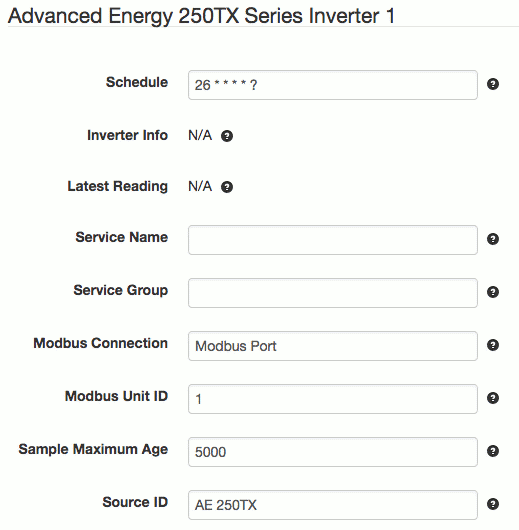

# SolarNode Advanced Energy 250TX Series Inverter Datum Source

This project provides SolarNode plugin that can collect data from
Advanced Energy 250TX series inverters.



# Install

The plugin can be installed via the **Plugins** page on your SolarNode. It
appears under the **Datum** category as **Advanced Energy 250TX Inverter
Data Source**.

# Datum structure

This datum generates a [datum stream][datum] with the following properties:

| Property | Class | Units | Description |
|:---------|:------|:------|:------------|
| `current`        | `i` | A | Common mode current |
| `dcCurrent`      | `i` | A | DC output current |
| `dcPower`        | `i` | W | DC output power |
| `dcVoltage`      | `i` | V | DC voltage |
| `events`         | `s` | bit set | Base-10 bit set of [SunSpec-compatible event codes](#sunspec-event-codes) |
| `faults`         | `s` | list | Comma-delimited set of [Fault codes](#fault-codes) |
| `frequency`      | `i` | Hz | AC frequency |
| `opState`        | `s` | enum | [Device Operating State][opstate] code |
| `opStates`       | `s` | enum | Active [System Status code](#system-status-codes) |
| `pvVoltage`      | `i` | V | The PV input voltage |
| `vendorEvents`   | `s` | bit set | Base-16 bit set of all active [Fault codes](#fault-codes) (alias for `faults`) |
| `voltage`        | `i` | W | Common mode voltage |
| `warnings`       | `s` | list | Comma-delimited set of all active AE 250TX warning codes |
| `wattHours`      | `a` | Wh | Lifetime energy |
| `watts`          | `i` | W | Active power total |

Here is an example datum, expressed in simplified JSON form:

```json
{
	"created": "2023-03-14 19:40:20.008Z",
	"nodeId": 123,
	"sourceId": "/INV/1",
	"localDate": "2023-03-14",
	"localTime": "15:40",
	"watts": 203800,
	"frequency": 60,
	"dcVoltage": 795,
	"current": 239.5,
	"dcPower": 208210,
	"voltage": -2.9,
	"dcCurrent": 261.9,
	"wattHours": 116685690,
	"opState": "1",
	"opStates": "1289"
}
```

# Use

Once installed, a new **Advanced Energy 250TX Series Inverter**
component will appear on the **Settings** page on your SolarNode. Click on the
**Manage** button to configure devices. You'll need to add one configuration
for each device you want to collect data from.

## Overall device settings

Each device configuration contains the following overall settings:

| Setting            | Description                                                                      |
|--------------------|----------------------------------------------------------------------------------|
| Schedule           | A cron schedule that determines when data is collected.                          |
| Service Name       | A unique name to identify this data source with.                                 |
| Service Group      | A group name to associate this data source with.                                 |
| Modbus Connection  | The service name of the Modbus port to use.                                      |
| Modbus Unit ID     | The ID of the Modbus device to collect data from, from 1 - 255.                  |
| Source ID          | The SolarNetwork unique source ID to assign to datum collected from this device. |
| Sample Maximum Age | A minimum time to cache captured Modbus data, in milliseconds.                   |
| Source ID          | The SolarNetwork source ID to assign to captured datum.                          |

## Overall device settings notes

<dl>
	<dt>Modbus Port</dt>
	<dd>This is the <i>service name</i> of the Modbus component configured elsewhere
	in SolarNode. You must configure that component with the proper connection settings
	for your Modbus network, configure a unique service name on that component, and then
	enter that same service name here.</dd>
	<dt>Source ID</dt>
	<dd>This value unique identifies the data collected from this device, by this node,
	 on SolarNetwork. Each configured device should use a different value.</dd>
	<dt>Sample Maximum Age</dt>
	<dd>SolarNode will cache the data collected from the device for at least
	this amount of time before refreshing data from the device again. Some devices
	do not refresh their values more than a fixed interval, so this setting can be
	used to avoid reading data unnecessarily. This setting also helps in highly
	dynamic configurations where other plugins request the current values from
	the device frequently.</dd>
</dl>

# System Status codes

The `opStates` property is an enumeration of the following possible values:

| Index | Name             | Description    |
|:------|:-----------------|:---------------|
| 0     | `Sleep`          | Sleep state    |
| 1     | `StartupDelay`   | Startup delay  |
| 2     | `AcPrecharge`    | AC precharge   |
| 3     | `DcPrecharge`    | DC precharge   |
| 4     | `Idle`           | Idle           |
| 5     | `PowerTrack`     | Power track    |
| 9     | `Fault`          | Fault          |
| 10    | `Initialization` | Initialization |
| 11    | `Disabled`       | Disabled       |
| 12    | `LatchingFault`  | Latching fault |
| 13    | `CoolDown`       | Cool down      |


# Fault codes

The `vendorEvents` property is a bit set of the following possible values:

| Index | Name                | Description                                             |
|:------|:--------------------|:--------------------------------------------------------|
| 0     | `Drive`             | A general Drive type fault has occurred                 |
| 1     | `Voltage`           | A general Voltage type fault has occurred               |
| 2     | `Grid`              | A general Grid type fault has occurred                  |
| 3     | `Temperature`       | A general Temperature type fault has occurred           |
| 4     | `System`            |  A general System type fault has occurred               |
| 15    | `Latching`          |  A general Latching type fault has occurred             |
| 16    | `DriveALow`         | Drive protection fault, phase A low.                    |
| 17    | `DriveAHigh`        | Drive protection fault, phase A high.                   |
| 18    | `DriveBLow`         | Drive protection fault, phase B low.                    |
| 19    | `DriveBHigh`        | Drive protection fault, phase B high.                   |
| 20    | `DriveCLow`         | Drive protection fault, phase C low.                    |
| 21    | `DriveCHigh`        | Drive protection fault, phase C high.                   |
| 22    | `HwOverCurrentA`    | Peak over-current, phase A.                             |
| 23    | `HwOverCurrentB`    | Peak over-current, phase B.                             |
| 24    | `HwOverCurrentC`    | Peak over-current, phase C.                             |
| 25    | `RmsOverCurrentA`   | RMS over-current, phase A.                              |
| 26    | `RmsOverCurrentB`   | RMS over-current, phase B.                              |
| 27    | `RmsOverCurrentC`   | RMS over-current, phase C.                              |
| 28    | `DcOverVoltage`     | DC volts over range.                                    |
| 29    | `DcUnderVoltage`    | DC volts under range.                                   |
| 32    | `VacOverPeakA`      | Peak AC voltage high, phase A.                          |
| 33    | `VacOverPeakB`      | Peak AC voltage high, phase B.                          |
| 34    | `VacOverPeakC`      | Peak AC voltage high, phase C.                          |
| 35    | `PllFault`          | Control PLL fault.                                      |
| 36    | `AcUnbalancedFault` | AC voltages unbalanced.                                 |
| 37    | `DcVoltageHigh`     | DC voltage high.                                        |
| 38    | `PowerSupplyP5`     | +5V power supply fault.                                 |
| 39    | `PowerSupply1P5`    | +15V power supply fault.                                |
| 40    | `PowerSupplyM15`    | -15V power supply fault.                                |
| 41    | `PowerSupply10`     | 10V power supply fault.                                 |
| 42    | `PowerSupply24`     | 24V power supply fault.                                 |
| 43    | `DcPrecharage`      | DC precharge fault.                                     |
| 44    | `PvDcDelta`         | PV input and DC bus voltage delta.                      |
| 48    | `AcFastUnderVoltA`  | Fast AC voltage low, phase A.                           |
| 49    | `AcFastUnderVoltB`  | Fast AC voltage low, phase B.                           |
| 50    | `AcFastUnderVoltC`  | Fast AC voltage low, phase C.                           |
| 51    | `AcSlowUnderVoltA`  | Slow AC voltage low, phase A.                           |
| 52    | `AcSlowUnderVoltB`  | Slow AC voltage low, phase B.                           |
| 53    | `AcSlowUnderVoltC`  | Slow AC voltage low, phase C.                           |
| 54    | `AcFastOverVoltA`   | Fast AC voltage high, phase A.                          |
| 55    | `AcFastOverVoltB`   | Fast AC voltage high, phase B.                          |
| 56    | `AcFastOverVoltC`   | Fast AC voltage high, phase C.                          |
| 57    | `AcSlowOverVoltA`   | Slow AC voltage high, phase A.                          |
| 58    | `AcSlowOverVoltB`   | Slow AC voltage high, phase B.                          |
| 59    | `AcSlowOverVoltC`   | Slow AC voltage high, phase C.                          |
| 60    | `AcUnderFreq`       | Low frequency fault.                                    |
| 61    | `AcOverFreq`        | High frequency fault.                                   |
| 64    | `HeatsinkTempA1`    | Module heat sink A1 temperature high.                   |
| 65    | `HeatsinkTempA2`    | Module heat sink A2 temperature high.                   |
| 66    | `HeatsinkTempB1`    | Module heat sink B1 temperature high.                   |
| 67    | `HeatsinkTempB2`    | Module heat sink B2 temperature high.                   |
| 68    | `HeatsinkTempC1`    | Module heat sink C1 temperature high.                   |
| 69    | `HeatsinkTempC2`    | Module heat sink C2 temperature high.                   |
| 70    | `BoardTempHigh`     | Control board temperature high.                         |
| 71    | `DriveTempLow`      | Drive temperature low.                                  |
| 72    | `MagTempHigh`       | Magnetics temperature high.                             |
| 73    | `AmbientTempLow`    | Ambient temperature low.                                |
| 74    | `MagTempLow`        | Magnetics temperature low.                              |
| 75    | `IpmTempHigh`       | IPM temperature high.                                   |
| 76    | `InductorTempHigh`  | Inductor temperature high.                              |
| 80    | `Ground`            | Ground fault, check the PV array field wiring.          |
| 81    | `AcContactor`       | AC contactor fault.                                     |
| 82    | `DcContactor`       | DC contactor fault.                                     |
| 83    | `Watchdog`          | Watchdog timer fault.                                   |
| 84    | `CpuLoad`           | CPU load fault.                                         |
| 85    | `RestartLimit`      | Too many fault restarts.                                |
| 86    | `Configuration`     | Configuration fault.                                    |
| 87    | `CurrentImbalance`  | AC current imbalance.                                   |
| 88    | `AcVoltageSense`    | No AC voltage detected.                                 |
| 89    | `ThermalSwitchOpen` | Thermal switch open.                                    |
| 90    | `DisconnectOpen`    | Disconnect open.                                        |
| 91    | `DcMiswire`         | DC mis-wired for configured grounding, check DC wiring. |


# SunSpec event codes

This plugin will map specific fault codes into the SunSpec `events` property:

| Fault | Name | Event | Inverter Model Event |
|:------|:-----|:------|:---------------------|
| 28    | `DcOverVoltage`     | 1  | `DcOverVoltage` |
| 37    | `DcVoltageHigh`     | 1  | `DcOverVoltage` |
| 48    | `AcFastUnderVoltA`  | 11 | `AcUnderVoltage` |
| 49    | `AcFastUnderVoltB`  | 11 | `AcUnderVoltage` |
| 50    | `AcFastUnderVoltC`  | 11 | `AcUnderVoltage` |
| 51    | `AcSlowUnderVoltA`  | 11 | `AcUnderVoltage` |
| 52    | `AcSlowUnderVoltB`  | 11 | `AcUnderVoltage` |
| 53    | `AcSlowUnderVoltC`  | 11 | `AcUnderVoltage` |
| 54    | `AcFastOverVoltA`   | 11 | `AcOverVoltage` |
| 55    | `AcFastOverVoltB`   | 11 | `AcOverVoltage` |
| 56    | `AcFastOverVoltC`   | 11 | `AcOverVoltage` |
| 57    | `AcSlowOverVoltA`   | 11 | `AcOverVoltage` |
| 58    | `AcSlowOverVoltB`   | 11 | `AcOverVoltage` |
| 59    | `AcSlowOverVoltC`   | 11 | `AcOverVoltage` |
| 60    | `AcUnderFreq`       | 9  | `UnderFrequency` |
| 61    | `AcOverFreq`        | 8  | `OverFrequency` |
| 64    | `HeatsinkTempA1`    | 7  | `OverTemperature` |
| 65    | `HeatsinkTempA2`    | 7  | `OverTemperature` |
| 66    | `HeatsinkTempB1`    | 7  | `OverTemperature` |
| 67    | `HeatsinkTempB2`    | 7  | `OverTemperature` |
| 68    | `HeatsinkTempC1`    | 7  | `OverTemperature` |
| 69    | `HeatsinkTempC2`    | 7  | `OverTemperature` |
| 70    | `BoardTempHigh`     | 7  | `OverTemperature` |
| 71    | `DriveTempLow`      | 13 | `UnderTemperature` |
| 72    | `MagTempHigh`       | 7  | `OverTemperature` |
| 73    | `AmbientTempLow`    | 13 | `UnderTemperature` |
| 74    | `MagTempLow`        | 13 | `UnderTemperature` |
| 75    | `IpmTempHigh`       | 7  | `OverTemperature` |
| 76    | `InductorTempHigh`  | 7  | `OverTemperature` |
| 80    | `Ground`            | 0  | `GroundFault` |
| 81    | `AcContactor`       | 2  | `AcDisconnect` |
| 82    | `DcContactor`       | 3  | `DcDisconnect` |

[datum]: https://github.com/SolarNetwork/solarnetwork/wiki/SolarNet-API-global-objects#datum
[opstate]: https://github.com/SolarNetwork/solarnetwork/wiki/SolarNet-API-global-objects#standard-device-operating-states
