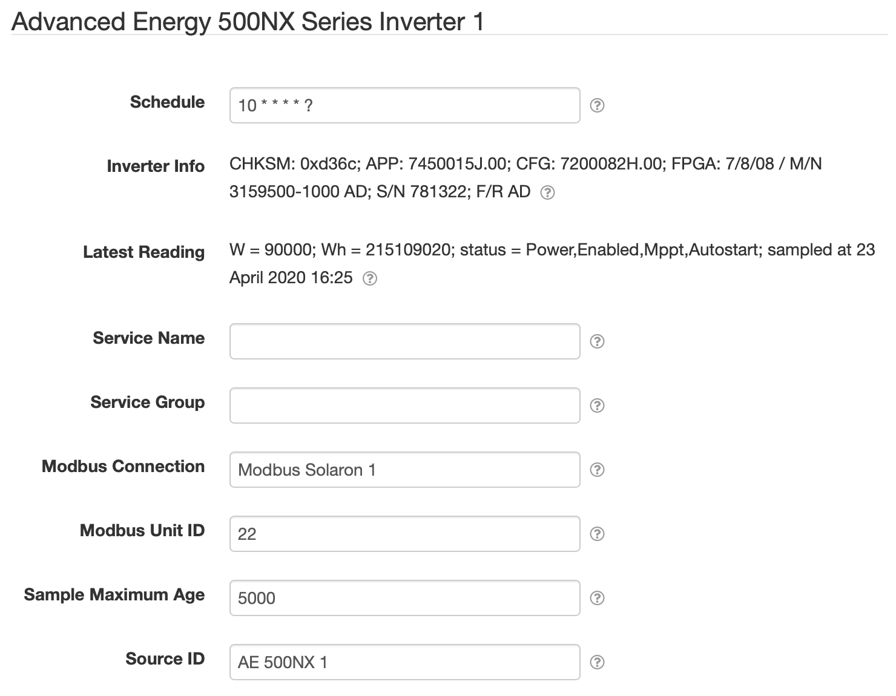

# SolarNode Advanced Energy 500NX Series Inverter Datum Source

This project provides SolarNode plugin that can collect data from Advanced Energy 500NX series
inverters.



# Install

The plugin can be installed via the **Plugins** page on your SolarNode. It appears under the
**Datum** category as **Advanced Energy 500NX Inverter Data Source**.

# Datum structure

This datum generates a [datum stream][datum] with the following properties:

| Property | Class | Units | Description |
|:---------|:------|:------|:------------|
| `current`        | `i` | A | Common mode current |
| `dcCurrent`      | `i` | A | PV current |
| `dcPower`        | `i` | W | PV power |
| `dcVoltage`      | `i` | V | PV voltage |
| `events`         | `s` | bit set | Base-10 bit set of [SunSpec-compatible event codes](#sunspec-event-codes) |
| `faults`         | `s` | bit set | Base-16 bit set of all active [Fault codes](#fault-codes) |
| `frequency`      | `i` | Hz | AC frequency |
| `limits`         | `s` | bit set | Base-10 bit set of all active [System Limit codes](#system-limit-codes) |
| `neutralCurrent` | `i` | A | Ground current |
| `opState`        | `s` | enum | [Device Operating State][opstate] code |
| `opStates`       | `s` | bit set | Base-10 bit set of active [System Status codes](#system-status-codes) |
| `reactivePower`  | `i` | VAR | Reactive power |
| `voltage`        | `i` | W | Common mode voltage |
| `temp`           | `i` | C | Cabinet temperature |
| `temp_ambient`   | `i` | C | Ambient temperature |
| `vendorEvents`   | `s` | bit set | Base-16 bit set of all active [Fault codes](#fault-codes) (alias for `faults`) |
| `warnings`       | `s` | bit set | Base-16 bit set of all active AE 500NX warning codes |
| `wattHours`      | `a` | Wh | Lifetime energy |
| `watts`          | `i` | W | Active power total |


Here is an example datum, expressed in simplified JSON form:

```json
{
	"created": "2023-03-14 19:40:20.008Z",
	"nodeId": 123,
	"sourceId": "/INV/1",
	"localDate": "2023-03-14",
	"localTime": "15:40",
	"watts": 203800,
	"frequency": 60,
	"dcVoltage": 795,
	"current": 239.5,
	"dcPower": 208210,
	"voltage": -2.9,
	"reactivePower": 100,
	"neutralCurrent": 0.8,
	"temp": 18.1,
	"dcCurrent": 261.9,
	"temp_ambient": 4.8,
	"wattHours": 116685690,
	"opState": "1",
	"opStates": "1289"
}
```

# Use

Once installed, a new **Advanced Energy 500NX Series Inverter** component will appear on the
**Settings** page on your SolarNode. Click on the **Manage** button to configure devices. You'll
need to add one configuration for each device you want to collect data from.

## Overall device settings

Each device configuration contains the following overall settings:

| Setting            | Description                                                                      |
|--------------------|----------------------------------------------------------------------------------|
| Schedule           | A cron schedule that determines when data is collected.                          |
| Service Name       | A unique name to identify this data source with.                                 |
| Service Group      | A group name to associate this data source with.                                 |
| Modbus Connection  | The service name of the Modbus port to use.                                      |
| Modbus Unit ID     | The ID of the Modbus device to collect data from, from 1 - 255.                  |
| Source ID          | The SolarNetwork unique source ID to assign to datum collected from this device. |
| Sample Maximum Age | A minimum time to cache captured Modbus data, in milliseconds.                   |
| Source ID          | The SolarNetwork source ID to assign to captured datum.                          |

## Overall device settings notes

<dl>
	<dt>Modbus Port</dt>
	<dd>This is the <i>service name</i> of the Modbus component configured elsewhere
	in SolarNode. You must configure that component with the proper connection settings
	for your Modbus network, configure a unique service name on that component, and then
	enter that same service name here.</dd>
	<dt>Source ID</dt>
	<dd>This value unique identifies the data collected from this device, by this node,
	 on SolarNetwork. Each configured device should use a different value.</dd>
	<dt>Sample Maximum Age</dt>
	<dd>SolarNode will cache the data collected from the device for at least
	this amount of time before refreshing data from the device again. Some devices
	do not refresh their values more than a fixed interval, so this setting can be
	used to avoid reading data unnecessarily. This setting also helps in highly
	dynamic configurations where other plugins request the current values from
	the device frequently.</dd>
</dl>

# System Limit codes

The `limits` property is a bit set of the following possible values:

| Bit | Name | Description |
|:----|:-----|:------------|
| 8   | `Iac` | Reducing power because the output alternating current limit has been exceeded |
| 16  | `PvCurrent` | Reducing power because the PV array direct current limit has been exceeded |
| 17  | `Pac` | Reducing output power because the AC power limit has been exceeded |
| 18  | `VdcHigh` | MPPT is limited due to excessive DC voltage |
| 19  | `VdcLow` | MPPT is limited due to insufficient DC voltage |
| 20  | `Headroom` | Consuming reactive power to limit current harmonics |
| 21  | `CoolantTemp` | Reducing power due to excessive coolant temperature|
| 22  | `IacInhibit` | Inhibiting PWM switching due to excessive AC current |
| 23  | `BusSlewInhibit` | Inhibiting PWM switching due to excessive bus capacitor voltage slew rate |
| 24  | `MaxPowerInhibit` | inhibiting PWM switching due to excessive power |


# System Status codes

The `opStates` property is a bit set of the following possible values:

| Bit | Name | Description |
|:----|:-----|:------------|
| 0   | `Power` | Set if unit is on |
| 1   | `Fault` | Set if unit has one or more active faults |
| 2   | `Limit` | Set if unit operation has been affected by one or more operating limits |
| 3   | `Enabled` | Set if master control enabled |
| 4   | `Startup` | Set if unit is in startup mode |
| 5   | `Warning` | Set if unit has one or more active warnings |
| 6   | `Lockout` | Set if the unit has been locked out |
| 8   | `Mppt` | Set if MPPT is active |
| 9   | `Sleep` | Set for sleep |
| 10  | `Autostart` | Set if auto-start is on |
| 11  | `BadMov` | Set if a surge protection device has failed |


# Fault codes

The `faults` property is a bit set of the following possible values:

| Bit | Name | Description |
|:----|:-----|:------------|
| 0   | `AuxSupply` | The DC auxiliary power supply aux supply voltages are out of range |
| 2   | `SoftStart` | The softstart relay did not close properly in order to charge the DC bus |
| 3   | `CoolantFlow` | The pump has stopped or coolant has leaked enough to have air in the system |
| 4   | `CoolantTemp` | The coolant has reached its maximum temperature limit |
| 5   | `DspWatchdog` | Indicates a failure of the control board |
| 6   | `Configuration` | Appropriate configuration file was not loaded into the unit or flash memory has failed |
| 10  | `ApplicationName` | Error occurred when updating firmware |
| 11  | `PosCurrent` | Current was flowing into the PV panels from the DC bus |
| 12  | `BusHigh` | The DC bus voltage is too high to allow the inverter to turn on |
| 13  | `BusLow` | The DC bus voltage fell below the minimum value required to allow the unit to continue to run |
| 14  | `NegCurrent` | Negative DC from the array has gone past the trip limit |
| 15  | `AcVolt` | Hardware protection against incorrect input AC voltage |
| 16  | `AcCurrent` | AC output current has exceeded the allowed maximum |
| 17  | `ZeroSequence` | There is an unexplained imbalance of current in the 3- phase AC output |
| 19  | `PosSequenceHigh` | A 3-phase voltage surge exceeded the limit of the unit |
| 22  | `AcContactor` | The mains contactor opened |
| 24  | `PosSequenceLow` | There was a sag in 3-phase line voltage that went beyond the limit of the unit in either time or voltage |
| 25  | `Cycling` | The unit has cycled on and off too many times in a short period |
| 26  | `ReactorTemp` | The line reactor temperature in the bottom of the unit cabinet has exceeded the maximum limit |
| 29  | `FrequencyLow` | A low frequency has persisted too long for the parameters of the unit |
| 30  | `FrequencyHigh` | AC frequency has exceeded the limit set in the configuration file |
| 31  | `GroundCurrent` | The ground current from the ground current DC side exceeds the limit |
| 32  | `CommonMode` | There is too much AC common mode voltage on the PV array neutral and hot wires |
| 33  | `DcContactor` | The DC contactor has reported that it has unexpectedly opened or has not operated properly during startup |
| 34  | `AmbientTemp` | The ambient temperature has exceeded the upper limit |
| 35  | `CabinetTemp` | The cabinet temperature has exceeded the upper limit |
| 36  | `TieContactor` | The PV array tie contactor has reported that it has unexpectedly opened or has not operated properly during startup |
| 41  | `DriveAInterlock` | A cable or connector has become loose inside the unit |
| 42  | `DriveBInterlock` | A cable or connector has become loose inside the unit |
| 43  | `DriveCInterlock` | A cable or connector has become loose inside the unit |
| 44  | `ISenseInterlock` | A cable or connector has become loose inside the unit |
| 45  | `Relay1Interlock` | A cable or connector has become loose inside the unit |
| 46  | `Relay2Interlock` | A cable or connector has become loose inside the unit |
| 47  | `SetInterlock` | A cable or connector has become loose inside the unit |
| 48  | `ThermalInterlock` | A cable or connector has become loose inside the unit |
| 49  | `ChargeFail` | The internal DC bus voltage did not reach an acceptable level quickly enough |
| 50  | `StopButton` | Someone has pressed the Stop button or the external interlock is preventing the unit from operating |
| 51  | `TurnOn` | A cloud edge disturbed the PV voltage to the unit during turn-on before the unit's DC contactor could close |
| 52  | `Fan1` | Fan is not running fast enough |
| 53  | `Fan2` | Fan is not running fast enough |
| 54  | `Fan3` | Fan is not running fast enough |
| 55  | `Fan4` | Fan is not running fast enough |
| 56  | `Fan5` | Fan is not running fast enough |
| 57  | `ArrayImbalance` | The positive and negative bipolar PV array voltages are out of balance |
| 58  | `OverPower` | The available PV array power increased too fast for the inverter to back off the voltage and keep the power from exceeding the trip limit |
| 59  | `GfiFailure` | A failure has occurred in a ground fault detection component in the unit |
| 60  | `Fan6` | Fan is not running fast enough |
| 61  | `Fan7` | Fan is not running fast enough |
| 62  | `GfiInterlock` | The cable for the ground fault detection and interruption device is loose or removed |
| 63  | `SoftStartStuck` | The softstart contactor is likely to be welded closed and unable to open |
| 64  | `PvTieStuck` | The PV Tie contactor is likely to be welded closed and unable to open |
| 65  | `DcContactorStuck` | The DC contactor is likely to be welded closed and unable to open |
| 66  | `AcContactorStuck` | The AC contactor is likely to be welded closed and unable to open |
| 70  | `Fan8` | Fan is not running fast enough |
| 71  | `PhaseALow` | Phase A low |
| 72  | `PhaseBLow` | Phase B low |
| 73  | `PhaseCLow` | Phase C low |
| 74  | `PhaseAHigh` | Phase A high |
| 75  | `PhaseBHigh` | Phase B high |
| 76  | `PhaseCHigh` | Phase C high |


# SunSpec event codes

This plugin will map specific fault codes into the SunSpec `events` property:

| Fault | Name | Event | Inverter Model Event |
|:------|:-----|:------|:---------------------|
| 4     | `CoolantTemp`   | 7 | `OverTemperature` |
| 5     | `DspWatchdog`   | 15 | `HwTestFailure` |
| 12    | `BusHigh`       | 1 | `DcOverVoltage` |
| 15    | `AcVolt`        | 10 | `AcOverVoltage` |
| 22    | `AcContactor`   | 2 | `AcDisconnect` |
| 26    | `ReactorTemp`   | 7 | `OverTemperature` |
| 29    | `FrequencyLow`  | 9 | `UnderFrequency` |
| 30    | `FrequencyHigh` | 9 | `OverFrequency` |
| 31    | `GroundCurrent` | 0 | `GroundFault` |
| 33    | `DcContactor`   | 3 | `DcDisconnect` |
| 34    | `AmbientTemp` | 7 | `OverTemperature` |
| 35    | `CabinetTemp` | 7 | `OverTemperature` |
| 50    | `StopButton`  | 6 | `ManualShutdown` |


[datum]: https://github.com/SolarNetwork/solarnetwork/wiki/SolarNet-API-global-objects#datum
[opstate]: https://github.com/SolarNetwork/solarnetwork/wiki/SolarNet-API-global-objects#standard-device-operating-states
