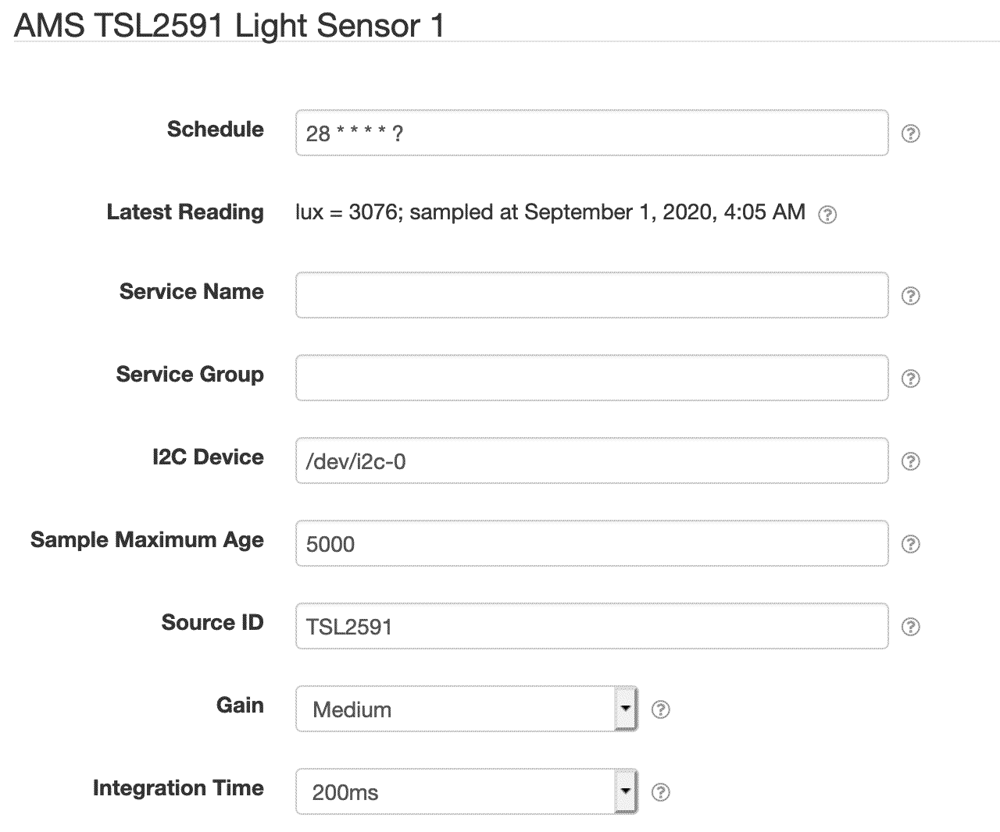

# SolarNode AMS TSL2591 Light Sensor Data Source

This project provides a SolarNode plugin that can collect data from the AMS TSL2591 series of
ambient light sensors.

# Install

The plugin can be installed via the **Plugins** page on your SolarNode. It appears under the
**Datum** category as **AMS TSL2591 Light Sensor Data Source**.

# Use

Once installed, a new **AMS TSL2591 Light Sensor** component will appear on the **Settings** page
on your SolarNode. Click on the **Manage** button to configure devices. You'll need to add one
configuration for each device you want to collect data from.

## Overall device settings

Each device configuration contains the following overall settings:

| Setting            | Description |
|:-------------------|:------------|
| Schedule           | A [cron schedule][cron] that determines when data is collected. |
| Service Name       | A unique name to identify this data source with. |
| Service Group      | A group name to associate this data source with. |
| I2C Device         | The I2C device path, e.g. `/dev/i2c-0`. |
| Sample Maximum Age | A minimum time to cache captured data, in milliseconds. |
| Source ID          | The SolarNetwork source ID to assign to captured datum. Supports [placeholders][placeholders]. |
| Gain               | The gain to configure the sensor with. Larger values are suitable for measuring lower light levels. |
| Integration Time   | The amount of time to collect light before integrating the results into a viable reading. Use longer times for low light levels. |

## Overall device settings notes

<dl>
	<dt>Source ID</dt>
	<dd>This value unique identifies the data collected from this device, by this node,
	 on SolarNetwork. Each configured device should use a different value.</dd>
	<dt>Sample Maximum Age</dt>
	<dd>SolarNode will cache the data collected from the device for at least
	this amount of time before refreshing data from the device again. Some devices
	do not refresh their values more than a fixed interval, so this setting can be
	used to avoid reading data unnecessarily. This setting also helps in highly
	dynamic configurations where other plugins request the current values from
	the device frequently.</dd>
</dl>

[cron]: https://github.com/SolarNetwork/solarnetwork/wiki/SolarNode-Cron-Job-Syntax
[placeholders]: https://github.com/SolarNetwork/solarnetwork/wiki/SolarNode-Placeholders
