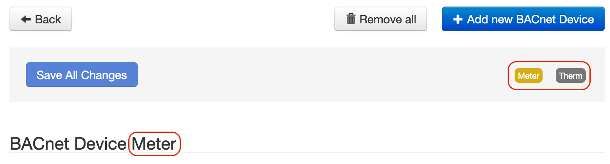

# SolarNode BACnet Device Datum Source

This project provides SolarNode plugin that can collect arbitrary data from BACnet enabled devices.
This is an advanced plugin that requires knowledge of BACnet and the BACnet configuration of the
devices you want to collect data from.


# SolarNodeOS port considerations

By default SolarNodeOS has a built-in firewall enabled that will not allow access to arbitrary IP
ports. If using BACnet/IP, the port the BACnet network runs on (the standard port is `47808`) must
be opened in the SolarNodeOS firewall, which by default is `nftables` and configured via the
`/etc/nftables.conf` file. To open port `47808`, you'd add the following lines, after the existing
ones that open ports 80 and 8080:

```
# Allows BACnet
add rule ip filter INPUT udp dport 47808 accept
```

If instead `iptables` is used, edit the `/etc/iptables/iptables.rules` file and add a rule like
this:

```
# Allow BACnet
-A INPUT -p udp --dport 47808 -j ACCEPT
```


# Use

Once installed, a new **BACnet Device** component will appear on the **Settings** page on your
SolarNode. Click on the **Manage** button to configure components.

This datum source can persist datum based on a schedule and also based on BACnet change-of-value
(COV) events, if the BACnet device you're collecting data from supports COV subscriptions. The
[Persist Mode](#overall-settings) device setting configures this. Regardless of when datum are
persisted, transient datum will be generated for each COV event and other plugins can do things with
those. For example, the [SolarFlux Upload][flux-upload] plugin can post those datum to SolarFlux.

> :warning: **Note** that although this component is named _BACnet Device Datum Source_, a single
> component instance _can_ be configured to read data from _any number_ of physical BACnet
> devices. The term _BACnet Device_ (upper case `D`) in this guide refers to this SolarNode
> component, while _BACnet device_ (lower case `d`) refers to a BACnet hardware/softare device this
> component will read data from.

# CSV Configurer

This plugin provides a **BACnet Device CSV Configurer** component will appear on the main settings
page. This component lets you upload a BACnet CSV Configuration file to configure all BACnet Device
components, without having to use the component settings form.


## BACnet CSV Configuration Format

The BACnet CSV Configuration uses the column structure detailed [below](#csv-column-definition),
with each row representing an individual datum property to read from the BACnet device. A header row
is required. Comment lines are allowed, just start the line with a `#` character (i.e. the first
cell value). The entire comment line will be ignored.

Here's an example screen shot of a configuration in a spreadsheet application. It is for two devices:

 1. Device `Therm` with 3 datum properties: `temp`, `tempWater`, and `tempOutdoor`
 2. Device `Meter` with 2 datum properties: `watts` and `wattHours`

Spreadsheet applications generally allows you to export the sheet in the CSV format, which can
then be loaded into SolarNode via the CSV Configurer.


### Instance identifiers

Individual BACnet Device components are defined by the first column (**Instance ID**). You can
assign any identifier you like (such as `Meter`, `Inverter`, and so on) or configure as a single
dash character `-` to have SolarNode assign a simple number identifier. Once an Instance ID has been
assigned on a given row, subsequent rows will use that value if the corresponding cell value is left
empty.

Here's an example of how 2 custom instance IDs `Meter` and `Therm` appear in the SolarNode UI:



### CSV column definition

The following table defines all the CSV columns used by BACnet Device CSV Configuration. Columns
**A - H** apply to the **entire BACnet Device configuration**, and only the values from the row that
defines a new Instance ID will be used to configure the device. Thus you can omit the values from
these columns when defining more than one property for a given instance.

Columns **I - Q** define the mapping of BACnet object properties to datum properties: each row
defines an individual datum property.


| Col | Name | Type | Default | Description |
|:----|:-----|:-----|:--------|:------------|
| `A` | **Instance ID** | string |  | The unique identifier for a single BACnet Device component. Can specify `-` to automatically assign a simple number value, which will start at `1`. |
| `B` | **Service Name** | string |  | An optional service name to assign to the component. |
| `C` | **Service Group** | string |  | An optional service group to assign to the component. |
| `D` | **Source ID** | string |  | The SolarNetwork datum source ID to use for the datum stream generated by this device configuration. |
| `E` | **Schedule** | string | `0 * * * * *` | The schedule at which to poll the BACnet device for data. Can be either a [cron][sn-cron-syntax] value or a millisecond frequency. |
| `F` | **Connection** | string |  | The **Service Name** of the **BACnet Connection** component to use. |
| `G` | **Persist mode** | string | `Polling only` | Controls when to persist datum. One of <code>Events only</code>, <code>Events and polling</code>, or <code>Polling only</code>, or shortened to <code>EventOnly</code>, <code>EventAndPoll</code>, or <code>PollOnly</code>. |
| `H` | **Sample Cache** | integer | `5000` | A maximum time to cache captured BACnet data, in milliseconds. |
| `I` | **Device ID** | integer |  | The BACnet device ID to collect data from. |
| `J` | **Object Type** | string |  | The BACnet object type to collect data from. Can be specified as a name, like <code>analog-input</code> or <code>AnalogInput</code>, or the associated integer code, like <code>0</code>. |
| `K` | **Object Number** | integer |  | The BACnet object type instance number to collect data from. |
| `L` | **Property ID** | string | `present-value` | The BACnet object property identifier to collect data from. Can be specified as a name, like <code>present-value</code> or <code>PresentValue</code>, or the associated integer code, like <code>85</code>. |
| `M` | **COV Increment** | decimal |  | An optional change-of-value (COV) event threshold to request when subscribing to COV events, essentially filtering the COV events unless the property value has changed by at least this amount. |
| `N` | **Property** | string |  | The datum property name to use. |
| `O` | **Property Type** | enum | `Instantaneous` |  The type of datum property to use. Must be one of `Instantaneous`, `Accumulating`, `Status`, or `Tag`, and can be shortened to just `i`, `a`, `s`, or `t`. |
| `P` | **Multiplier** | decimal | `1` | For numeric data types, a multiplier to apply to the BACnet value to normalize it into a standard unit. |
| `Q` | **Decimal Scale** | integer | `5` | For numeric data types, a maximum number of decimal places to round decimal numbers to, or `-1` to not do any rounding. |

## Example CSV

Here is the CSV as shown in the example configuration screen shot above (comments have been removed
for brevity):

```csv
Instance ID,Service Name,Service Group,Source ID,Schedule,Connection,Persist Mode,Sample Cache,Device ID,Object Type,Object Number,Property ID,COV Increment,Property,Property Type,Multiplier,Decimal Scale
Therm,Thermometer,,therm/1,0 * * * * *,BACnet/IP,Polling only,5000,3637469,analog-input,0,present-value,,temp,Instantaneous,1,5
,,,,,,,,3637469,analog-input,1,present-value,,tempWater,Instantaneous,1,5
,,,,,,,,3637469,analog-input,2,present-value,,tempOutdoor,Instantaneous,1,5
Meter,,,meter/1,0 * * * * *,BACnet/IP,Polling only,5000,112821,analog-input,0,present-value,,watts,Instantaneous,1,0
,,,,,,,,112821,accumulator,0,present-value,,wattHours,Accumulating,1,0
```


# Overall settings

Each component configuration contains the following settings:

| Setting               | Description |
|:----------------------|:------------|
| Schedule              | A [cron schedule][sn-cron-syntax] that determines when data is collected, or millisecond frequency. |
| Service Name          | A unique name to identify this data source with. |
| Service Group         | A group name to associate this data source with. |
| Source ID             | The SolarNetwork unique source ID to assign to datum collected by this component. |
| BACnet Connection     | The **Service Name** of the **BACnet Connection** component to use. |
| Sample Maximum Age    | A maximum time to cache captured BACnet data, in milliseconds. |
| Persist Mode          | Controls when to persist datum. _Event_ modes relate to change-of-value subscription updates published by the associated BACnet devices. _Polling_ modes relate to the schedule configured on this component. |
| Device Configurations | A list of BACnet device-specific settings. Any number of device configurations can be added, to collect data from any number of BACnet devices. |

## Overall settings notes

<dl>
	<dt>BACnet Connection</dt>
	<dd>This is the <b>Service Name</b> of the <b>BACnet Connection</b> component configured elsewhere
	in SolarNode. You must configure that component with the proper connection settings
	for your BACnet network, configure a unique Service Name on that component, and then
	enter that same Service Name  here.</dd>
	<dt>Source ID</dt>
	<dd>This value unique identifies the data collected by this component, by this node,
	 on SolarNetwork. Each configured component should use a different value.</dd>
	<dt>Sample Maximum Age</dt>
	<dd>SolarNode will cache the data collected from the BACnet device for at most
	this amount of time before refreshing data from the device again. Some devices
	do not refresh their values more than a fixed interval, so this setting can be
	used to avoid reading data unnecessarily. This setting also helps in highly
	dynamic configurations where other plugins request the current values from
	this component frequently.</dd>
</dl>

# Device settings

You must configure settings for each BACnet device you want to collect data from. You can
configure as many device settings as you like, using the <kbd>+</kbd> and <kbd>-</kbd> buttons to
add/remove configurations.


Each device configuration contains the following settings:

| Setting   | Description |
|:----------|:------------|
| Device ID | The BACnet device ID to collect data from. |
| Property Configurations | A list of BACnet object property-specific settings. Any number of property configurations can be added, to collect data from any number of object properties on the associated BACnet device. |

# Property settings

You must configure settings for each datum property you want to collect from a given device. You can
configure as many property settings as you like, using the <kbd>+</kbd> and <kbd>-</kbd> buttons to
add/remove configurations.


Each property configuration contains the following settings:

| Setting         | Default | Description |
|:----------------|:--------|:------------|
| Object Type     |  | The BACnet object type to collect data from. Can be specified as a name, like <code>analog-input</code> or <code>AnalogInput</code>, or the associated integer code, like <code>0</code>. |
| Object Number   |  | The BACnet object type instance number to collect data from. |
| Property ID     | `present-value` | The BACnet object property identifier to collect data from. Can be specified as a name, like <code>present-value</code> or <code>PresentValue</code>, or the associated integer code, like <code>85</code>. |
| COV Increment   |  | An optional decimal change-of-value (COV) event threshold to request when subscribing to COV events, essentially filtering the COV events unless the property value has changed by at least this amount. |
| Property        |  | The name of the datum property to save the BACnet value as. |
| Property Type   | `Instantaneous` | The type of datum property to use. |
| Multiplier      | `1` | For numeric data types, a multiplier to apply to the BACnet property value to normalize it into a standard unit. |
| Decimal Scale   | `5` | For numeric data types, a maximum number of decimal places to round decimal numbers to, or `-1` to not do any rounding. |

## Datum property settings notes

<dl>
	<dt>COV Increment</dt>
	<dd>This value only affects the change-of-value (COV) event subscription, and has no impact on the
	polling schedule configured. This can be used to limit the number of COV events generated by
	highly-dynamic BACnet property values, so events are only generated if the value changes by at
	least this amount.</dd>
	<dt>Property</dt>
	<dd>Property names represent what the associated data value is, and SolarNetwork
	has many standardized names that you should consider using. For example the
	<a href="https://github.com/SolarNetwork/solarnetwork-common/blob/develop/net.solarnetwork.common/src/net/solarnetwork/domain/datum/EnergyDatum.java">EnergyDatum</a>
	class defines properties such as <code>watts</code> and <code>wattHours</code>
	for electrical energy.</dd>
	<dt>Property Type</dt>
	<dd>Each property must be categorized as <code>Accumulating</code>, <code>Instantaneous</code>,
	or <code>Status</code>. <b>Accumulating</b> is used for properties that record
	a value that accumulates over time, such as <code>wattHours</code> captured from
	a power meter. <b>Instantaneous</b> is used for properties that capture values
	that record independent values over time, such as <code>watts</code>. <b>Status</b>
	is used for non-numeric values such as string status messages.</dd>
	<dt>Multiplier</dt>
	<dd>The property values stored in SolarNetwork should be normalized into standard
	base units if possible. For example if a power meter reports power in <i>kilowattts</i>
	then a unit multiplier of <code>1000</code> can be used to convert the values into
	<i>watts</i>.</dd>
	<dt>Decimal Scale</dt>
	<dd>This setting will round decimal numbers to at most this number of decimal places. Setting
	to <code>0</code> rounds decimals to whole numbers. Setting to <code>-1</code> disables
	rounding completely.</dd>
</dl>


[flux-upload]: ../net.solarnetwork.node.upload.flux/
[sn-cron-syntax]: https://github.com/SolarNetwork/solarnetwork/wiki/SolarNode-Cron-Job-Syntax
