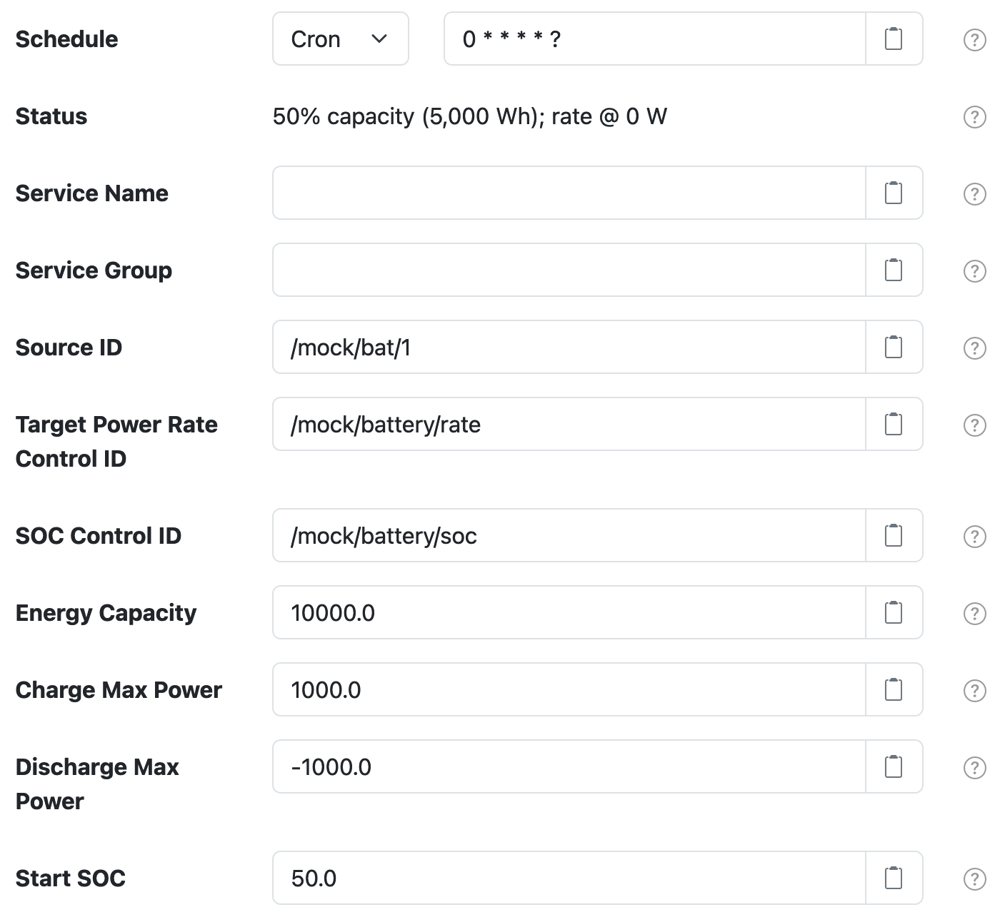

# SolarNode Mock Battery Datum Source

This project provides SolarNode plugin that pretends to collect data from a battery, and offers a
control for adjusting its charge/discharge power rate. It is designed for developers to use, when
testing SolarNode components.

# Use

Once installed, a new **Mock Battery** component will appear on the **Settings** page on your
SolarNode. Click on the **Manage** button to configure devices. You'll need to add one configuration
for each mock battery you want to generate data from.

# Settings

Each configuration contains the following overall settings:

| Setting                      | Description |
|:-----------------------------|:------------|
| Schedule                     | A cron schedule that determines when data is collected. |
| Service Name                 | A unique name to identify this data source with. |
| Service Group                | A group name to associate this data source with. |
| Source ID                    | The SolarNetwork unique source ID to assign to datum collected from this component. |
| Target Power Rate Control ID | A control ID to expose for managing the target power rate. The `SetControlParameter` instruction can be used to update the control value, passing the desired power rate, in **watts**. A positive value represents a _charge_ (receive) rate while a negative value represents a _discharge_ (supply) rate. |
| Energy Capacity              | The total capacity of the battery, in **watt-hours**. |
| Charge Max Power             | The maximum power rate allowed for charging, in **watts**. |
| Discharge Max Power          | The maximum power rate allowed for discharging, in watts. |

# Power rate control

The **Target Power Rate Control ID** defines a writable control ID that accepts a decimal charge
or discharge rate to configure the battery on. A rate of `0` make the battery neither charge nor
discharge. A positive value represents a _charge_ (receive) rate while a negative value represents a
 _discharge_ (supply) rate. The battery only simulates a "perfect" system where the specified rate
 is maintained without variation, until the available energy is depleted or reaches the configured
 capacity.

 > **Note** the available capacity of the battery is only updated according to the configured power
 > rate _when the battery information is measured_ according to the configured **Schedule**.
