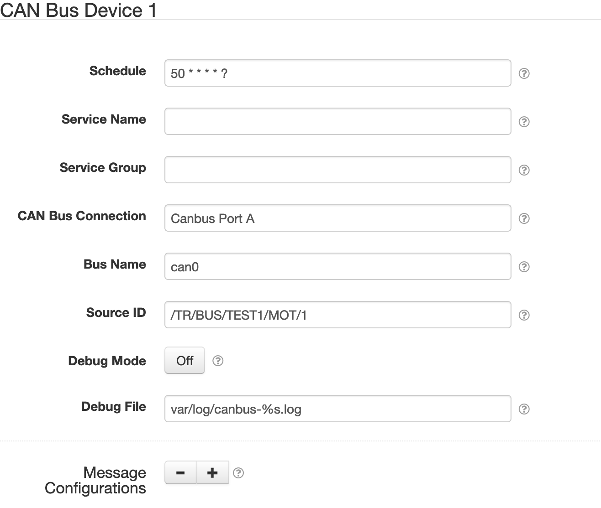

# SolarNode CAN Bus Datum Data Source

This project provides SolarNode plugin that can collect arbitrary data from CAN bus networks. This
is an advanced plugin that requires specific low-level knowledge of the CAN network you want to
collect data from. It also requires a plugin that provides a CAN Bus Connection component to use,
for example the [SolarNode CAN Bus Connection][can-conn] plugin.



# Install

The plugin can be installed via the **Plugins** page on your SolarNode. It appears under the
**Datum** category as **CAN Bus Datum Source**.

# Use

Once installed, a new **CAN Bus Device** component will appear on the **Settings** page on your
SolarNode. Click on the **Manage** button to configure components. You'll need to add one
configuration for each datum stream (source ID) you want to collect data on.

To understand how to configure this plugin, it is helpful to consider how CAN bus messages are
structured. Each message contains a unique _address_ and some number of bytes as content. CAN does
not specify the format of any message, so some mapping information must be provided to decode a
message from a given address.  A message then might contain several pieces of information bundled
together. The goal of this plugin is to capture CAN bus messages, decode the messages into
individual property values, and map those values into datum properties.

The configuration for a given CAN Bus Device in SolarNode is broken into these parts:

| Configuration | Description |
|:--------------|:------------|
| Device        | A SolarNetwork datum stream with a _source ID_. A device contains 1 or more message configurations. |
| Message       | A CAN bus message for a specific _CAN bus address_. A message contains 1 or more property configurations. |
| Property      | An individual datum property taken from a message. |

You can visualize this structure like a tree. For example, here's a single Device with 2 messages
and 5 properties:

```
TR-BUS-TEST1-MOT-1      # Device - a source ID
├── 0x0C03A1A7          # Message - a CAN bus address
│   ├── speed           # Property - part 1 of message
│   └── torque          # Property - part 2 of message
└── 0x1818D0F3
    ├── current
    ├── soc
    └── voltage
```

With that configuration, SolarNode might capture a datum that looks like this:

```json
{
  "sourceId" : "TR-BUS-TEST1-MOT-1",
  "speed" : 1115,
  "torque" : 29426,
  "current": 8.1,
  "soc": 0.868,
  "voltage": 669.2
}
```

## Datum generation

This plugin does not _request_ values from the configured CAN bus. Instead, it _listens_ for CAN
messages from the CAN addresses configured, and captures the property values _whenever a message
arrives_. When it needs to generate a datum object, it copies the appropriate properties that have
been most-recently captured to a new datum instance and returns that. Thus the values on a given
datum could have been generated at any point _before_ the datum is generated. For most cases the
messages on a CAN bus are emitted quite frequently, and the end result is that the property values
captured in a given datum are reasonably close to whatever those property values might have been at
the time the datum is generated.

It is also possible for datum to be generated that do not contain values for all the properties
configured to be captured by that datum, if no message has arrived for a particular property. Again,
this is not much of an issue because CAN messages are typically generated very frequently.

# KCD Configurer

This plugin also provides a **CAN Bus Device Configurer** component will appear on the main settings
page. This component lets you upload a [KCD][sn-kcd] XML configuration file to configure all CAN Bus
Device components, without having to use the settings form.


# Device settings

Each device configuration contains the following overall settings:

| Setting                | Description                                             |
|------------------------|---------------------------------------------------------|
| Schedule               | A cron schedule that determines when data is collected. |
| Service Name           | A unique name to identify this data source with. |
| Service Group          | A group name to associate this data source with. |
| CAN Bus Connection     | The **service name** of the CAN Bus Connection to use. |
| Bus Name               | The CAN bus name to connect to. |
| Source ID              | The source ID to assign to generated datum. |
| Debug Mode             | When enabled, capture all CAN messages into the configured **Debug File**, and do **not** collect any datum. |
| Debug File             | File path to write CAN messages to when **Debug Mode** is enabled. Accepts a single `%s` argument which will be replaced by the configured **Bus Name**. |
| Message Configurations | A list of CAN bus message configurations that determine which datum properties are collected, from which CAN bus addresses. |

# Message settings


Each message configuration contains the following overall settings:

| Setting                 | Description                                             |
|-------------------------|---------------------------------------------------------|
| CAN bus Address         | The CAN bus address to read. Can be specified in base 16 (hex) with a `0x` prefix, e.g. `0x1A` is equivalent to `26`. |
| Description             | An optional friendly description to give to this property. |
| Interval                | An minimum interval, in **milliseconds**, to limit message updates to. Use `0` for no limit so updates occur at whatever frequency they are broadcast at. |
| Byte Ordering           | The byte ordering used by the message data. |
| Property Configurations | A list of configurations that determine which CAN bus message data values are extracted into datum properties. |

# Property settings


Each property configuration contains the following overall settings:

| Setting         | Description                          |
|-----------------|--------------------------------------|
| Property        | The datum property name to populate. |
| Property Type   | The [datum property classification][datum-samples] to use. |
| Data Type       | The data type to read from the message. |
| Unit            | The physical unit of the value, as a valid [Unified Code for Units of Measure][ucum] unit representation. |
| Normalized Unit | The unit to convert the value to, as a valid [Unified Code for Units of Measure][ucum] unit representation. If empty then apply standard normalization rules. |
| Bit Offset      | The bit offset within the CAN bus message to read the property value from. |
| Bit Length      | The number of bits to read. Only used for variable-length **Data Type** values. |
| Multiplier      | A multiplication factor to transform data values into normalized units. In CAN this is often referred to as the **slope**, represented by `m` in the linear equation `y = mx + b`. Set to `1` for no multiplier. |
| Offset          | An offset to transform data values into normalized units. This is applied **after** the **Multiplier**, represented by `b` in the linear equation `y = mx + b`. Set to `0` for no offset. |
| Decimal Scale   | A maximum scale (number of digits after the decimal point) to round decimal values to. This is applied after all transforms. Set to `0` to round to whole numbers. Set to `-1` to disable rounding. |
| Value Labels    | An optional list of labels to associate with specific property values. |
| Localized Names | An optional list of localized names to publish with the metadata for the device. |

## Value labels

Value labels allow you to configure descriptive labels with specific property values. When 
configured, SolarNode will generate an extra status datum property named like **Property** with
`Label` appended. For example, here are two value labels configured for values `0` and `1`
with labels `Normal` and `Broken`, respectively:


Assuming the associated **Property** setting is configured as `state`, then when the captured
property value matches `1` a `stateLabel` property would also be populated with a value `Broken`:

```json
{
  "state"      : 1,
  "stateLabel" : "Broken"
}
```

# Datum metadata

This plugin will publish metadata based on the configuration provided. This is to help with client
applications that want to understand the units used by each property. An example of the metadata is:

Each property will have the following metadata elements published:

Each property configuration contains the following overall settings:

| Metadata   | Description |
|------------|------------ |
| name       | The localized names, if provided, as an object with language tags for object keys. |
| unit       | The normalized UCUM unit of the datum property. |
| sourceUnit | The original UCUM unit of the property configuration, if different from the normalized unit. |

```json
{
  "created": "2019-12-15 20:50:06.480Z",
  "updated": "2019-12-16 01:01:54.518Z",
  "nodeId": 123,
  "sourceId": "/TR/BUS/TEST1/BAT/1",
  "pm": {
    "soc": {
      "name": {
        "en": "Battery State of Charge"
      },
      "unit": "",
      "sourceUnit": "%"
    },
    "current": {
      "name": {
        "en": "Battery Current"
      },
      "unit": "A"
    },
    "voltage": {
      "name": {
        "en": "Battery Voltage"
      },
      "unit": "V"
    },
    "regenEnergy": {
      "name": {
        "en": "Battery Input Energy",
        "fr": "Énergie d'entrée de la batterie"
      },
      "unit": "W.h",
      "sourceUnit": "kW.h"
    },
    "outputEnergy": {
      "name": {
        "en": "Battery Output Energy",
        "fr": "Énergie de sortie de la batterie"
      },
      "unit": "W.h",
      "sourceUnit": "kW.h"
    },
    "minCellVoltage": {
      "unit": "V"
    },
    "posIsoResistance": {
      "unit": "Ω",
      "sourceUnit": "kOhm"
    }
  }
}
```

[can-conn]: ../net.solarnetwork.node.io.canbus
[datum-samples]: https://github.com/SolarNetwork/solarnetwork/wiki/SolarNet-API-global-objects#datum-samples
[sn-kcd]: ../net.solarnetwork.node.io.canbus#solarnetwork-kcd-support
[ucum]: http://unitsofmeasure.org/ucum.html
