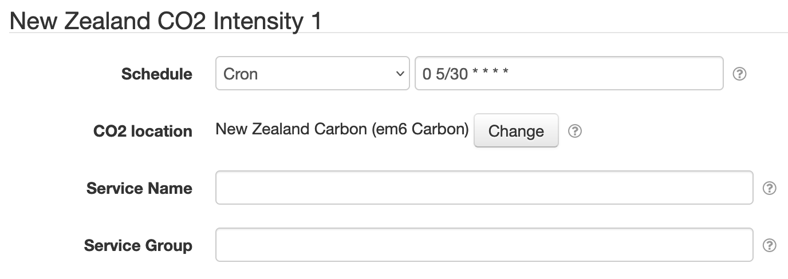
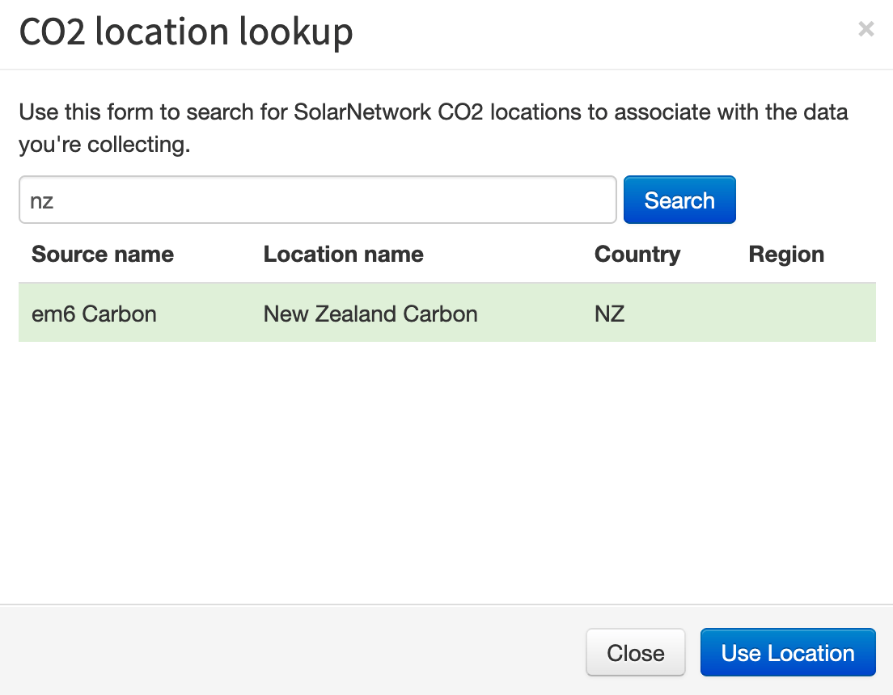

# SolarNode em6 CO2 Intensity Datum Source

This project provides SolarNode plugin that can collect data from the [em6][em6]
API, for New Zealand electricity grid CO<sub>2</sub> intensity information.



# Install

The plugin can be installed via the **Plugins** page on your SolarNode. It appears under
the **Datum** category as **CO2 Intensity Tracking (NZ em6)**.

# Datum structure

This datum generates a _location_ [datum stream][datum] with the following properties:

| Property | Class | Units | Description |
|:---------|:------|:------|:------------|
| `co2_g`                  | `i` | g | Total grams of CO<sub>2</sub> produced in the trading period |
| `co2_gkwh`               | `i` | g/kWh | Grams of CO<sub>2</sub> produced per kWh generated |
| `co2_change_gkwh`        | `i` | g/kWh | Change in grams of CO<sub>2</sub> produced per kWh generated from the previous trading period |
| `current_month_avg_gkwh` | `i` | g/kWh | Average grams of CO<sub>2</sub> produced per kWh generated in the current month
| `current_year_avg_gkwh`  | `i` | g/kWh | Average grams of CO<sub>2</sub> produced per kWh generated in the current year |
| `min_24hrs_gkwh`         | `i` | g/kWh | Minimum grams of CO<sub>2</sub> produced per kWh in the last 24hrs. |
| `max_24hrs_gkwh`         | `i` | g/kWh | Maximum grams of CO<sub>2</sub> produced per kWh in the last 24hrs. |
| `pct_current_year_gkwh`  | `i` | percent | Current CO<sub>2</sub> output as a percentage (0 - 100) of the rolling 12 month max output |
| `renewable`              | `i` | percent | Percentage (0 - 100) of generation qualifying as _renewable_ |

Here is an example datum, expressed in simplified JSON form:

```json
{
	"created": "2023-03-10 03:00:00Z",
	"locationId": 11532079,
	"sourceId": "em6 Carbon",
	"localDate": "2023-03-10",
	"localTime": "16:00:00",
	"co2_g": 276780,
	"co2_gkwh": 111.05,
	"renewable": 82.57,
	"max_24hrs_gkwh": 112.08,
	"min_24hrs_gkwh": 60.03,
	"co2_change_gkwh": 4.32,
	"current_year_avg_gkwh": 74.15,
	"pct_current_year_gkwh": 80.04,
	"current_month_avg_gkwh": 95.62
}
```

# Use

Once installed, a new component will appear on the **Settings** page on your SolarNode: **New
Zealand CO2 Intensity**.  Click on the **Manage** button to configure the data source. You'll need
to add one configuration for each location  you want to collect data for.

## CO2 Location

You have to associate the datum stream with a SolarNetwork CO2 Location. Use the **CO2 location >
Change** button to find and select a suitable location.



## Overall settings

Each configuration contains the following overall settings:

| Setting            | Description                                                                      |
|--------------------|----------------------------------------------------------------------------------|
| Schedule           | A cron schedule that determines when data is collected.                          |
| CO2 Location       | The SolarNetwork weather location to associate the collected data with.          |
| Service Name       | A unique name to identify this data source with.                                 |
| Service Group      | A group name to associate this data source with.                                 |

## Overall settings notes

 * A suitable **CO2 Location** must be configured by the SolarNetwork administrators to enable
   collecting this data. Contact info@solarnetwork.net if you do not find a suitable location
   using the location search UI.


[datum]: https://github.com/SolarNetwork/solarnetwork/wiki/SolarNet-API-global-objects#datum
[em6]: https://app.em6.co.nz/
