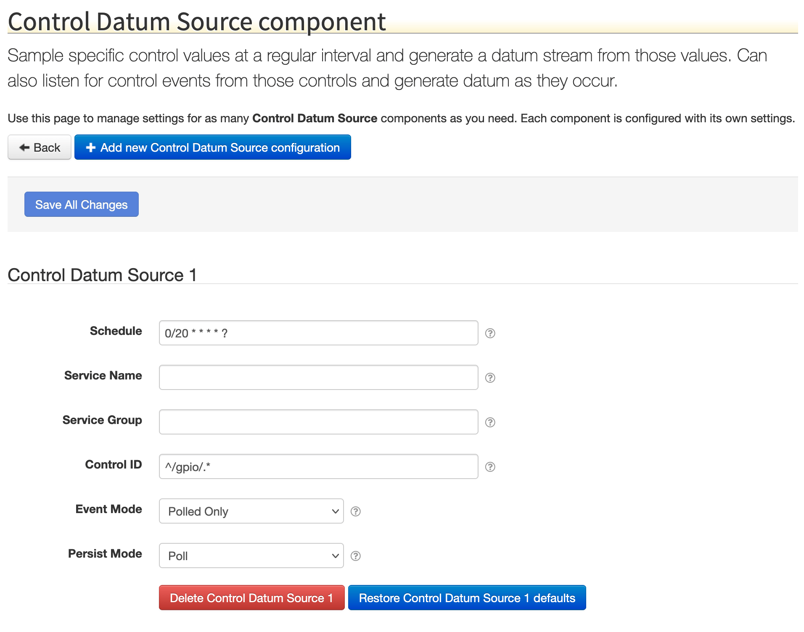

# SolarNode Control Event Datum Logger

This SolarNode plugin provides a component that can generate a datum stream from SolarNode control
values.

The datum generated by this component will use the control's ID value for the datum source ID. For
the control value, if the control defines a specific property name the generated datum will have a
status property with the same name. Otherwise the generated datum will have a status property `val`,
and if the control has a number value an instantaneous property `v` will also be created.

# Install

The plugin can be installed via the **Plugins** page on your SolarNode. It appears under the
**Datum** category as **Control Datum Source**. Once installed, a **Control Datum Source**
component will become available.

# Configuration

Each service configuration contains the following settings:

| Setting               | Description  |
|:----------------------|:-------------|
| Service Name          | A unique name to identify this data source with.                                 |
| Service Group         | A group name to associate this data source with.                                 |
| Control ID            | A regular expression to filter control ID values by, or left blank to generate datum for all control IDs. |
| Mode                  | A control event type to filter by. |

## Control Mode

The **Mode** setting allows you to configure which control events are turned into datum objects:

| Mode | Description |
|:-----|:------------|
| Sampled | Emitted when some plugin reads (samples) a control value. |
| Changed | Emitted when a plugin writes (changes) a control value.   |
| Sampled and changed | Generate datum from both **Sampled** and **Changed** control events. |
