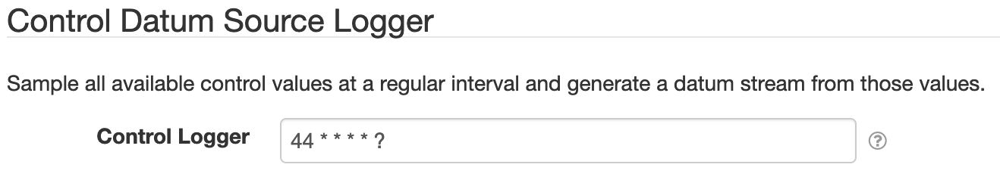

# SolarNode Controls Datum Data Source

This project provides SolarNode plugin that can collect data from all available controls
configured in SolarNode.

# Install

The plugin can be installed via the **Plugins** page on your SolarNode. It appears under the
**Datum** category as **Controls Datum Data Source**. Once installed, a 
**Controls Data Source** service will become available.

# Configuration

Each service configuration contains the following settings:

| Setting               | Description  |
|:----------------------|:-------------|
| Control Logger        | A [cron expression][cron-exp] to sample control values at. |

[cron-exp]: https://github.com/SolarNetwork/solarnetwork/wiki/SolarNode-Cron-Job-Syntax
