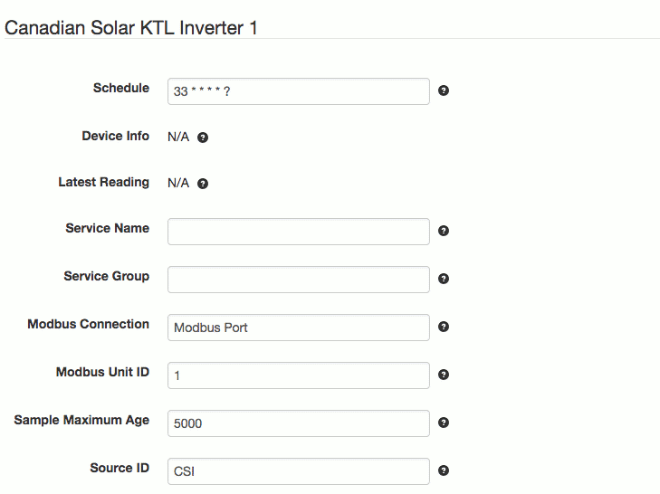

# SolarNode CanadianSolar 50KTL-CT Series Inverter Datum Source

This project provides SolarNode plugin that can collect data from
CanadianSolar CSI-50KTL-CT series inverters.



# Install

The plugin can be installed via the **Plugins** page on your SolarNode. It appears under the
**Datum** category as **CanadianSolar KTL-CT Inverter Data Source**.

# Datum structure

This datum generates a [datum stream][datum] with the following properties:

| Property | Class | Units | Description |
|:---------|:------|:------|:------------|
| `ambientTemp`      | `i` | C | Ambient temperature |
| `apparentPower`    | `i` | VA | Apparent power |
| `current_a`        | `i` | A | AC current, phase A |
| `current_b`        | `i` | A | AC current, phase B |
| `current_c`        | `i` | A | AC current, phase C |
| `dcPower`          | `i` | W | DC output power |
| `dcPower1`         | `i` | W | DC module 1 output power |
| `dcPower2`         | `i` | W | DC module 2 output power |
| `dcPower3`         | `i` | W | DC module 3 output power |
| `dcVoltage`        | `i` | V | DC voltage |
| `dcVoltage1`       | `i` | V | DC module 1 voltage |
| `dcVoltage2`       | `i` | V | DC module 2 voltage |
| `dcVoltage3`       | `i` | V | DC module 3 voltage |
| `efficiency`       | `i` | % | Efficiency rating (0-1) |
| `events`           | `s` | bit set | Base-10 bit set of [SunSpec-compatible event codes](#sunspec-event-codes) |
| `fault0`           | `s` | bit set | Base-10 bit set of [Fault codes](#fault-codes) (0-15) |
| `fault1`           | `s` | bit set | Base-10 bit set of [Fault codes](#fault-codes) (16-31, offset -15) |
| `fault2`           | `s` | bit set | Base-10 bit set of [Fault codes](#fault-codes) (32-47, offset -32) |
| `frequency`        | `i` | Hz | AC frequency |
| `opState`          | `s` | enum | [Device Operating State][opstate] code |
| `permFault`        | `s` | bit set | Base-10 bit set of [Permanent fault codes](#permanent-fault-codes) |
| `reactivePower`    | `i` | VAR | Reactive power |
| `temp`             | `i` | C | Internal temperature |
| `temp_heatSink`    | `i` | C | Heatsink temperature |
| `temp_transformer` | `i` | C | Transformer temperature |
| `vendorEvents`     | `s` | bit set | Base-16 bit set of all active [Fault codes](#fault-codes) |
| `voltage_a`        | `i` | V | AC voltage, phase A-N |
| `voltage_b`        | `i` | V | AC voltage, phase B-N |
| `voltage_c`        | `i` | V | AC voltage, phase C-N |
| `voltage_ab`       | `i` | V | AC voltage, phase A-B |
| `voltage_bc`       | `i` | V | AC voltage, phase B-C |
| `voltage_ca`       | `i` | V | AC voltage, phase C-A |
| `warn`             | `s` | bit set | Base-10 bit set of [Warning codes](#warning-codes) |
| `wattHours`        | `a` | Wh | Lifetime energy |
| `watts`            | `i` | W | Active power total |

Here is an example datum, expressed in simplified JSON form:

```json
{
	"created": "2023-03-16 19:46:43.195Z",
	"nodeId": 123,
	"sourceId": "/INV/1",
	"localDate": "2023-03-16",
	"localTime": "15:46",
	"temp": 44.8,
	"watts": 45800,
	"frequency": 60,
	"ambientTemp": 36.7,
	"apparentPower": 45800,
	"dcPower1": 15408.629,
	"dcPower2": 15491.25,
	"dcPower3": 15212.35,
	"dcVoltage1": 634.1,
	"dcVoltage2": 637.5,
	"dcVoltage3": 636.5,
	"dcPower": 15409,
	"current_a": 52.5,
	"current_b": 52.6,
	"current_c": 52.8,
	"dcVoltage": 636.0333,
	"voltage_a": 291.2,
	"voltage_b": 293,
	"voltage_c": 290,
	"efficiency": 0.0988,
	"voltage_ab": 505.5,
	"voltage_bc": 502.6,
	"voltage_ca": 503.1,
	"reactivePower": 3300,
	"wattHours": 600613000
}
```

# Use

Once installed, a new **CanadianSolar KTL-CT Series Inverter** component will appear on the
**Settings** page on your SolarNode. Click on the **Manage** button to configure devices. You'll
need to add one configuration for each device you want to collect data from.

## Overall device settings

Each device configuration contains the following overall settings:

| Setting            | Description                                                                      |
|--------------------|----------------------------------------------------------------------------------|
| Schedule           | A cron schedule that determines when data is collected.                          |
| Service Name       | A unique name to identify this data source with.                                 |
| Service Group      | A group name to associate this data source with.                                 |
| Modbus Connection  | The service name of the Modbus port to use.                                      |
| Modbus Unit ID     | The ID of the Modbus device to collect data from, from 1 - 255.                  |
| Sample Maximum Age | A minimum time to cache captured Modbus data, in milliseconds.                   |
| Source ID          | The SolarNetwork source ID to assign to captured datum.                          |

## Overall device settings notes

<dl>
	<dt>Modbus Port</dt>
	<dd>This is the <i>service name</i> of the Modbus component configured elsewhere
	in SolarNode. You must configure that component with the proper connection settings
	for your Modbus network, configure a unique service name on that component, and then
	enter that same service name here.</dd>
	<dt>Source ID</dt>
	<dd>This value unique identifies the data collected from this device, by this node,
	 on SolarNetwork. Each configured device should use a different value.</dd>
	<dt>Sample Maximum Age</dt>
	<dd>SolarNode will cache the data collected from the device for at least
	this amount of time before refreshing data from the device again. Some devices
	do not refresh their values more than a fixed interval, so this setting can be
	used to avoid reading data unnecessarily. This setting also helps in highly
	dynamic configurations where other plugins request the current values from
	the device frequently.</dd>
</dl>

# Warning codes

The `warn` property is an enumeration of the following possible values:


| Index | Name       | Description                            |
|:------|:-----------|:---------------------------------------|
| 0     | `Warn0010` | External fan alarm                     |
| 1     | `Warn0020` | Internal fan alarm                     |
| 2     | `CommErr`  | Comm error                             |
| 3     | `Warn0030` | EEPROM fault                           |
| 4     | `Warn0040` | DC side lightning protection exception |
| 5     | `Warn0050` | Temperature sensor anomaly             |
| 6     | `Warn0060` | Warn0060                               |
| 7     | `Warn0070` | AC side MOV anomaly                    |
| 8     | `Warn0080` | Warn0080                               |
| 9     | `Warn0090` | Warn0090                               |
| 10    | `Warn0100` | Warn0100                               |
| 11    | `Warn0110` | Warn0110                               |
| 12    | `Warn0120` | Warn0120                               |
| 13    | `Warn0130` | Warn0130                               |
| 14    | `Warn0140` | Warn0140                               |
| 15    | `Warn0150` | Warn0150                               |


# Permanent fault codes

The `permFault` property is an enumeration of the following possible values:

| Index | Name        | Description                                   |
|:------|:------------|:----------------------------------------------|
| 0     | `Fault0130` | Bus sum high fault                            |
| 1     | `Fault0120` | 3.3V voltage low                              |
| 2     | `Fault0110` | Bus differential high fault                   |
| 3     | `Fault0100` | Relay fault                                   |
| 4     | `Fault0090` | Steady state GFCI fault                       |
| 5     | `Fault0080` | Bst hardware overcurrent fault                |
| 6     | `Fault0070` | DCI too high fault                            |
| 7     | `Fault0060` | Bus hardware overvoltage fault                |
| 8     | `Fault0050` | Inverter hardware overcurrent fault           |
| 9     | `Fault0040` | Permanent fault of driver source              |
| 10    | `Fault0030` | Fault0030                                     |
| 11    | `Fault0020` | Fault0020                                     |
| 12    | `Fault0010` | Permanent fault of power module               |
| 13    | `Fault0140` | Internal hardware failure                     |
| 14    | `Fault0150` | Open loop self detection failure              |
| 15    | `Fault0160` | Control board voltage and drive power failure |

# Fault codes

The `vendorEvents` property is a bit set of the following possible values:

| Index | Name                        | Description                              |
|:------|:----------------------------|:-----------------------------------------|
| 0     | `Protect0090`               | BUS sum high                             |
| 1     | `Protect0080`               | Protect0080                              |
| 2     | `Protect0070`               | BUS difference is high                   |
| 3     | `Protect0060`               | Bus Soft start time out                  |
| 4     | `Protect0050`               | Inverter Soft start time out             |
| 5     | `PVVoltageOver`             | PV voltage over limit                    |
| 6     | `Protect0040`               | PV1 High current                         |
| 7     | `GridVoltageOutsideLimit07` | Grid line voltage over limit             |
| 8     | `GridVoltageOutsideLimit08` | Grid phase voltage over limit            |
| 9     | `Protect0030`               | Inverter current too high                |
| 10    | `GridFrequencyOutsideLimit` | High frequency of power grid             |
| 11    | `GridVoltageOutsideLimit11` | Low frequency of power grid              |
| 12    | `GridVoltageOutsideLimit12` | Out of phase                             |
| 13    | `Protect0020`               | Grid connected relay protection          |
| 14    | `TempOver`                  | Over temperature protection              |
| 15    | `Protect0010`               | Inverter current bias                    |
| 16    | `Protect0190`               | Protect0190                              |
| 17    | `Protect0180`               | DCI current bias                         |
| 18    | `Protect0170`               | DCI High current                         |
| 19    | `IsolationErr`              | Insulation impedance is too low          |
| 20    | `GFCIErr`                   | Leakage current is too high              |
| 21    | `Protect0160`               | Frequency selective anomaly              |
| 22    | `PVReverse`                 | PV reverse                               |
| 23    | `Protect0150`               | MCU Protect                              |
| 24    | `Protect0140`               | Inverter hardware over current           |
| 25    | `GridVoltageOutsideLimit09` | Unbalanced grid voltage                  |
| 26    | `Protect0270`               | Protect0270                              |
| 27    | `Protect0130`               | Inverter current imbalance               |
| 28    | `Protect0120`               | Power module protection                  |
| 29    | `ACContErr`                 | AC cont error                            |
| 30    | `Protect0110`               | Bus hardware over voltage                |
| 31    | `Protect0100`               | Leakage current sensor fault             |
| 32    | `Protect0200`               | Protect0200                              |
| 33    | `Protect0210`               | Internal hardware exception              |
| 34    | `Protect0220`               | Input / output power mismatch            |
| 35    | `PV2Reverse`                | PV2 reverse connection                   |
| 36    | `Protect0240`               | PV2 input over current                   |
| 37    | `PV2VoltageOver`            | PV2 voltage is too high                  |
| 38    | `Protect0260`               | Anomal PV source input                   |
| 39    | `Protect0230`               | Turn on the inverter Open loop detection |
| 40    | `GFDIErr`                   | GFDI error                               |
| 41    | `PV1Reverse`                | PV1 input reverse connection             |
| 42    | `PV1VoltageOver`            | PV1 voltage is too high                  |
| 43    | `PV3Reverse`                | PV3 input reverse connection             |
| 44    | `PV3VoltageOver`            | PV3 voltage is too high                  |
| 45    | `Protect0300`               | Protect0300                              |
| 46    | `Protect0290`               | Protect0290                              |
| 47    | `EmergencyStp`              | Emergency stop                           |

# SunSpec event codes

This plugin will map specific fault codes into the SunSpec `events` property:

| Fault | Name | Event | Inverter Model Event |
|:------|:-----|:------|:---------------------|
| 5     | `PVVoltageOver`             | 1  | `DcOverVoltage` |
| 7     | `GridVoltageOutsideLimit07` | 10 | `AcOverVoltage` |
| 8     | `GridVoltageOutsideLimit08` | 10 | `AcOverVoltage` |
| 25    | `GridVoltageOutsideLimit09` | 10 | `AcOverVoltage` |
| 10    | `GridFrequencyOutsideLimit` | 8  | `OverFrequency` |
| 11    | `GridVoltageOutsideLimit11` | 9  | `UnderFrequency` |
| 13    | `Protect0020`               | 2  | `AcDisconnect` |
| 14    | `TempOver`                  | 7  | `OverTemperature` |
| 30    | `Protect0110`               | 1  | `DcOverVoltage` |
| 33    | `Protect0210`               | 15 | `HwTestFailure` |
| 37    | `PV2VoltageOver`            | 1  | `DcOverVoltage` |
| 42    | `PV1VoltageOver`            | 1  | `DcOverVoltage` |
| 44    | `PV3VoltageOver`            | 1  | `DcOverVoltage` |
| 47    | `EmergencyStp`              | 6  | `ManualShutdown` |

[datum]: https://github.com/SolarNetwork/solarnetwork/wiki/SolarNet-API-global-objects#datum
[opstate]: https://github.com/SolarNetwork/solarnetwork/wiki/SolarNet-API-global-objects#standard-device-operating-states
