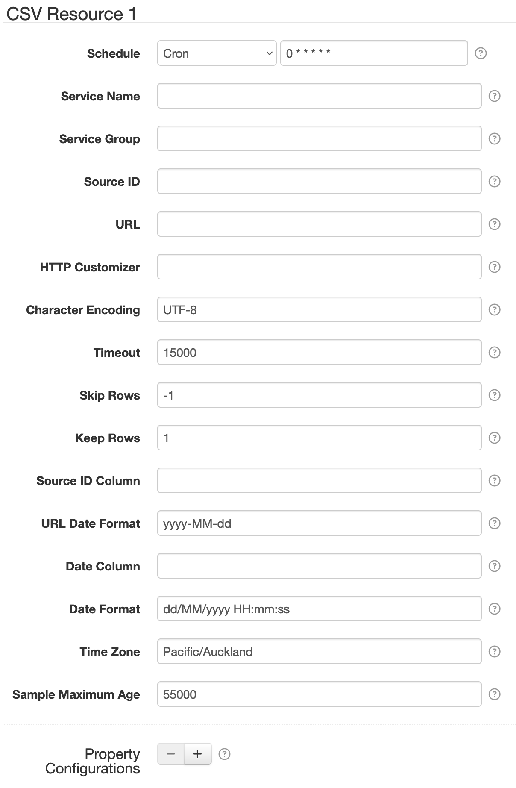
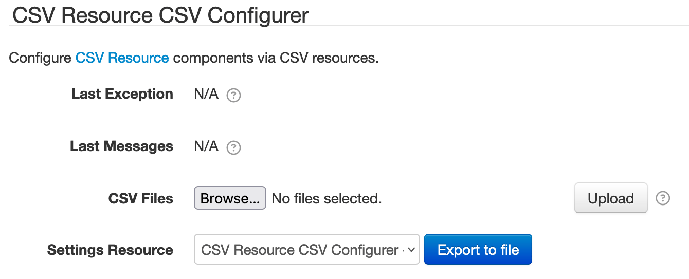
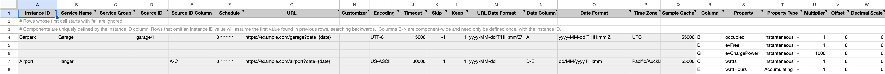
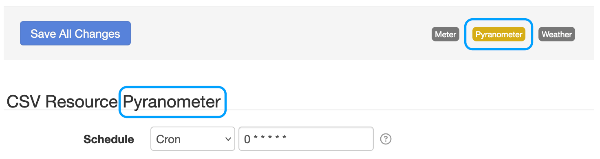
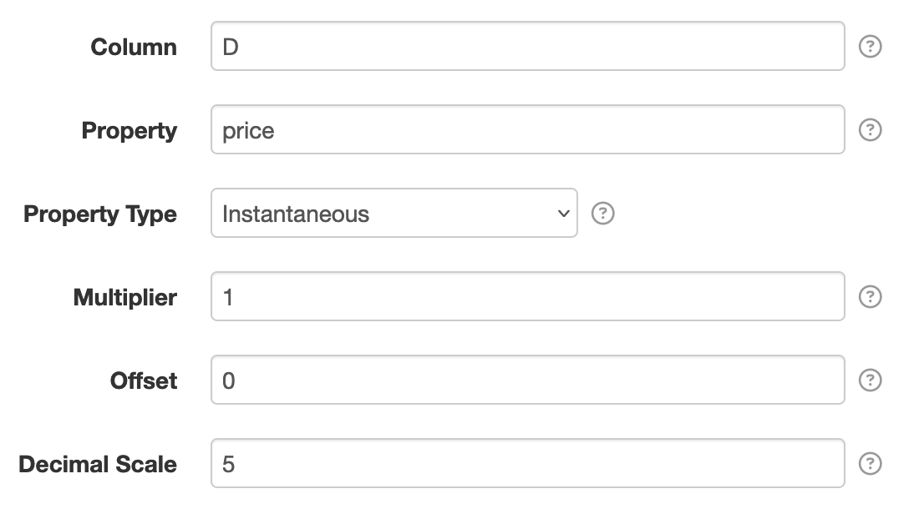
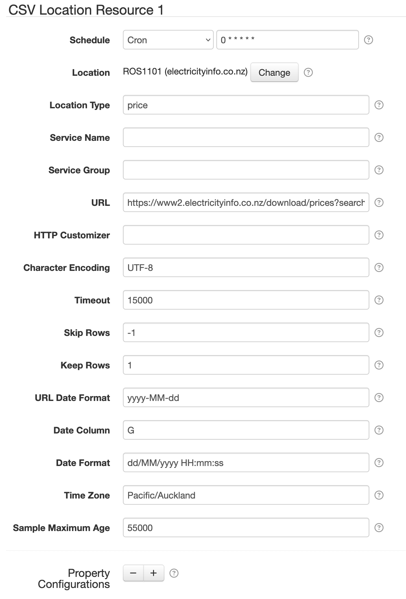
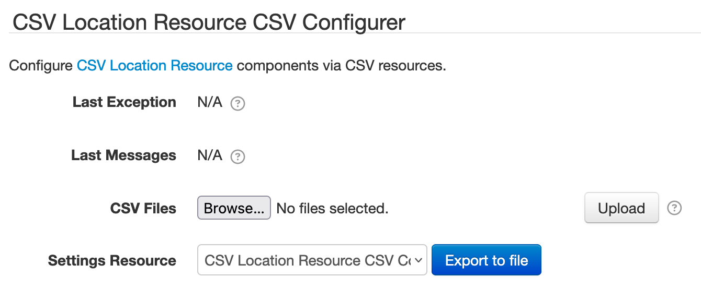

# SolarNode CSV Resource Datum Source

This project provides SolarNode plugin that can collect data from URLs returning
comma-separated-value (CSV) data, either as a node or location datum stream.



# Install

The plugin can be installed via the **Plugins** page on your SolarNode. It appears under the
**Datum** category as **CSV Datum Source**.


# Use

Once installed, new [**CSV Resource**](#csv-resource)  and [**CSV Location
Resource**](#csv-location-resource) components will appear on the **Settings** page on your SolarNode.
Click on the **Manage** button to configure components. You'll need to add one configuration for
each CSV lookup you want to collect data from.


# CSV Column References

All CSV column reference settings accept a list of column ranges. When more than one column is
configured, then all column values are joined together with a ` ` (space) character to form a single
final value.

A column can be referenced as a number, starting from `1`, or a letter, starting from `A` (common
in spreadsheet applications). After `Z` comes `AA`, `AB`, `AC`, and so on.

A range of columns can be referenced using a `-` (dash) delimiter. For example `1-3` means columns
1, 2, and 3 will be included. Similarly `A-C` would include the same columns. Letters and numbers
can be freely mixed. For example `1-C` would include the same columns. The letters are also
case-insensitive, so `a-c` would include the same columns.

Multiple columns, or ranges of columns, can be referenced using a `,` (comma) delimiter. For example
`1,3` means columns 1 and 3 would be included. Similarly `A,C` would include the same columns. A
more complex example of `1,F-H,3` would include columns 1, 6, 7, 8, and 3. The order of the
references are preserved when joining the columns together with a ` ` (space) character.


# CSV Configurers

This plugin also provides [**CSV Resource CSV Configurer**](#csv-resource-configurer) and [**CSV
Location Resource CSV Configurer**](#csv-location-resource-configurer) components; these will appear
on the main settings page. These components let you upload a CSV Configuration file to configure all
CSV [Location] Resource components, without having to use the settings form.


# CSV Resource

The CSV Resource component collects CSV data as a **node** datum stream. See [CSV Location
Resource](#csv-location-resource) if you need to collect a **location** datum stream.

## CSV Resource Configurer




### CSV Resource CSV Configuration Format

The CSV Resource CSV Configurer uses the column structure detailed
[below](#csv-resource-csv-column-definition), with each row representing an individual datum
property to read from the CSV data. A header row is required. Comment lines are allowed, just start
the line with a `#` character (i.e. the first cell value). The entire comment line will be ignored.

Here's an example screen shot of a configuration in a spreadsheet application. It is for two components:

 1. Resource `Carpark` with 3 datum properties: `occupied`, `evFree`, and `evChargePower`
 2. Resource `Airport` with 2 datum properties: `watts` and `wattHours`

Spreadsheet applications generally allow you to export sheets in the CSV format, which can
then be loaded into SolarNode via the CSV Resource CSV Configurer.



### Instance identifiers

Individual CSV Resource components are defined by the first column (**Instance ID**). You can
assign any identifier you like (such as `Meter`, `Inverter`, and so on) or configure as a single
dash character `-` to have SolarNode assign a simple number identifier. Once an Instance ID has been
assigned on a given row, subsequent rows will use that value if the corresponding cell value is left
empty.

Here's an example of how 3 custom instance IDs `Meter`, `Pyranometer`, and `Weather` appear in the
SolarNode UI, with the `Pyranometer` component selected:



### CSV Resource CSV column definition

The following table defines all the CSV columns used by CSV Resource CSV Configuration. Columns
**A - Q** apply to the **entire CSV Resource configuration**, and only the values from the row that
defines a new [Instance ID](#instance-identifiers) will be used to configure the component. Thus you can omit the values from
these columns when defining more than one property for a given component.

Columns **S - W** define the mapping of CSV columns to datum properties: each row defines an
individual datum property.

| Col | Name | Type | Default | Description |
|:----|:-----|:-----|:--------|:------------|
| `A` | **Instance ID** | string |  | The unique identifier for a single CSV Resource component. Can specify `-` to automatically assign a simple number value, which will start at `1`. |
| `B` | **Service Name** | string |  | An optional service name to assign to the component. |
| `C` | **Service Group** | string |  | An optional service group to assign to the component. |
| `D` | **Source ID** | string |  | The SolarNetwork datum source ID to use for the datum stream generated by this component configuration. |
| `E` | **Source ID Column** | string |  | The [CSV column reference](#csv-column-references) to use for the source ID, in preference to the **Source ID** setting. |
| `F` | **Schedule** | string | `0 * * * * *` | The schedule at which to poll the resource for data. Can be either a [cron][sn-cron-syntax] value or a millisecond frequency. |
| `G` | **URL** | string |  | The URL of the resource to fetch. A `{date}` parameter is supported, which will be replaced by the formatted request date. |
| `H` | **HTTP Customizer** | string |  | The **Service Name** of a HTTP Request Customizer service to apply to HTTP requests. This can be used to supply authentication credentials. |
| `I` | **Character Encoding** | string | `UTF-8` | The text encoding of the CSV resource, as a [RFC 2278](http://www.ietf.org/rfc/rfc2278.txt) value. For example `UTF-8`, `US-ASCII`, `ISO-LATIN-1`. |
| `J` | **Timeout** | integer | `15000` | A network timeout, in milliseconds. |
| `K` | **Skip Rows** | integer | `-1` |  The number of CSV rows to skip. This is useful for skipping a "header" row. If negative, then return rows from the end of the data. For example `-1` would return the last row. |
| `L` | **Keep Rows** | integer | `1` |  The number of CSV rows to turn into datum. Each row becomes a datum. |
| `M` | **URL Date Format** | string | `yyyy-MM-dd` | The [date format][datepat] to format the `{date}` URL parameter. |
| `N` | **Date Column** | string |  |  The [CSV column reference](#csv-column-references) to parse the datum timestamp from. |
| `O` | **Date Format** | string | `dd/MM/yyyy HH:mm:ss` | The [date format][datepat] to use for parsing the **Date Column** value. |
| `P` | **Time Zone** | string |  | The time zone to use when parsing and formatting dates. If omitted then use the system time zone of the node. |
| `Q` | **Sample Maximum Age** | integer | `55000` | A maximum time to cache captured CSV data, in milliseconds. |
| `R` | **Column** | string |  | The [CSV column reference](#csv-column-references) to read as a datum property value. |
| `S` | **Property** | string |  | The name of the datum property to save the **Column** value as. |
| `T` | **Property Type** | enum | `Instantaneous` | The datum property type: one of `Instantaneous`, `Accumulating`, `Status`, or `Tag`. |
| `U` | **Multiplier** | decimal | `1` | For numeric data types, a multiplier to apply to the CSV value to normalize it into a standard unit. |
| `V` | **Offset** | decimal | `0` | For numeric data types, a value to add to the CSV value to normalize it into a standard unit. |
| `W` | **Decimal Scale** | integer | `0` | For numeric data types, a maximum number of decimal places to round decimal numbers to, or `-1` to not do any rounding. |

### CSV Resource Example CSV

Here is the CSV as shown in the example configuration screen shot above (comments have been
removed for brevity):

```csv
Instance ID,Service Name,Service Group,Source ID,Source ID Column,Schedule,URL,Customizer,Encoding,Timeout,Skip,Keep,URL Date Format,Date Column,Date Format,Time Zone,Sample Cache,Column,Property,Property Type,Multiplier,Offset,Decimal Scale
Carpark,Garage,,garage/1,,0 * * * * *,https://example.com/garage?date={date},,UTF-8,15000,-1,1,yyyy-MM-dd'T'HH:mm'Z',A,yyyy-MM-dd'T'HH:mm'Z',UTC,55000,B,occupied,Instantaneous,1,0,0
,,,,,,,,,,,,,,,,,D,evFree,Instantaneous,1,0,0
,,,,,,,,,,,,,,,,,G,evChargePower,Instantaneous,1000,0,0
Airport,Hangar,,,A-C,0 * * * * *,https://example.com/airport?date={date},,US-ASCII,30000,1,1,yyyy-MM-dd,D-E,dd/MM/yyyy HH:mm,Pacific/Auckland,55000,C,watts,Instantaneous,1,0,0
,,,,,,,,,,,,,,,,,E,wattHours,Accumulating,1,0,0
```

## CSV Resource Settings

Each CSV Resource configuration contains the following settings:

| Setting            | Description |
|--------------------|-------------|
| Schedule           | A cron schedule that determines when data is collected.  |
| Service Name       | A unique name to identify this data source with. |
| Service Group      | A group name to associate this data source with. |
| Source ID          | The SolarNetwork unique source ID to assign to datum collected from this component. |
| URL                | The URL of the CSV resource to fetch. The following parameters are allowed: `{date}` the current date, formatted using the **URL Date Format** setting. |
| HTTP Customizer    | The **Service Name** of a HTTP Request Customizer service to apply to HTTP requests. This can be used to supply authentication credentials. |
| Character Encoding | The text encoding of the CSV resource, as a [RFC 2278](http://www.ietf.org/rfc/rfc2278.txt) value. For example `UTF-8`, `US-ASCII`, `ISO-LATIN-1`. |
| Timeout            | A network timeout, in milliseconds. |
| Skip Rows          | The number of CSV rows to skip. This is useful for skipping a "header" row. If negative, then return rows from the end of the data. For example `-1` would return the last row. |
| Keep Rows          | The number of CSV rows to turn into datum. Each row becomes a datum. |
| Source ID Column   | If configured, then extract the datum source ID from this CSV column. See [CSV Column References](#csv-column-references) for the allowed syntax. |
| URL Date Format    | The [date format][datepat] to format the `{date}` URL parameter. |
| Date Column        | The CSV column to parse the datum timestamp from. See [CSV Column References](#csv-column-references) for the allowed syntax. |
| Date Format        | The [date format][datepat] to use for parsing the **Date Column** value. |
| Time Zone          | The time zone to use when parsing and formatting dates. |
| Sample Maximum Age      | A maximum time to cache captured CSV data, in milliseconds. |
| Property Configurations | A list of CSV row property settings. Any number of property configurations can be added, to capture any number of CSV columns. |

## CSV Resource Property Settings

You must configure settings for each datum property you want to collect from each component. You can
configure as many property settings as you like, using the <kbd>+</kbd> and <kbd>-</kbd> buttons to
add/remove property configurations.



Each CSV Resource property configuration contains the following settings:

| Setting         | Description |
|:----------------|:------------|
| Column          | The [CSV column reference](#csv-column-references) to read. |
| Property        | The name of the datum property to save the CSV value as. |
| Property Type   | The type of datum property to use. |
| Multiplier      | For numeric data types, a multiplier to apply to the CSV value to normalize it into a standard unit. |
| Offset          | For numeric data types, an offset to add to the CSV value to normalize it into a standard unit. |
| Decimal Scale   | For numeric data types, a maximum number of decimal places to round decimal numbers to, or `-1` to not do any rounding. |


# CSV Location Resource

The CSV Location Resource component collects CSV data as a **location** datum stream. See [CSV
Resource](#csv-resource) if you need to collect a **node** datum stream.



## CSV Location Resource Configurer

The CSV Location Resource Configurer is similar to the [CSV Resource Configurer](#csv-resource-configurer):



### CSV Location Resource CSV column definition

The CSV Location Resource CSV column definition is similar to the
[CSV Resource CSV column definition](#csv-resource-csv-column-definition). Only the following
columns are different:

| Col | Name | Type | Default | Description |
|:----|:-----|:-----|:--------|:------------|
| `D` | **Location** | string |  | The SolarNetwork location to associate the collected data with. See [Locations](#locations) for more information. |
| `E` | **Location Type** | string |  | A supported SolarNetwork location type, for example `price` or `weather`. |

## CSV Location Resource Settings

Each configuration is very similar to the [CSV Resource Settings](#csv-resource-settings). There are
no **Source ID** or **Source ID Column** settings, because those are provided by the configured
**Location**. The following additional settings are available:

| Setting            | Description |
|--------------------|-------------|
| Location           | The SolarNetwork location to associate the collected data with. See [Locations](#locations) for more information.  |
| Location Type      | A supported SolarNetwork location type, for example `price` or `weather`.  |

## Locations

The **Location** and **Location Type** settings are used to associate the data with a SolarNetwork
location datum stream. These locations must be created by SolarNetwork administrators. The
**Location** setting will allow you to search for available locations. You can also use the [Find
location datum metadata API][loc-meta-list] to search for locations. You can use the [Location
Request API][loc-req] to request a new location if a suitable one does not exist already.


[expr]: https://github.com/SolarNetwork/solarnetwork/wiki/Expression-Languages
[datepat]: https://docs.oracle.com/en/java/javase/11/docs/api/java.base/java/time/format/DateTimeFormatter.html#patterns
[ExpressionRoot]: https://github.com/SolarNetwork/solarnetwork-node/tree/develop/net.solarnetwork.node.datum.modbus/src/net/solarnetwork/node/datum/modbus/ExpressionRoot.java
[GeneralNodeDatum]: https://github.com/SolarNetwork/solarnetwork-node/blob/develop/net.solarnetwork.node/src/net/solarnetwork/node/domain/GeneralNodeDatum.java
[loc-meta-list]: https://github.com/SolarNetwork/solarnetwork/wiki/SolarQuery-API#find-location-datum-metadata
[loc-req]: https://github.com/SolarNetwork/solarnetwork/wiki/SolarUser-Location-Request-API
[ModbusData]: https://github.com/SolarNetwork/solarnetwork-node/blob/develop/net.solarnetwork.node.io.modbus/src/net/solarnetwork/node/io/modbus/ModbusData.java
[meta-api]: https://github.com/SolarNetwork/solarnetwork/wiki/SolarQuery-API#add-node-datum-metadata
[metadata-key-path]: https://github.com/SolarNetwork/solarnetwork/wiki/SolarNet-API-global-objects#metadata-filter-key-paths
[regex]: https://docs.oracle.com/en/java/javase/11/docs/api/java.base/java/util/regex/Pattern.html#sum
[sn-cron-syntax]: https://github.com/SolarNetwork/solarnetwork/wiki/SolarNode-Cron-Job-Syntax
[sn-expressions]: https://github.com/SolarNetwork/solarnetwork/wiki/SolarNode-Expressions
