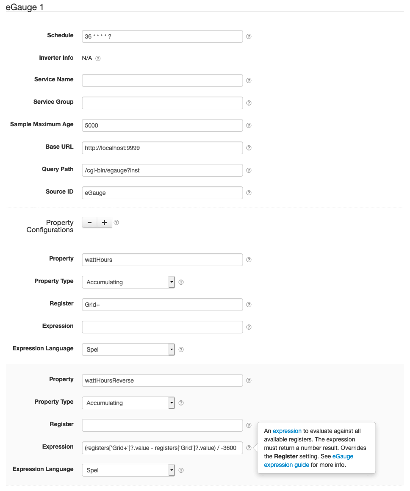

# eGauge Datum Source

This project provides SolarNode plugin that can collect data from eGauge devices that support the
eGauge XML web service API. 



# Install

The plugin can be installed via the **Plugins** page on your SolarNode. It appears under the
**Datum** category as **eGauge Datum Source**.

# Use

Once installed, a new **eGauge** component will appear on the **Settings** page on your SolarNode.
Click on the **Manage** button to configure devices. You'll need to add one configuration for each
eGauge device you want to collect data from.

## Overall device settings

Each device configuration contains the following overall settings:

| Setting            | Description                                                                      |
|--------------------|----------------------------------------------------------------------------------|
| Schedule           | A cron schedule that determines when data is collected.                          |
| Service Name       | A unique name to identify this data source with.                                 |
| Service Group      | A group name to associate this data source with.                                 |
| Sample Maximum Age | A minimum time to cache captured device data, in milliseconds.                   |
| Base URL           | The base URL for the eGauge web service, for example `http://10.150.2.161`.      |
| Query Path         | The path for the eGauge web service, relative to **Base URL**, for example `/cgi-bin/egauge?inst`. |
| Source ID          | The SolarNetwork unique source ID to assign to datum collected from this device. |

## Overall device settings notes

<dl>
	<dt>Sample Maximum Age</dt>
	<dd>SolarNode will cache the data collected from the Modbus device for at least
	this amount of time before refreshing data from the device again. Some devices
	do not refresh their values more than a fixed interval, so this setting can be
	used to avoid reading data unnecessarily. This setting also helps in highly
	dynamic configurations where other plugins request the current values from
	the device frequently.</dd>
	<dt>Source ID</dt>
	<dd>This value unique identifies the data collected from this device, by this node,
	 on SolarNetwork. Each configured device should use a different value.</dd>
</dl>

## Datum property settings

You must configure settings for each datum property you want to collect from each device.
You can configure as many property settings as you like, using the <kbd>+</kbd> and <kbd>-</kbd>
buttons to add/remove property configurations.

Each property configuration contains the following settings:

| Setting             | Description |
|---------------------|-------------|
| Property            | The name of the datum property to save the eGauge value as. |
| Property Type       | The type of datum property to use. |
| Register            | The name of the eGauge register to read from, unless an **Expression** is configured. |
| Expression          | An [expression](#expressions) to evaluate against all available registers. |
| Expression Language | The expression language to write **Expression** in. |

## Datum property settings notes

<dl>
	<dt>Property</dt>
	<dd>Property names represent what the associated data value is, and SolarNetwork
	has many standardized names that you should consider using. For example the
	<a href="https://github.com/SolarNetwork/solarnetwork-node/blob/master/net.solarnetwork.node/src/net/solarnetwork/node/domain/EnergyDatum.java">EnergyDatum</a>
	class defines properties such as <code>watts</code> and <code>wattHours</code>
	for electrical energy. See <a href="https://github.com/SolarNetwork/solarnetwork/wiki/SolarNet-API-global-objects#standard-property-names">Standard property names</a>
	for more info.</dd>
	<dt>Property Type</dt>
	<dd>Each property must be categorized as <code>Accumulating</code>, <code>Instantaneous</code>,
	or <code>Status</code>. <b>Accumulating</b> is used for properties that record
	a value that accumulates over time, such as <code>wattHours</code> captured from
	a power meter. <b>Instantaneous</b> is used for properties that capture values
	that record independent values over time, such as <code>watts</code>. <b>Status</b>
	is used for non-numeric values such as string status messages.</dd>
	<dt>Expression</dt>
	<dd>The expression must return a number result. Overrides the <b>Register</b> setting.
	See <a href="#expressions">Expressions</a> for more info.</dd>
</dl>

## Expressions

Since version **1.1** properties can be defined using [expressions][expr].

## Example

Given XML like the following:

```xml
<data serial="0x273157db">
  <ts>1549290708</ts>
  <r t="P" n="Grid"><v>291302316124</v><i>-59450</i></r>
  <r t="P" n="Grid+"><v>22927481554</v><i>0</i></r>
  <r t="P" n="Solar"><v>267538727526</v><i>77823</i></r>
  <r t="P" n="Solar+"><v>274845613848</v><i>77823</i></r>
</data>
```

Then here are some example expressions:

| Expression | Result |
|:-----------|:-------|
| `registers['Grid']?.instant` | `-59450` |
| `(registers['Grid+']?.value - registers['Grid']?.value) / -3600` | `74548565` |


## Root object

The root object is a [ExpressionRoot][ExpressionRoot] object, which has the following properties:

| Property | Type | Description |
|:---------|:-----|:------------|
| `data` | `List<DataRegister>` | A list of [`DataRegister`](#dataregister-object) objects, one for each register captured from the eGauge device. |
| `registers` | `Map<String,DataRegister>` | A mapping of register names to associated [`DataRegister`](#dataregister-object) objects. |

## `DataRegister` object

A [DataRegister][DataRegister] object represents the data captured from a single eGauge register,
and has the following properties:

| Property | Type | Description |
|:---------|:-----|:------------|
| `name` | `String` | The register name, for example `Grid`. |
| `type` | `String` | The register type, for example `P`. |
| `runtimeType` | `String` | The `@rt` attribute, e.g. `total`. |
| `value` | `Number` | The `<v>` register value. |
| `instant` | `Number` | The `<i>` register value. |


[expr]: https://github.com/SolarNetwork/solarnetwork/wiki/Expression-Languages
[ExpressionRoot]: https://github.com/SolarNetwork/solarnetwork-node/blob/develop/net.solarnetwork.node.datum.egauge.ws/src/net/solarnetwork/node/datum/egauge/ws/client/ExpressionRoot.java
[DataRegister]: https://github.com/SolarNetwork/solarnetwork-node/blob/develop/net.solarnetwork.node.datum.egauge.ws/src/net/solarnetwork/node/datum/egauge/ws/client/DataRegister.java
