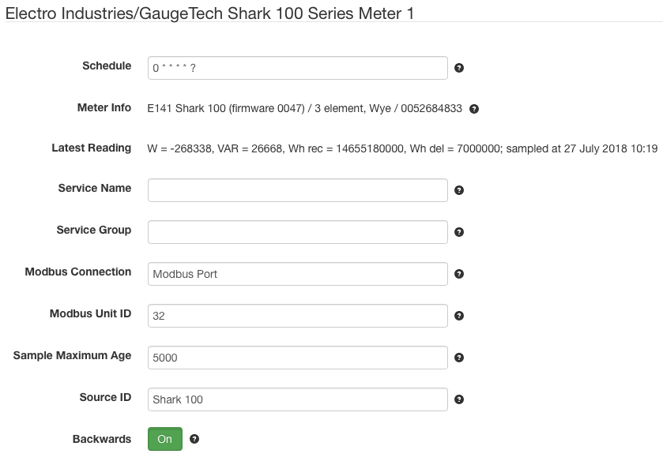

# SolarNode Electro Industries/GaugeTech Shark 100 Series Power Meter Datum Source

This project provides SolarNode plugin that can collect data from the Electro
Industries/GaugeTech Shark 100 series power meters.

# Install

The plugin can be installed via the **Plugins** page on your SolarNode. It
appears under the **Datum** category as **Electro Industries/GaugeTech Shark 
100 Meter Data Source**.

# Use

Once installed, a new **Electro Industries/GaugeTech Shark 100 Series Meter**
component will appear on the **Settings** page on your SolarNode. Click on the
**Manage** button to configure devices. You'll need to add one configuration
for each Modbus device you want to collect data from.

## Overall device settings

Each device configuration contains the following overall settings:

| Setting            | Description                                                                      |
|--------------------|----------------------------------------------------------------------------------|
| Schedule           | A cron schedule that determines when data is collected.                          |
| Service Name       | A unique name to identify this data source with.                                 |
| Service Group      | A group name to associate this data source with.                                 |
| Modbus Connection  | The service name of the Modbus port to use.                                      |
| Modbus Unit ID     | The ID of the Modbus device to collect data from, from 1 - 255.                  |
| Sample Maximum Age | A minimum time to cache captured Modbus data, in milliseconds.                   |
| Source ID          | The SolarNetwork source ID to assign to captured datum.                          |
| Backwards          | Toggle to treat energy delivered as `wattHoursReverse` instead of `wattHours`    |

## Overall device settings notes

<dl>
	<dt>Modbus Port</dt>
	<dd>This is the <i>service name</i> of the Modbus component configured elsewhere
	in SolarNode. You must configure that component with the proper connection settings
	for your Modbus network, configure a unique service name on that component, and then
	enter that same service name here.</dd>
	<dt>Source ID</dt>
	<dd>This value unique identifies the data collected from this device, by this node,
	 on SolarNetwork. Each configured device should use a different value.</dd>
	<dt>Sample Maximum Age</dt>
	<dd>SolarNode will cache the data collected from the Modbus device for at least
	this amount of time before refreshing data from the device again. Some devices
	do not refresh their values more than a fixed interval, so this setting can be
	used to avoid reading data unnecessarily. This setting also helps in highly
	dynamic configurations where other plugins request the current values from
	the device frequently.</dd>
	<dt>Backwards</dt>
	<dd>Normally this plugin maps the <i>energy delivered</i> value to the <code>wattHours</code>
	datum property and <i>energy received</i> to <code>wattHoursReverse</code>. Enable this to instead
	map <i>energy delivered</i> to <code>wattHoursReverse</code> and <i>energy received</i>
	to <code>wattHours</code>.</dd>
</dl>
