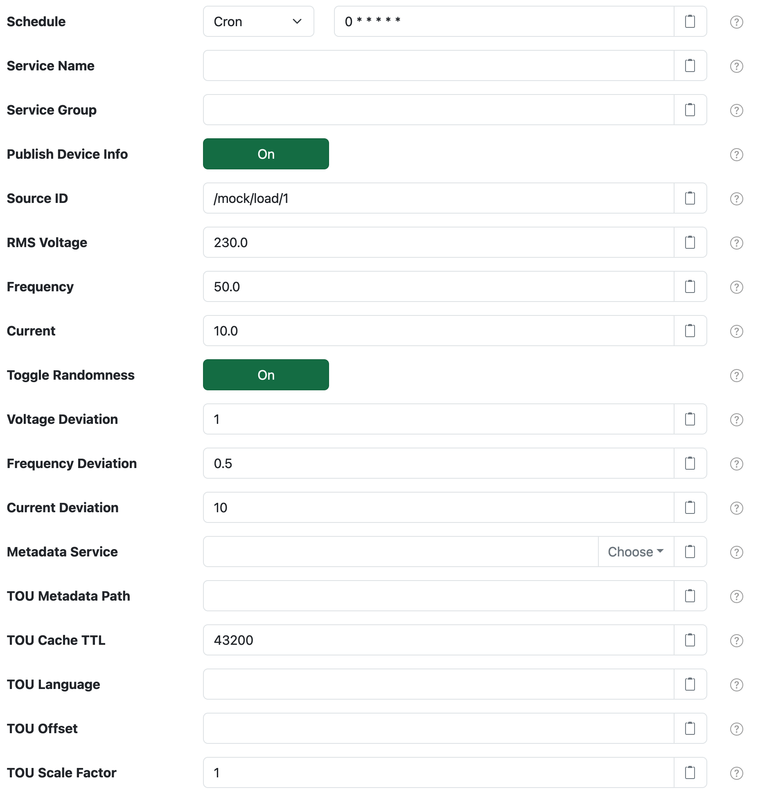
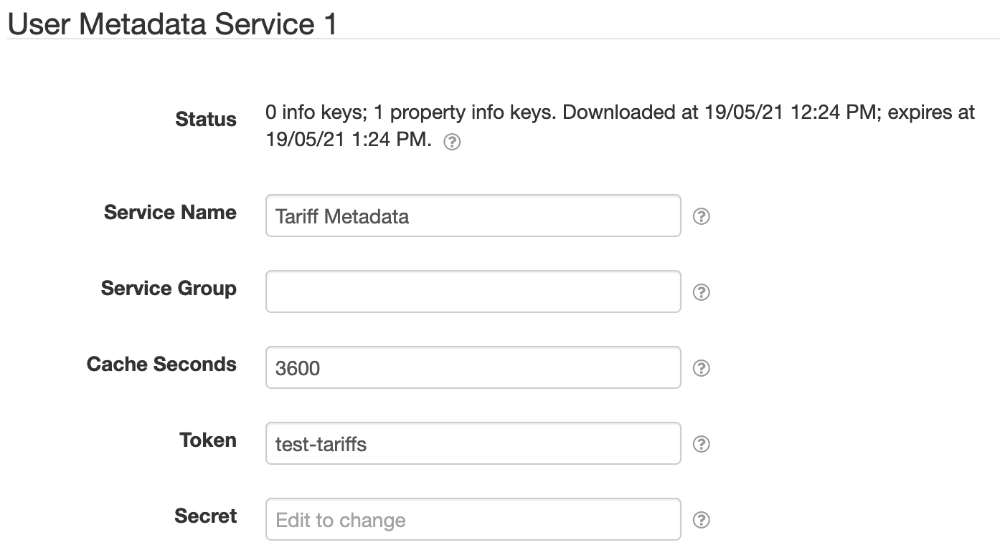
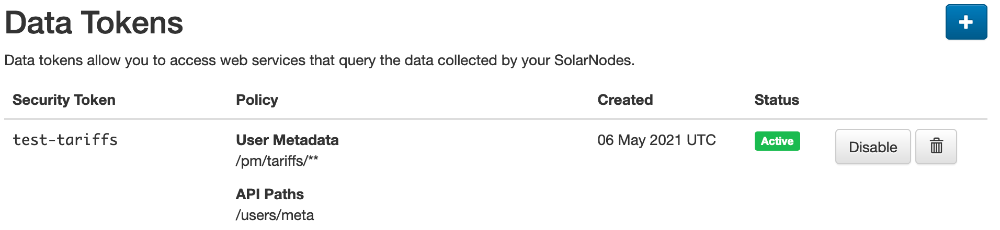

# SolarNode Mock Power Meter Datum Source

This project provides SolarNode plugin that pretends to collect data from 
a power meter. It is designed for developers to use, when testing SolarNode
components.



# Use

Once installed, a new **Mock Power Meter Datum Source** component will
appear on the **Settings** page on your SolarNode. Click on the **Manage**
button to configure devices. You'll need to add one configuration for each
mock device you want to generate data from.

# Settings

Each configuration contains the following overall settings:

| Setting              | Description |
|----------------------|-------------|
| Schedule             | A cron schedule that determines when data is collected. |
| Service Name         | A unique name to identify this data source with. |
| Service Group        | A group name to associate this data source with. |
| Source ID            | The SolarNetwork unique source ID to assign to datum collected from this device. |
| RMS Voltage          | RMS of the power supply, in volts. |
| Frequency            | Frequency of power supply, in Hz. |
| Current              | Current of the power supply, in A. |
| Toggle Randomness    | When enabled, apply random deviation to votage, frequency, and current values, limited by the various **Deviation** settings. |
| Voltage Deviation    | The +- maximum amount of randomness to apply to the voltage value. |
| Frequency Deviation  | The +- maximum amount of randomness to apply to the frequency value. |
| Current Deviation    | The +- maximum amount of randomness to apply to the current value. |
| Inductance Deviation | The +- maximum amount of randomness to apply to the inductance value. |
| Metadata Service     | The **Service Name** of the Metadata Service to obtain the tariff schedule from. See [Metadata Service](#metadata-service) for more information. |
| TOU Metadata Path    | The metadata path that will resolve the tariff schedule from the configured **Metadata Service**. See [Tariff schedule format](#tariff-schedule-format) for more information. |
| TOU Cache TTL        | The amount of seconds to cache the tariff schedule obtained from the configured **Metadata Service**. |
| TOU Language         | A IETF BCP 47 language tag to parse the tariff data with. If not configured then the default system language will be assumed. |
| TOU Offset           | A number of **hours** to add to the current time when resolving TOU rules. |
| TOU Scale Factor     | A multiplication factor to apply to the resolved TOU schedule rates. |


# Metadata Service

SolarNode provides **Node Metadata Service** and **User Metadata Service** components that this datum source
can use for the **Metadata Service** setting. This allows you to configure the tariff schedule as either
node or user metadata in SolarNetwork and then SolarNode will download the schedule and use it as needed.

The **Node Metadata Service** does not require any configuration to use (its **Service Name** is simply
`Node Metadata Service`), but the **User Metadata Service** requires setting up.



You must configure a SolarNetwork security token to use the User Metadata Service. We recommend that
you create a **Data** security token in SolarNetwork with a limited security policy that includes an
**API Path** of just `/users/meta` and a **User Metadata Path** of something granular like
`/pm/tariffs/**`. This will give SolarNode access to just the tariff metadata under the
`/pm/tariffs` metadata path.



The [SolarNetwork API Explorer][api-explorer] can be used to add the necessary tariff schedule
metadata to your account. For example:


# Tariff schedule format

The tariff schedule obtained from the configured **Metadata Service** uses a simple CSV-based format
that can be easily exported from a spreadsheet. Each row represents a rule that includes:

 * a set of time constraints that must be satisfied for the rule to be applied
 * a **power** rate to be used as the meter power value when the rule matches

The schedule consists of 4 time constraint columns followed by a power rate column. Each
constraint is represented as a range, in the form `start - end`. Multiple ranges can be specified by
adding a `,` between each range (see [Range sets](#range-sets) below). Whitespace is allowed around the
`-` character. If the `start` and `end` are the same, the range may be shortened to just `start`. A
range can be left empty to represent **all values**. The time constraint columns are:

| Column | Constraint | Description |
|:-------|:-----------|:------------|
| 1      | Month range | An inclusive month range. Months can be specified as numbers (1-12) or abbreviations (Jan-Dec) or full names (January - December). When using text names case does not matter and they will be parsed using the **TOU Lanauage** setting. |
| 2      | Day range | An inclusive day-of-month range. Days are specified as numbers (1-31). |
| 3      | Weekday range | An inclusive day-of-week range. Weekdays can be specified as numbers (1-7) with Monday being `1` and Sunday being `7`, or abbreviations (Mon-Sun) or full names (Monday - Sunday). When using text names case does not matter and they will be parsed using the **TOU Lanauage** setting. |
| 4      | Time range | An **inclusive - exclusive** time-of-day range. The time can be specified as whole hour numbers (0-24) or `HH:MM` style (`00:00` - `24:00`). |
| 5      | Power | The power output of the meter. Linear iterpolation will be applied if the **Time range** is specified in every rule, so the actual power value generated scales between the current rule's power value and the next rule's power value. |

## Range sets

All range values can be specified as a comma-delimited set of ranges, so disparate ranges can be used.
For example a Month range could be specified as `Jan-Mar,Oct-Dec` to represent the overall set of months
including January, February, March, October, November, and December.

## Example schedule

Here's an example schedule with 4 rules and a single **TOU** rate (the `*` stands for **all values**):

| Rule  | Month   | Day | Weekday | Time | Power |
|:------|:--------|:----|:--------|:-----|------:|
| **1** | Jan-Dec | *   | Mon-Fri | 0-8  |  9000 |
| **2** | Jan-Dec | *   | Mon-Fri | 8-24 |  5000 |
| **3** | Jan-Dec | *   | Sat-Sun | 0-8  |  2000 |
| **4** | Jan-Dec | *   | Sat-Sun | 8-24 |   500 |


In CSV format the schedule would look like this:

```csv
Month,Day,Weekday,Time,Power
Jan-Dec,,Mon-Fri,0-8,9000
Jan-Dec,,Mon-Fri,8-24,5000
Jan-Dec,,Sat-Sun,0-8,2000
Jan-Dec,,Sat-Sun,8-24,500
```

When encoding into SolarNetwork metadata JSON, that same schedule would look like this when saved
at the `/pm/tariffs/schedule` path:

```json
{
  "pm": {
    "tariffs": {
      "schedule": "Month,Day,Weekday,Time,TOU\nJan-Dec,,Mon-Fri,0-8,10.48\nJan-Dec,,Mon-Fri,8-24,11.00\nJan-Dec,,Sat-Sun,0-8,9.19\nJan-Dec,,Sat-Sun,8-24,11.21"
    }
  }
}
```

[api-explorer]: https://go.solarnetwork.net/dev/api/
