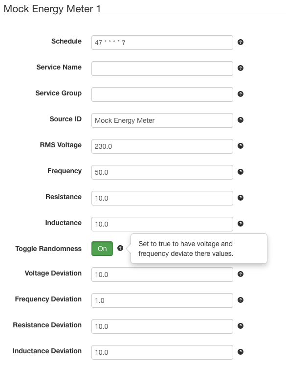

# SolarNode Mock Power Meter Datum Source

This project provides SolarNode plugin that pretends to collect data from 
a power meter. It is designed for developers to use, when testing SolarNode
components.

# Install

The plugin is meant for developers and can be manually installed.

# Use

Once installed, a new **Schneider Electric PM5100 Series Meter** component will
appear on the **Settings** page on your SolarNode. Click on the **Manage**
button to configure devices. You'll need to add one configuration for each
Modbus device you want to collect data from.

## Overall device settings

Each device configuration contains the following overall settings:

| Setting              | Description |
|----------------------|-------------|
| Schedule             | A cron schedule that determines when data is collected. |
| Service Name         | A unique name to identify this data source with. |
| Service Group        | A group name to associate this data source with. |
| Source ID            | The SolarNetwork unique source ID to assign to datum collected from this device. |
| RMS Voltage          | RMS of the power supply, in volts. |
| Frequency            | Frequency of mock AC power supply, in Hz. |
| Resistance           | Resistance of the circuit, in Ohms. |
| Inductance           | Inductance of the circuit, in mirco Henry. |
| Toggle Randomness    | When enabled, apply random deviation to votage, frequency, resistance, and inductance values. |
| Voltage Deviation    | The maximum amount of randomness to apply to the voltage value. |
| Frequency Deviation  | The maximum amount of randomness to apply to the frequency value. |
| Resistance Deviation | The maximum amount of randomness to apply to the resistance value. |
| Inductance Deviation | The maximum amount of randomness to apply to the inductance value. |

## Overall device settings notes

<dl>
	<dt>Toggle Randomness</dt>
	<dd>When this is <b>disabled</b> then the values produced by this data source will be constant.
	    When this is <b>enabled</b> then the values will have a randomness applied to them, limited
	    by the various <code>Deviation</code> settings.</dd>
</dl>
