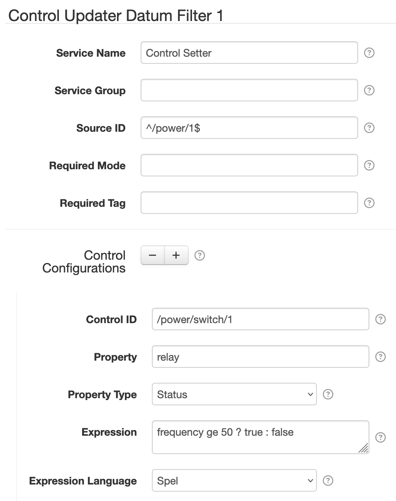

# SolarNode Control Updater Datum Filter

This component can update controls with the result of an expression, optionally populating the
expression result as a datum property.

# Use

Once installed, a new **Control Updater Datum Filter** component will appear on the
**Settings > Datum Filter** page on your SolarNode. Click on the **Manage** button to configure
filters.

The screen shot shows a filter that would toggle the `/power/switch/1` control on/off based on the
`frequency` property in the `/power/1` datum stream: on when the frequency is 50 or higher, off
otherwise.

# Settings

Each filter configuration contains the following overall settings:

| Setting            | Description                                                       |
|:-------------------|:------------------------------------------------------------------|
| Service Name       | A unique ID for the filter, to be referenced by other components. |
| Service Group      | An optional service group name to assign.                         |
| Source ID          | The source ID(s) to filter.                                       |
| Required Mode      | If configured, an [operational mode](https://github.com/SolarNetwork/solarnetwork/wiki/SolarNode-Operational-Modes) that must be active for this filter to be applied. |
| Required Tag       | Only apply the filter on datum with the given tag. A tag may be prefixed with <code>!</code> to invert the logic so that the filter only applies to datum **without** the given tag. Multiple tags can be defined using a `,` delimiter, in which case **at least one** of the configured tags must match to apply the filter. |
| Control Configurations | A list of control expression configurations. |

Each control configuration contains the following settings:

| Setting             | Description                                                       |
|:--------------------|:------------------------------------------------------------------|
| Control ID          | The ID of the control to update with the expression result. Placeholders are supported, including a `sourceId` placeholder for the source ID of the datum being filtered. |
| Property            | The optional datum property to store the expression result in. |
| Property Type       | The datum property type to use. |
| Expression          | The expression to evaluate. See [below](#expressions) for more info. |
| Expression Language | The [expression language][expr] to write **Expression** in. |

## Settings notes

 * **Source ID** — This is a case-insensitive [regular expression][regex] pattern to match against
   datum source ID values. If omitted then datum for _all_ source ID values will be filtered,
   otherwise only datum with _matching_ source ID values will be filtered.

## Expressions

See the [SolarNode Expressions][node-expr] guide for general expressions reference. The root object
is a [`DatumExpressionRoot`][DatumExpressionRoot] that lets you treat all datum properties, and
filter parameters, as expression variables directly.

[expr]: https://github.com/SolarNetwork/solarnetwork/wiki/Expression-Languages
[DatumExpressionRoot]: https://github.com/SolarNetwork/solarnetwork-common/blob/develop/net.solarnetwork.common/src/net/solarnetwork/domain/DatumExpressionRoot.java
[node-expr]: https://github.com/SolarNetwork/solarnetwork/wiki/SolarNode-Expressions
[regex]: https://docs.oracle.com/en/java/javase/11/docs/api/java.base/java/util/regex/Pattern.html#sum
