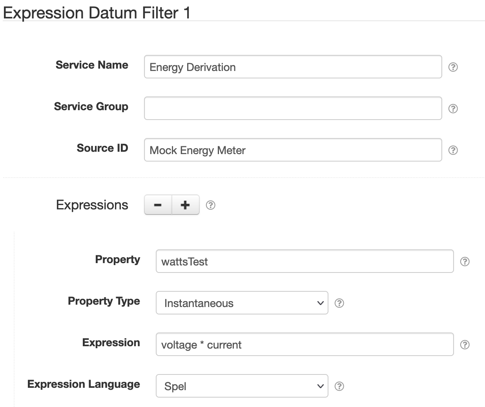

# SolarNode Expression Datum Filter

This component provides a way to generate new properties by evaluating expressions against existing
properties.

# Use

Once installed, a new **Expression Datum Filter** component will appear on the 
**Settings > Datum Filter** page on your SolarNode. Click on the **Manage** button to configure 
filters.

# Settings

Each filter configuration contains the following overall settings:

| Setting            | Description                                                       |
|:-------------------|:------------------------------------------------------------------|
| Service Name       | A unique ID for the filter, to be referenced by other components. |
| Service Group      | An optional service group name to assign. |
| Source ID          | The source ID(s) to filter. |
| Required Mode      | If configured, an [operational mode](https://github.com/SolarNetwork/solarnetwork/wiki/SolarNode-Operational-Modes) that must be active for this filter to be applied. |
| Expressions        |  A list of expression configurations that are evaluated to derive datum property values from other property values. |

Use the <kbd>+</kbd> and <kbd>-</kbd> buttons to add/remove expression configurations.

## Expression settings

Each expression configuration contains the following settings:

| Setting             | Description                                                       |
|:--------------------|:------------------------------------------------------------------|
| Property            | The datum property to store the expression result in. |
| Property Type       | The datum property type to use. |
| Expression          | The expression to evaluate. See [below](#expressions) for more info. |
| Expression Language | The [expression language][expr] to write **Expression** in. |

# Expressions

The root object is a [`DatumExpressionRoot`][DatumExpressionRoot] that lets you
treat all datum properties, and filter parameters, as expression variables directly, along with
the following properties:

| Property | Type | Description |
|:---------|:-----|:------------|
| `datum` | `Datum` | A [`Datum`][Datum] object, populated with data from all property and virtual meter configurations. |
| `props` | `Map<String,Object>` | Simple Map based access to the properties in `datum`, and transform parameters, to simplify expressions. |

The following methods are available:

| Function | Arguments | Result | Description |
|:---------|:----------|:-------|:------------|
| `has(name)` | `String` | `boolean` | Returns `true` if a property named `name` is defined. |
| `hasLatest(source)` | `String` | `boolean` | Returns `true` if a datum with source ID `source` is available via the `latest(source)` function. |
| `latest(source)` | `String` | [`DatumExpressionRoot`][DatumExpressionRoot] for the latest available datum matching the given source ID, or `null` if not available. |

## Expression examples

Assuming a datum sample with properties like the following:

| Property | Value |
|:---------|:------|
| `current` | `7.6`   |
| `voltage` | `240.1` |
| `status`  | `Error` |

Then here are some example expressions and the results they would produce:

| Expression | Result | Comment |
|:-----------|:-------|:--------|
| `voltage * current` | `1824.76` | Simple multiplication of two properties. |
| `props['voltage'] * props['current']` | `1824.76` | Another way to write the previous expression. Can be useful if the property names contain non-alphanumeric characters, like spaces. |
| `has('frequency') ? 1 : null` | `null` | Uses the `?:` _if/then/else_ operator to evaluate to `null` because the `frequency` property is not available. When an expression evaluates to `null` then no property will be added to the output samples. |
| `current > 7 or voltage > 245 ? 1 : null` | `1` | Uses comparison and logic operators to evaluate to `1` because `current` is greater than `7`. |
| `voltage * currrent * (hasLatest('battery') ? 1.0 - latest('battery')['soc'] : 1)` | `364.952` | Assuming a `battery` datum with a `soc` property value of `0.8` then the expression resolves to `7.6 * 241.0 * (1.0 - 0.8)`. |

[expr]: https://github.com/SolarNetwork/solarnetwork/wiki/Expression-Languages
[DatumExpressionRoot]: https://github.com/SolarNetwork/solarnetwork-common/blob/develop/net.solarnetwork.common/src/net/solarnetwork/domain/DatumExpressionRoot.java
[Datum]: https://github.com/SolarNetwork/solarnetwork-common/blob/develop/net.solarnetwork.common/src/net/solarnetwork/domain/datum/Datum.java
