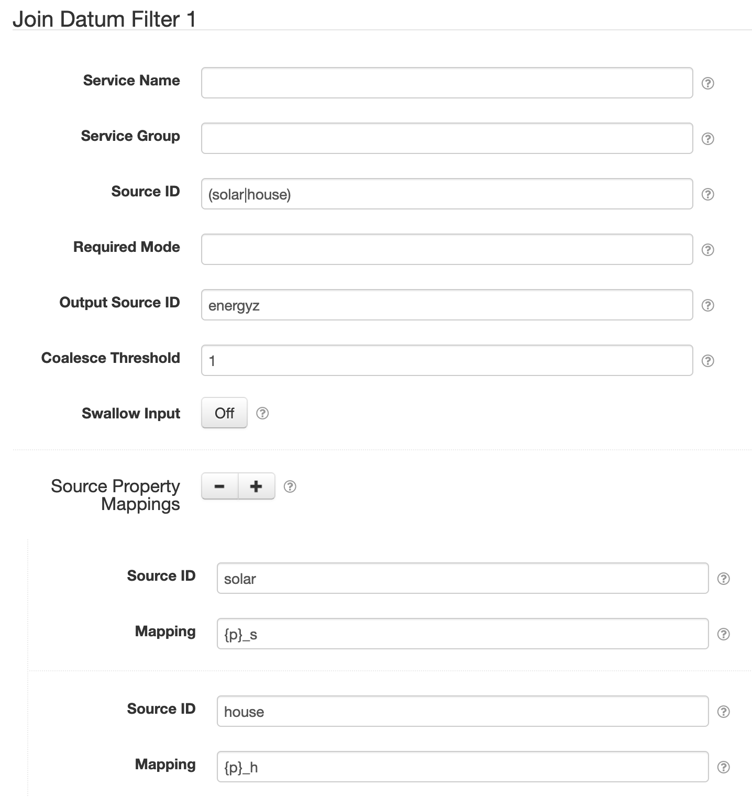

# SolarNode Join Datum Filter

This component provides a way to merge the properties of multiple datum streams into a new derived
datum stream.

# Use

Once installed, a new **Join Datum Filter** component will appear on the **Settings > Datum Filter**
page on your SolarNode. Click on the **Manage** button to configure filters.

# Settings

Each filter configuration contains the following overall settings:

| Setting             | Description                                                       |
|:--------------------|:------------------------------------------------------------------|
| Service Name        | A unique ID for the filter, to be referenced by other components. |
| Service Group       | An optional service group name to assign. |
| Source ID           | The source ID(s) to filter. |
| Required Mode       | If configured, an [operational mode][opmodes] that must be active for this filter to be applied. |
| Output Source ID    | The source ID of the merged datum stream. [Placeholders][placeholders] are allowed. |
| Coalesce Threshold  | When `2` or more then wait until datum from this many _different_ source IDs have been encountered before generating an output datum. Once a coalesced datum has been generated the tracking of input sources resets and another datum will only be generated after the threshold is met again. If `1` or less, then generate output datum for all input datum. |
| Swallow Input       | If enabled, then filter out input datum after merging. Otherwise leave the input datum as-is. |
| Source Property Mappings |  A list of source IDs with associated property name templates to rename the properties with. Each template must contain a `{p}` parameter which will be replaced by the property names merged from datum encountered with the associated source ID. For example `{p}_s1` would map an input property `watts` to `watts_s1`. |

Use the <kbd>+</kbd> and <kbd>-</kbd> buttons to add/remove expression configurations.

## Source Property Mappings settings

Each source property mapping configuration contains the following settings:

| Setting             | Description                                                       |
|:--------------------|:------------------------------------------------------------------|
| Source ID           | A source ID pattern to apply the associated **Mapping** to. Any _capture groups_ (parts of the pattern between `()` groups) are provided to the **Mapping** template. |
| Mapping             | A property name template with a `{p}` parameter for an input property name to be mapped to a merged (output) property name. Pattern _capture groups_ from **Source ID** are available starting with `{1}`. For example `{p}_s1` would map an input property `watts` to `watts_s1`. |

> :warning: **Note** that if a matching source property mapping does not exist for an input datum 
  source ID then the property names of that datum are used as-is.

### Source mapping examples

The **Source ID** pattern can define _capture groups_ that will be provided to the **Mapping** template as numbered parameters, starting with `{1}`. For example, assuming an input datum property `watts`, then:

| Datum Source ID | Source ID Pattern | Mapping | Result |
|:----------------|:------------------|:--------|:-------|
| `/power/main`   | `/power/`         | `{p}_main` | `watts_main` |
| `/power/1`      | `/power/(\d+)$`   | `{p}_s{1}` | `watts_s1` |
| `/power/2`      | `/power/(\d+)$`   | `{p}_s{1}` | `watts_s2` |
| `/solar/1`      | `/(\w+)/(\d+)$`   | `{p}_{1}{2}` | `watts_solar1` |

[opmodes]: https://github.com/SolarNetwork/solarnetwork/wiki/SolarNode-Operational-Modes
[placeholders]: https://github.com/SolarNetwork/solarnetwork/wiki/SolarNode-Placeholders
