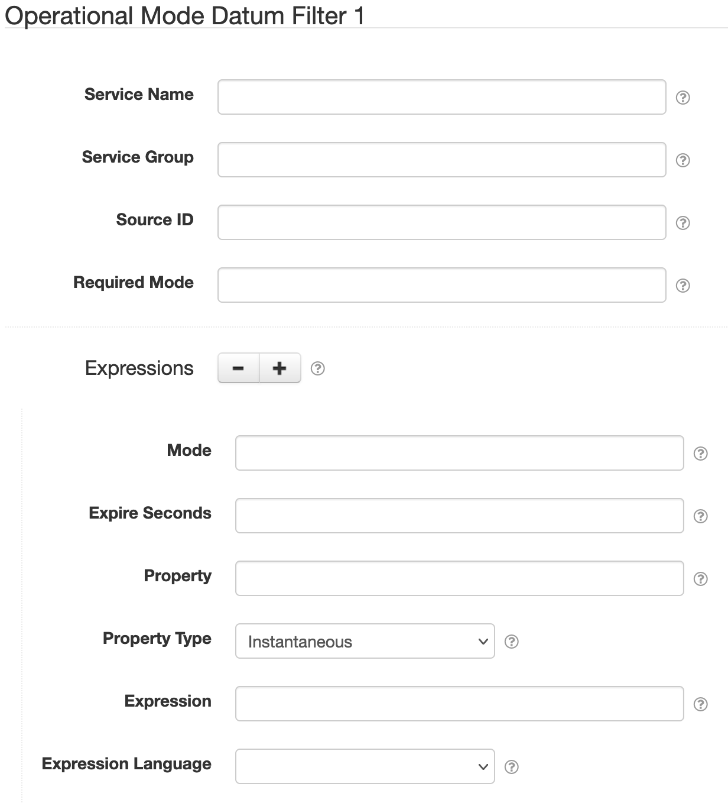

# SolarNode Operational Mode Datum Filter

This component provides a way to evaluate expressions to toggle [operational modes][opmodes]. When
an expression evaluates to `true` the associated operational mode is activated. When an expression
evaluates to `false` the associated operational mode is deactivated.

# Use

Once installed, a new **Operational Mode Datum Filter** component will appear on the 
**Settings > Datum Filter** page on your SolarNode. Click on the **Manage** button to configure 
filters.

# Settings

Each filter configuration contains the following overall settings:

| Setting             | Description                                                       |
|:--------------------|:------------------------------------------------------------------|
| Service Name        | A unique ID for the filter, to be referenced by other components. |
| Service Group       | An optional service group name to assign. |
| Source ID           | The source ID(s) to filter. |
| Required Mode       | If configured, an [operational mode][opmodes] that must be active for this filter to be applied. |
| Required Tag        | Only apply the filter on datum with the given tag. A tag may be prefixed with <code>!</code> to invert the logic so that the filter only applies to datum **without** the given tag. Multiple tags can be defined using a `,` delimiter, in which case **at least one** of the configured tags must match to apply the filter. |
| Expressions         |  A list of expression configurations that are evaluated to toggle operational modes. |

Use the <kbd>+</kbd> and <kbd>-</kbd> buttons to add/remove expression configurations.

## Expression settings

Each expression configuration contains the following settings:

| Setting             | Description                                                       |
|:--------------------|:------------------------------------------------------------------|
| Mode                | The operational mode to toggle. |
| Expire Seconds      | If configured and greater than `0`, the number of seconds after activating the operational mode to automatically deactivate it. If not configured or `0` then the operational mode will be deactivated when the expression evaluates to `false`. See [below](#expire-setting) for more information. |
| Property            | If configured, the datum property to store the expression result in. See [below](#property-setting) for more information. |
| Property Type       | The datum property type to use if **Property** is configured. See [below](#property-setting) for more information. |
| Expression          | The expression to evaluate. See [below](#expressions) for more info. |
| Expression Language | The [expression language][expr] to write **Expression** in. |

### Expire setting

When configured the expression will **never deactivate the operational mode directly**. When
evaluating the given expression, if it evaluates to `true` the mode will be activated and configured
to deactivate after this many seconds. If the operation mode was already active, the expiration will
be **extended** by this many seconds.

This configuration can be thought of like a time out as used on motion-detecting lights: each time
motion is detected the light is turned on (if not already on) and a timer set to turn the light off
after so many seconds of no motion being detected.

Note that the operational modes service might actually deactivate the given mode a short time
**after** the configured expiration.

### Property setting

A property does not have to be populated. If you provide a **Property** name to populate, the value
of the datum property depends on property type configured:

| Type          | Description |
|:--------------|:------------|
| Instantaneous | The property value will be `1` or `0` based on `true` and `false` expression results. |
| Status        | The property will be the expression result, so `true` or `false`. |
| Tag           | A tag named as the configured property will be added if the expression is `true`, or removed if `false`. |

# Expressions

See the [SolarNode Expressions][node-expr] guide for general expressions reference. The expression
must evaluate to  a **boolean** (`true` or `false`) result. When it evaluates to `true` the
configured operational mode will be **activated**. When it evaluates to `false` the operational mode
will be **deactivated** (unless an [expire setting](#expire-setting) has been configured).

The root object is a [datum samples expression object][DatumSamplesExpressionRoot] that lets you
treat all datum properties, and filter parameters, as expression variables directly, along with
the following properties:

| Property | Type | Description |
|:---------|:-----|:------------|
| `datum` | `GeneralNodeDatum` | A [`GeneralNodeDatum`][GeneralNodeDatum] object, populated with data from all property and virtual meter configurations. |
| `props` | `Map<String,Object>` | Simple Map based access to the properties in `datum`, and transform parameters, to simplify expressions. |

The following methods are available:

| Function | Arguments | Result | Description |
|:---------|:----------|:-------|:------------|
| `has(name)` | `String` | `boolean` | Returns `true` if a property named `name` is defined. |

## Expression examples

Assuming a datum sample with properties like the following:

| Property | Value |
|:---------|:------|
| `current` | `7.6`   |
| `voltage` | `240.1` |
| `status`  | `Error` |

Then here are some example expressions and the results they would produce:

| Expression | Result | Comment |
|:-----------|:-------|:--------|
| `voltage * current > 1800` | `true` | Since `voltage * current` is **1824.76**, the expression is `true`. |
| `status != 'Error'` | `false` | Since `status` is `Error` the expression is `false`. |

[expr]: https://github.com/SolarNetwork/solarnetwork/wiki/Expression-Languages
[DatumSamplesExpressionRoot]: https://github.com/SolarNetwork/solarnetwork-common/blob/develop/net.solarnetwork.common/src/net/solarnetwork/domain/DatumSamplesExpressionRoot.java
[GeneralNodeDatum]: https://github.com/SolarNetwork/solarnetwork-node/blob/develop/net.solarnetwork.node/src/net/solarnetwork/node/domain/GeneralNodeDatum.java
[node-expr]: https://github.com/SolarNetwork/solarnetwork/wiki/SolarNode-Expressions
[opmodes]: https://github.com/SolarNetwork/solarnetwork/wiki/SolarNode-Operational-Modes
