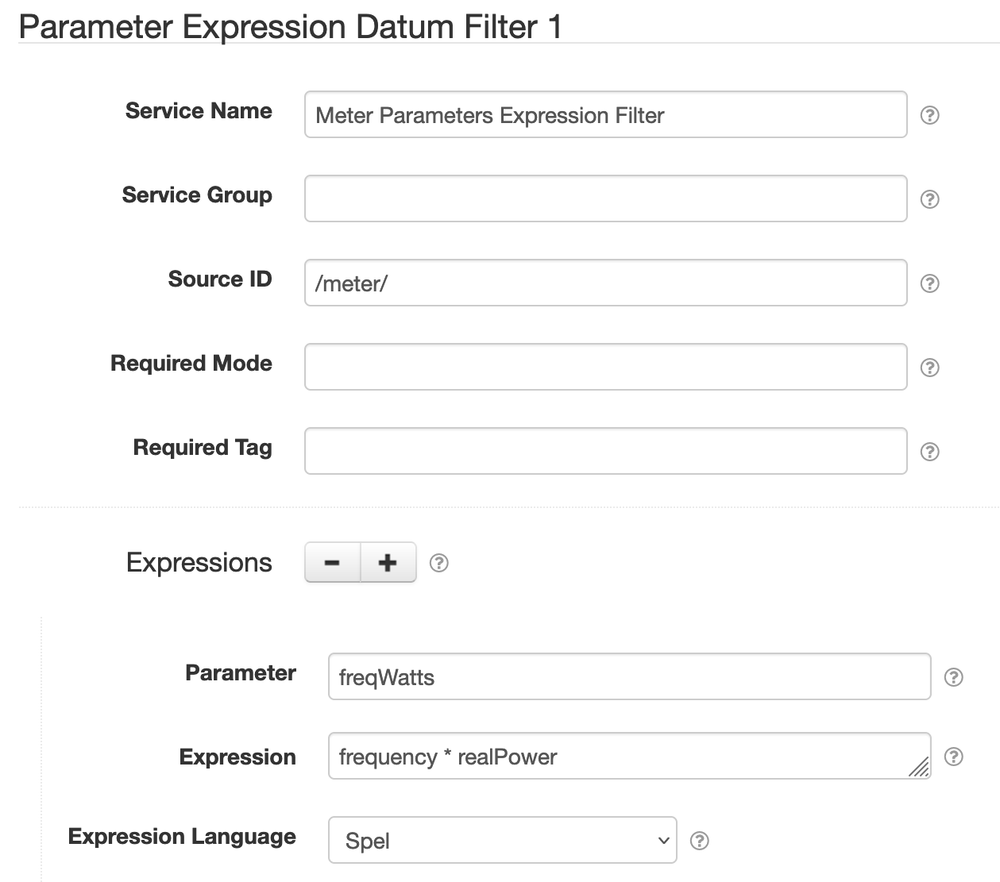

# SolarNode Parameter Expression Datum Filter

This component provides a way to generate filter parameters by evaluating expressions against
existing properties. The generated parameters will be available to any further datum filters in the
same filter chain.

# Use

Once installed, a new **Parameter Expression Datum Filter** component will appear on the 
**Settings > Datum Filter** page on your SolarNode. Click on the **Manage** button to configure 
filters.

# Settings

Each filter configuration contains the following overall settings:

| Setting            | Description                                                       |
|:-------------------|:------------------------------------------------------------------|
| Service Name       | A unique ID for the filter, to be referenced by other components. |
| Service Group      | An optional service group name to assign. |
| Source ID          | The source ID(s) to filter. |
| Required Mode      | If configured, an [operational mode](https://github.com/SolarNetwork/solarnetwork/wiki/SolarNode-Operational-Modes) that must be active for this filter to be applied. |
| Required Tag       | Only apply the filter on datum with the given tag. A tag may be prefixed with <code>!</code> to invert the logic so that the filter only applies to datum **without** the given tag. Multiple tags can be defined using a `,` delimiter, in which case **at least one** of the configured tags must match to apply the filter. |
| Expressions        |  A list of expression configurations that are evaluated to derive parameter values from other property values. |

Use the <kbd>+</kbd> and <kbd>-</kbd> buttons to add/remove expression configurations.

## Expression settings

Each expression configuration contains the following settings:

| Setting             | Description                                                       |
|:--------------------|:------------------------------------------------------------------|
| Parameter           | The filter parameter name to store the expression result in. |
| Expression          | The expression to evaluate. See [below](#expressions) for more info. |
| Expression Language | The [expression language][expr-lang] to write **Expression** in. |

# Expressions

See the [SolarNode Expressions][node-expr] guide for general expressions reference. The root object
is a `DatumExpressionRoot` that lets you treat all datum properties, and filter parameters, as
expression variables directly.

[expr-lang]: https://github.com/SolarNetwork/solarnetwork/wiki/Expression-Languages
[node-expr]: https://github.com/SolarNetwork/solarnetwork/wiki/SolarNode-Expressions
