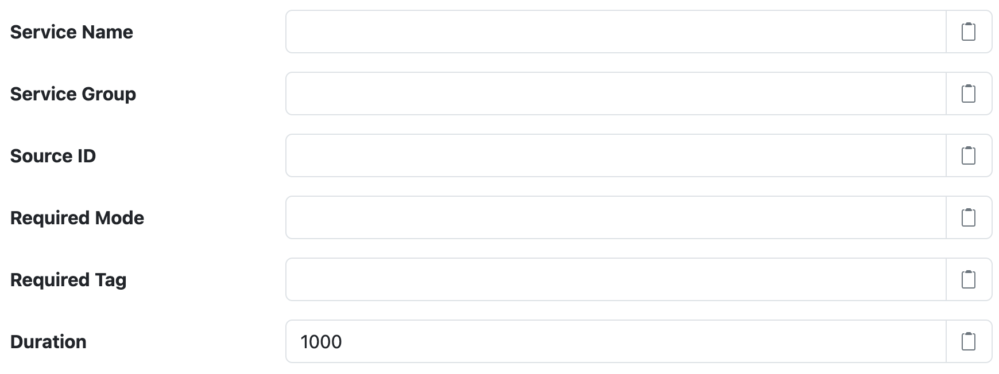

# SolarNode Rounded Timestamp Datum Filter

This component provides a way to round datum timestamps down to clock-aligned values.

# Use

Once installed, a new **Rounded Timestamp Datum Filter** component will appear on the
**Settings > Datum Filter** page on your SolarNode. Click on the **Manage** button to configure
filters.

# Settings

Each filter configuration contains the following overall settings:

| Setting            | Description                                                       |
|:-------------------|:------------------------------------------------------------------|
| Service Name       | A unique ID for the filter, to be referenced by other components. |
| Service Group      | An optional service group name to assign. |
| Source ID          | The source ID(s) to filter. |
| Required Mode      | If configured, an [operational mode](https://github.com/SolarNetwork/solarnetwork/wiki/SolarNode-Operational-Modes) that must be active for this filter to be applied. |
| Required Tag       | Only apply the filter on datum with the given tag. A tag may be prefixed with <code>!</code> to invert the logic so that the filter only applies to datum **without** the given tag. Multiple tags can be defined using a `,` delimiter, in which case **at least one** of the configured tags must match to apply the filter. |
| Duration           | A duration in milliseconds to round datum timestamps **down** by. See the [note below](#duration) on how the times become clock-aligned. |

## Duration

The resolved timestamp of each output datum will be rounded down based on the duration configured.
For example if `300000` is configured then the resolved timestamps would have times exactly at
_hour:minute_ values like `00:00`, `00:05`, `00:10`, and so on.

Sub-second durations are also supported. For example if `250` is configured then the resolved
timestamps would have have times exactly at _second.millisecond_ values like
`00.000`, `00.250`, `00.500`, and so on.

**Note** that if datum are generated at a rate faster than the configured duration,
"duplicate" datum will be generated with identical timestamps. If these datum end up in
SolarNetwork the most recently generated datum will replace any previously generated datum with
the same timestamp.

