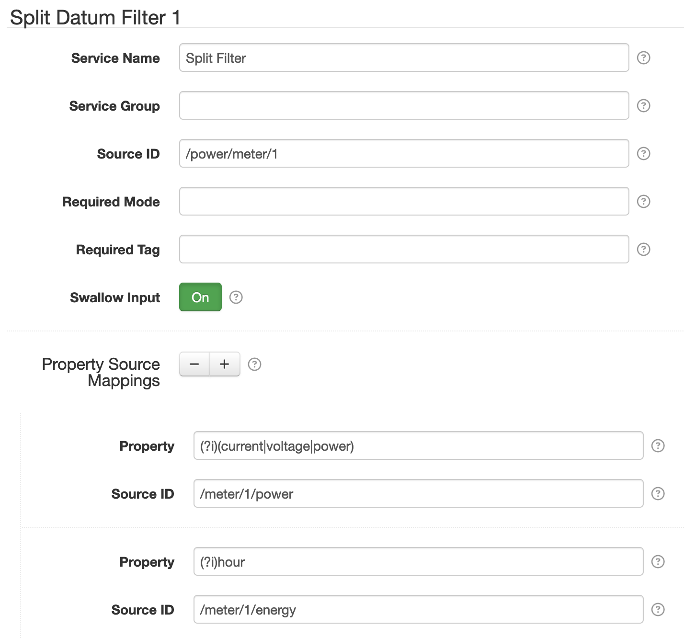

# SolarNode Split Datum Filter

This component provides a way to split the properties of a datum stream into multiple new derived
datum streams.

# Use

Once installed, a new **Split Datum Filter** component will appear on the
**Settings > Datum Filter** page on your SolarNode. Click on the **Manage** button to configure
filters.

In the example screen shot shown above, the `/power/meter/1` datum stream is split into two datum
streams: `/meter/1/power` and `/meter/1/energy`. Properties with names containing `current`,
`voltage`, or `power` (case-insensitive) will be copied to `/meter/1/power`. Properties with names
containing `hour` (case-insensitive) will be copied to `/meter/1/energy`.

# Settings

Each filter configuration contains the following overall settings:

| Setting            | Description |
|:-------------------|:------------|
| Service Name       | A unique ID for the filter, to be referenced by other components. |
| Service Group      | An optional service group name to assign. |
| Source ID          | A [regular expression][regex] to match the input source ID(s) to filter. |
| Required Mode      | If configured, an [operational mode](https://github.com/SolarNetwork/solarnetwork/wiki/SolarNode-Operational-Modes) that must be active for this filter to be applied. |
| Required Tag       | Only apply the filter on datum with the given tag. A tag may be prefixed with <code>!</code> to invert the logic so that the filter only applies to datum **without** the given tag. Multiple tags can be defined using a `,` delimiter, in which case **at least one** of the configured tags must match to apply the filter. |
| Swallow Input      | If enabled, then discard input datum after splitting. Otherwise leave the input datum as is. |
| Property Source Mappings |  A list of property name [regular expression][regex] with associated source IDs to copy matching properties to. |

## Settings notes

 * **Source ID** — This is a case-insensitive [regular expression][regex] to match against
   datum source ID values. If omitted then datum for _all_ source ID values will be filtered,
   otherwise only datum with _matching_ source ID values will be filtered.

## Property Source Mappings settings

Use the <kbd>+</kbd> and <kbd>-</kbd> buttons to add/remove Property Source Mapping configurations.

Each property source mapping configuration contains the following settings:

| Setting   | Description |
|:----------|:------------|
| Property  | A property name case-sensitive [regular expression][regex] to match on the input datum stream. You can enable case-insensitive matching by including a `(?i)` prefix. |
| Source ID | The destination source ID to copy the matching properties to. Supports [placeholders][placeholders]. |

> :point_up: If multiple property name expressions match the same property name, that property will
> be copied to **all** the datum streams of the associated source IDs.

[placeholders]: https://github.com/SolarNetwork/solarnetwork/wiki/SolarNode-Placeholders
[regex]: https://docs.oracle.com/en/java/javase/11/docs/api/java.base/java/util/regex/Pattern.html#sum
