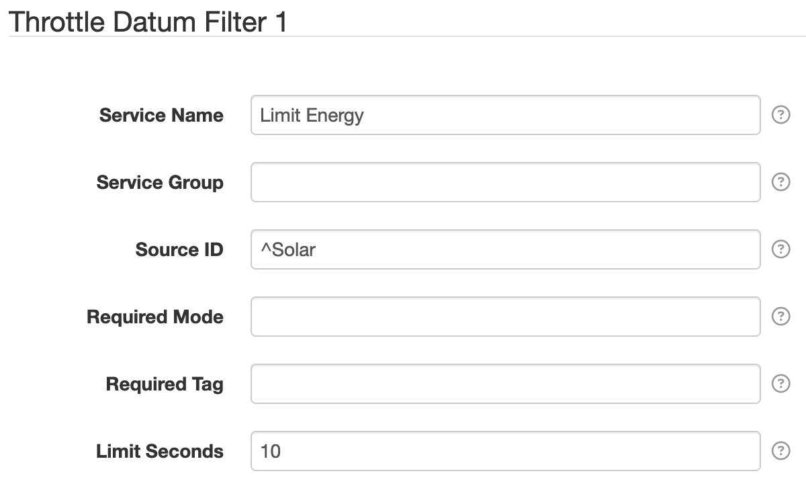

# SolarNode Throttle Datum Filter

This component can throttle **entire datum** over time, so that they are posted to SolarNetwork less
frequently than a plugin that collects the data produces them. This can be useful if you need a
plugin to collect data at a high frequency for use internally by SolarNode but don't need to save
such high resolution of data in SolarNetwork. For example, a plugin that monitors a device and
responds quickly to changes in the data might be configured to sample data every second, but you
only want to capture that data once per minute in SolarNetwork.

The general idea for filtering datum is to configure rules that define which datum **sources** you
want to filter, along with **time limit** to throttle matching datum by. Any datum matching the
sources that are captured faster than the time limit will filtered and **not** uploaded to
SolarNetwork.

The filter can also operate such that matching datum are simply **discarded** by configuring
the **Limit Seconds** as `-1`. This has the effect of configuring an _infinite_ time limit,
such that all matching datum are always discarded.

# Use

Once installed, a new **Throttle Datum Filter** component will appear on the 
**Settings > Datum Filter** page on your SolarNode. Click on the **Manage** button to configure 
filters.

# Settings

Each filter configuration contains the following overall settings:

| Setting            | Description                                                       |
|:-------------------|:------------------------------------------------------------------|
| Service Name       | A unique ID for the filter, to be referenced by other components. |
| Service Group      | An optional service group name to assign.                         |
| Source ID          | The source ID(s) to filter.                                       |
| Required Mode      | If configured, an [operational mode](https://github.com/SolarNetwork/solarnetwork/wiki/SolarNode-Operational-Modes) that must be active for this filter to be applied. |
| Required Tag       | Only apply the filter on datum with the given tag. A tag may be prefixed with `!` to invert the logic so that the filter only applies to datum **without** the given tag. Multiple tags can be defined using a `,` delimiter, in which case **at least one** of the configured tags must match to apply the filter. |
| Limit Seconds      | A throttle limit, in seconds, to apply to matching datum. Can be set to `-1` to discard all matching datum, regardless of time. |

## Settings notes

 * **Source ID** --  This is a case-insensitive regular expression pattern to match against datum source ID values.
   **Only** datum with matching source ID values will be filtered. This is required.
 * **Limit Seconds** -- The throttle limit is applied to datum by source ID. Before each datum is uploaded
   to SolarNetwork, the filter will check how long has elapsed since a datum with the
   same source ID was uploaded. If the elapsed time is less than the configured limit,
   the datum will not be uploaded. Can also be set to `-1` for an _infinite_ limit so all
   matching datum are discarded, always.
