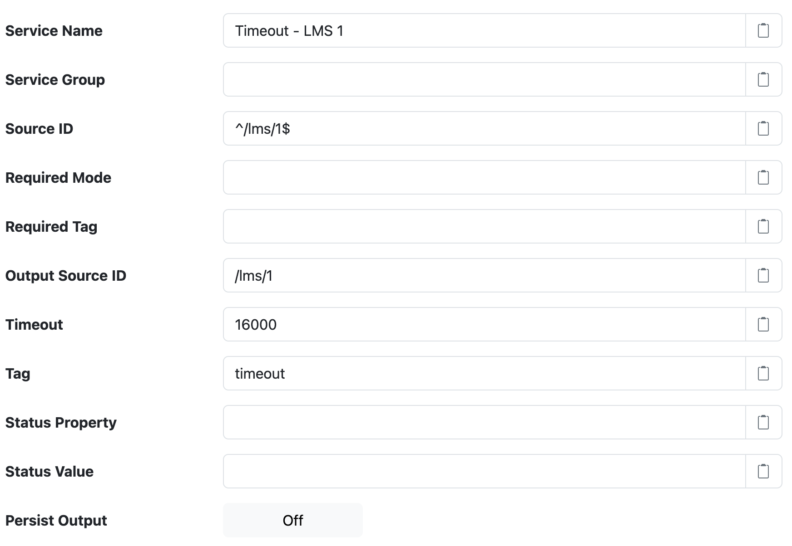

# SolarNode Timeout Datum Filter

This component provides a way to generate a datum if a matching source ID is not seen within a
configurable timeout.

# Use

Once installed, a new **Timeout Datum Filter** component will appear on the **Settings > Datum Filter**
page on your SolarNode. Click on the **Manage** button to configure filters.

# Settings

Each filter configuration contains the following overall settings:

| Setting             | Description                                                       |
|:--------------------|:------------------------------------------------------------------|
| Service Name        | A unique ID for the filter, to be referenced by other components. |
| Service Group       | An optional service group name to assign. |
| Source ID           | The source ID(s) to filter. |
| Required Mode       | If configured, an [operational mode][opmodes] that must be active for this filter to be applied. |
| Required Tag        | Only apply the filter on datum with the given tag. A tag may be prefixed with <code>!</code> to invert the logic so that the filter only applies to datum **without** the given tag. Multiple tags can be defined using a `,` delimiter, in which case **at least one** of the configured tags must match to apply the filter. |
| Output Source ID    | The source ID of the timeout datum stream. Often the **Source ID** pattern matches this exactly. |
| Timeout             | When greater than `0` then wait at most this amount of milliseconds for a matching source ID to be seen before generating an empty timeout datum with the **Output Source ID**. As long as a matching source ID is seen before this timeout occurs, no additional datum will be generated. Input datum are always passed through. This means a datum for **Output Source ID** will always be generated at at least this frequency: either as an input datum passed through this filter or a timeout datum generated by this filter. |
| Tag                 | An optional tag to include in generated timeout datum. |
| Status Property     | An optional status property to include in generated timeout datum. The value of the property will be **Status Value**. |
| Status Value        | If **Status Property** is configured, the value to use for the status property in generated timeout datum. |
| Persist Output      | If enabled then process and persist the generated timeout datum. Otherwise process the generated timeout datum without persisting them. Input datum are unaffected by this setting. |

[opmodes]: https://github.com/SolarNetwork/solarnetwork/wiki/SolarNode-Operational-Modes
[placeholders]: https://github.com/SolarNetwork/solarnetwork/wiki/SolarNode-Placeholders
