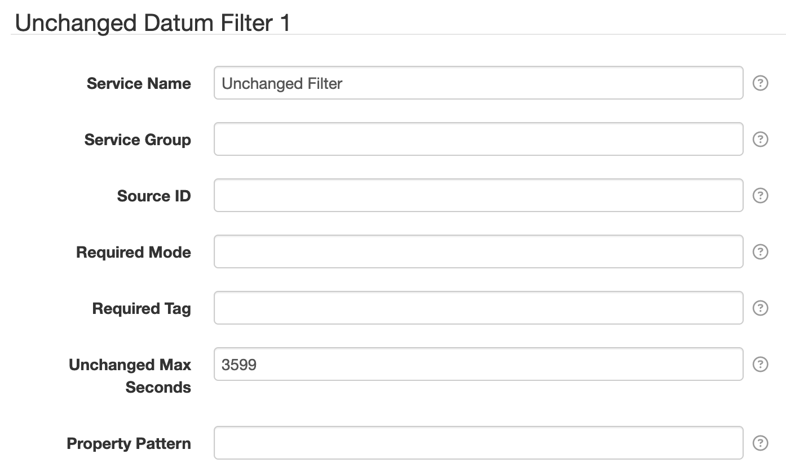

# SolarNode Unchanged Datum Filter

This component can discard **entire datum** that have not changed within a datum stream.

# Use

Once installed, a new **Unchanged Datum Filter** component will appear on the
**Settings > Datum Filter** page on your SolarNode. Click on the **Manage** button to configure
filters.

# Settings

Each filter configuration contains the following overall settings:

| Setting            | Description                                                       |
|:-------------------|:------------------------------------------------------------------|
| Service Name       | A unique ID for the filter, to be referenced by other components. |
| Service Group      | An optional service group name to assign.                         |
| Source ID          | The source ID(s) to filter.                                       |
| Required Mode      | If configured, an [operational mode](https://github.com/SolarNetwork/solarnetwork/wiki/SolarNode-Operational-Modes) that must be active for this filter to be applied. |
| Required Tag       | Only apply the filter on datum with the given tag. A tag may be prefixed with `!` to invert the logic so that the filter only applies to datum **without** the given tag. Multiple tags can be defined using a `,` delimiter, in which case **at least one** of the configured tags must match to apply the filter. |
| Unchanged Max Seconds | When greater than `0` then the maximum number of seconds to refrain from publishing an unchanged datum within a single datum stream. |
| Property Pattern | A property name [pattern][regex] that limits the properties monitored for changes. Only property names that match this expression will be considered when determining if a datum differs from the previous datum within the datum stream. |

## Settings notes

 * **Source ID** — This is a case-insensitive [regular expression][regex] pattern to match against
   datum source ID values. If omitted then datum for _all_ source ID values will be filtered,
   otherwise only datum with _matching_ source ID values will be filtered.
 * **Unchanged Max Seconds** — Use this setting to ensure a datum stream has datum included
   occasionally, even if the property values have not changed. Having at least one datum per
   hour in a datum stream is recommended. This time period is always relative to the last
   unfiltered datum seen by the filter.

[regex]: https://docs.oracle.com/en/java/javase/11/docs/api/java.base/java/util/regex/Pattern.html
