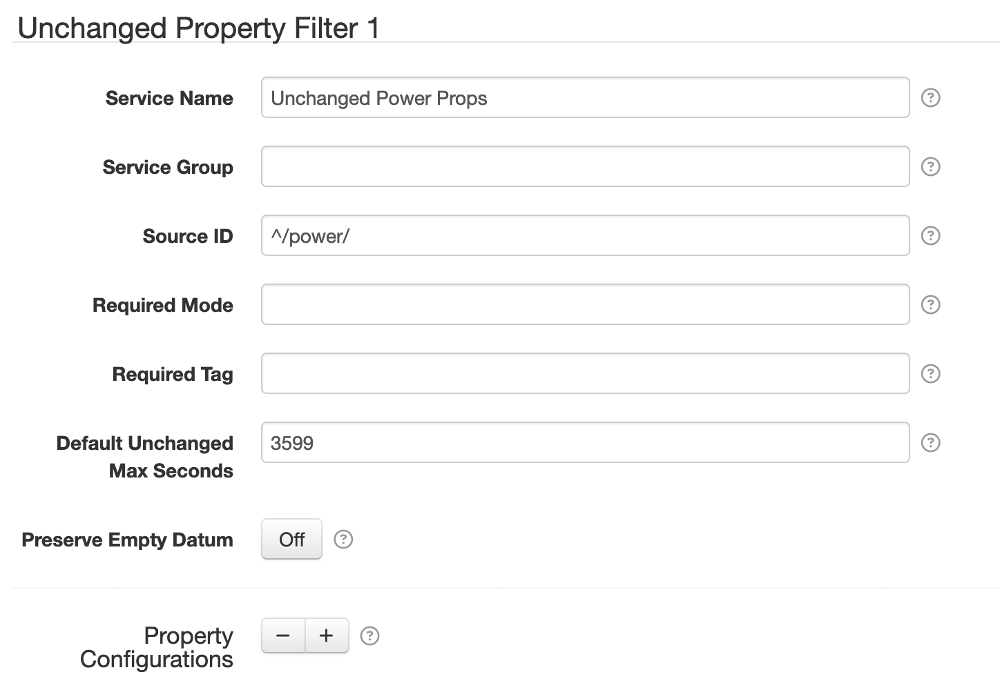
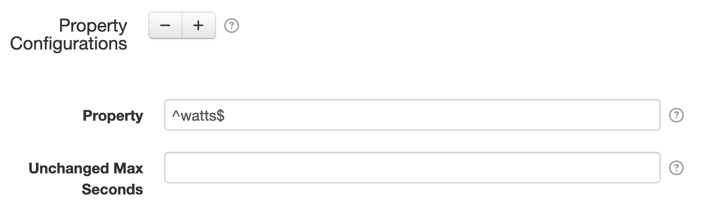

# SolarNode Unchanged Property Datum Filter

This component can discard **individual datum properties** that have not changed within a datum stream.

# Use

Once installed, a new **Unchanged Property Filter** component will appear on the
**Settings > Datum Filter** page on your SolarNode. Click on the **Manage** button to configure
filters.

# Settings

Each filter configuration contains the following overall settings:

| Setting            | Description                                                       |
|:-------------------|:------------------------------------------------------------------|
| Service Name       | A unique ID for the filter, to be referenced by other components. |
| Service Group      | An optional service group name to assign.                         |
| Source ID          | The source ID(s) to filter.                                       |
| Required Mode      | If configured, an [operational mode](https://github.com/SolarNetwork/solarnetwork/wiki/SolarNode-Operational-Modes) that must be active for this filter to be applied. |
| Required Tag       | Only apply the filter on datum with the given tag. A tag may be prefixed with `!` to invert the logic so that the filter only applies to datum **without** the given tag. Multiple tags can be defined using a `,` delimiter, in which case **at least one** of the configured tags must match to apply the filter. |
| Default Unchanged Max Seconds | When greater than `0` then the maximum number of seconds to discard unchanged properties within a single datum stream (source ID). |
| Property Configurations | A list of [property settings](#property-settings). |

## Settings notes

 * **Source ID** — This is a case-insensitive regular expression [pattern][regex] to match against
   datum source ID values. If omitted then datum for _all_ source ID values will be filtered,
   otherwise only datum with _matching_ source ID values will be filtered.
 * **Default Unchanged Max Seconds** — Use this setting to ensure a property is included
   occasionally, even if the property value have not changed. Having at least one value per
   hour in a datum stream is recommended. This time period is always relative to the last
   unfiltered property within a given datum stream seen by the filter.

## Property Settings

Use the <kbd>+</kbd> and <kbd>-</kbd> buttons to add/remove Property configurations.

Each property configuration contains the following settings:

| Setting            | Description                                                       |
|:-------------------|:------------------------------------------------------------------|
| Property           | A regular expression [pattern][regex] to match against datum property names. All matching properties will be filtered. |
| Unchanged Max Seconds | When greater than `0` then the maximum number of seconds to discard unchanged properties within a single datum stream (source ID). This can be used to override the filter-wide **Default Unchanged Max Seconds** setting, or left blank to use the default value. |

[regex]: https://docs.oracle.com/en/java/javase/11/docs/api/java.base/java/util/regex/Pattern.html
