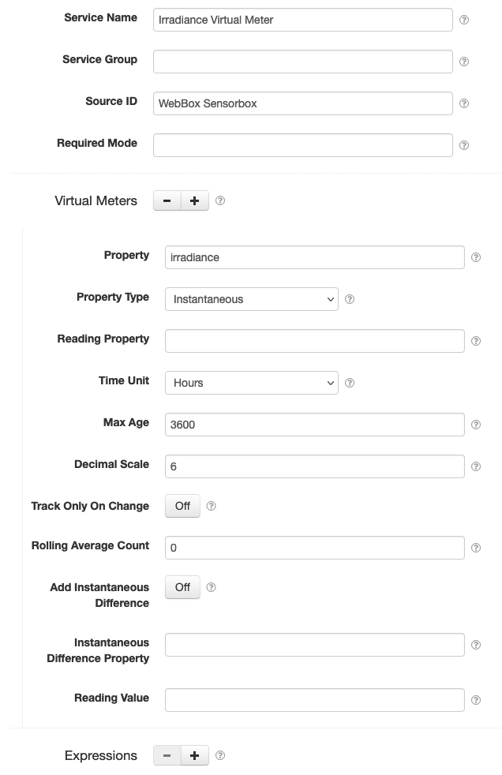
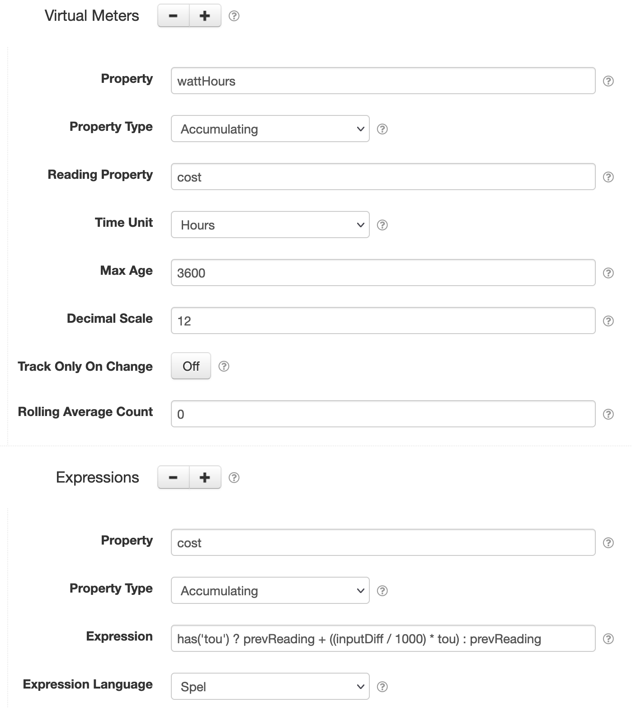

# SolarNode Virtual Meter Datum Filter

This component can derive an accumulating "meter reading" value out of an instantaneous property
value over time. For example, if you have an irradiance sensor that allows you to capture
instantaneous <code>W / m<sup>2</sup></code> power values, you could configure a virtual meter to
generate <code>Wh / m<sup>2</sup></code> energy values. You can configure as many virtual meters as
you like, using the <kbd>+</kbd> and <kbd>-</kbd> buttons to add/remove meter configurations.

Each virtual meter works with a single input datum property, typically an instantaneous property.
The derived accumulating datum property will be named after that property with the time unit suffix
appended. For example, an instantaneous `irradiance` property using the `Hours` time unit would
result in an accumulating `irradianceHours` property. The value is calculated as an **average**
between the _current_ and the _previous_ instantaneous property values, multiplied by the amount of
time that has elapsed between the two samples.

# Use

Once installed, a new **Virtual Meter Datum Filter** component will appear on the 
**Settings > Datum Filter** page on your SolarNode. Click on the **Manage** button to configure 
filters.



# Settings

Each filter configuration contains the following overall settings:

| Setting            | Description                                                       |
|:-------------------|:------------------------------------------------------------------|
| Service Name       | A unique ID for the filter, to be referenced by other components. |
| Service Group      | An optional service group name to assign.                         |
| Source ID          | The source ID(s) to filter.                                       |
| Required Mode      | If configured, an [operational mode](https://github.com/SolarNetwork/solarnetwork/wiki/SolarNode-Operational-Modes) that must be active for this filter to be applied. |
| Required Tag       | Only apply the filter on datum with the given tag. A tag may be prefixed with <code>!</code> to invert the logic so that the filter only applies to datum **without** the given tag. Multiple tags can be defined using a `,` delimiter, in which case **at least one** of the configured tags must match to apply the filter. |
| Virtual Meters     | A list of meter configurations to apply.                          |
| Expressions        | A list of expressions that meter configurations can refer to.     |

Use the <kbd>+</kbd> and <kbd>-</kbd> buttons to add/remove meter and expression configurations.

Each meter configuration contains the following settings:

| Setting               | Description                                                                           |
|:----------------------|:--------------------------------------------------------------------------------------|
| Property              | The name of the **input** datum property to derive the virtual meter values from. |
| Property Type         | The type of the **input** datum property. Typically this will be `Instantaneous` but when combined with an expression an `Accumulating` property can be used. |
| Reading Property      | The name of the **output** meter accumulating datum property to generate. Leave empty for a default derived from **Property** and **Time Unit**. |
| Time Unit             | The time unit to record meter readings as. |
| Max Age               | The maximum time allowed between samples where the meter reading can advance. |
| Decimal Scale         | A maximum number of digits after the decimal point to round to. Set to`0` to round to whole numbers. |
| Track Only On Change  | When enabled, then only update the previous reading date if the new reading value differs from the previous one. |
| Rolling Average Count | A count of samples to average the property value from. |
| Add Instantaneous Difference | When enabled, then include an **output** instantaneous property of the difference between the current and previous reading values. |
| Instantaneous Difference Property | The derived **output** instantaneous datum property name to use when **Add Instantaneous Difference** is enabled. By default this property will be derived from the **Reading Property** value with `Diff` appended. |
| Reading Value         | You can reset the virtual meter reading value with this setting. :warning: **Note** this is an advanced operation. |

Expressions can be configured to calculate the **output** meter datum property, instead of using the
default averaging algorithm. See [below](#expressions) for more information. Each expression
configuration contains the following settings:

| Setting             | Description                                                       |
|:--------------------|:------------------------------------------------------------------|
| Property            | The datum property to store the expression result in. |
| Property Type       | The datum property type to use. |
| Expression          | The expression to evaluate.See [below](#expressions) for more info. |
| Expression Language | The [expression language][expr] to write **Expression** in. |

## Settings notes

<dl>
	<dt>Source ID</dt>
	<dd>This is a case-insensitive regular expression pattern to match against datum source ID values.
	<b>Only</b> datum with matching source ID values will be filtered. This is required.</dd>
	<dt>Reading Property</dt>
	<dd>This can be used to customize the generated accumulating datum property name. If left unconfigured,
	the accumulating datum property will be named after the Property value with the Time Unit suffix appended. 
	For example, an instantaneous <code>irradiance</code> property using the <code>Hours</code> time unit would 
	result in an accumulating <code>irradianceHours</code> property.</dd>
	<dt>Time Unit</dt>
	<dd>This value affects the name of the virtual meter reading property: it will be appended to the
	end of the property name. It also affects the virtual meter reading values, as they will be calculated in
	this time unit.</dd>
	<dt>Max Age</dt>
	<dd>In case the node isn't collecting samples for a period of time, this setting prevents the plugin
	from calculating an unexpectedly large reading value jump. For example if a node was turned off for
	a day, the first sample it captures when turned back on would otherwise advance the reading as if the
	associated instantaneous property had been active over that entire time. With this restriction, the
	node will record the new sample date and value, but not advance the meter reading until another sample
	is captured within this time period.</dd>
	<dt>Rolling Average Count</dt>
	<dd>When set to something greater than <code>1</code>, then 
	apply a rolling average of this many property samples and output that value as the <em>instantaneous</em> 
	source property value. This has the effect of smoothing the instantaneous values to an average over the 
	time period leading into each output sample. Defaults to <code>0</code> so no average is applied.</dd>
	<dt>Reading Value</dt>
	<dd>If you submit a value for this setting, the virtual meter reading will be reset to this 
	value such that the next datum the reading is calculated for will use this as the current meter
	reading. This will impact the datum stream's reported aggregate values, so you should be very
	sure this is something you want to do. For example if the virtual meter was at <code>1000</code>
	and you reset it <code>0</code> then that will appear as a <code>-1000</code> drop in whatever
	the reading is measuring. You might want to create a <code>Reset</code> 
	<a href="https://github.com/SolarNetwork/solarnetwork/wiki/SolarNet-API-global-objects#datum-auxiliary">Datum
	auxiliary record</a> to accomodate the reset value.</dd>
</dl>

# Filter parameters

When the virtual meter filter is applied to a given datum, it will generate the following filter
parameters, which will be available to other filters that are applied to the same datum after this
filter:

| Parameter | Description |
|:----------|:------------|
| `{inputPropertyName}_diff` | The difference between the current **input** property value and the previous input property value. The `{inputPropertyName}` part of the parameter name will be replaced by the actual input property name. For example `irradiance_diff`. |
| `{meterPropertyName}_diff` | The difference between the current **output** meter property value and the previous output meter property value. The `{meterPropertyName}` part of the parameter name will be replaced by the actual output meter property name. For example `irradianceHours_diff`. |

# Expressions

See the [SolarNode Expressions][node-expr] guide for general expressions reference. Expressions can
be configured to calculate the **output** meter datum property, instead of using the default
averaging algorithm. If an expression configuration exists for the same **property name** as the
configured (or implied) meter **reading property name**, then the expression will be invoked to
generate the new meter reading value.

> :warning: **Note** it is important to remember that the expression must calculate the next 
> _meter reading_ value. Typically this means it will calculate some differential value based on 
> the amount of time that has elapsed and **add** that to the previous meter reading value.

For example, imagine you'd like to track a time-of-use cost based on the energy readings captured
from an energy meter. The [Time-based Tariff Datum Filter][tariff-filter] filter could be used
to add a `tou` property to each datum, and then a virtual meter expression can be used to 
calculate a `cost` reading property. The `cost` property will be an accumulating property like any
meter reading, so when SolarNetwork aggregates its value over time you will see the effective cost
over each aggregate time period.

Here is a screen shot of the settings used for this scenario:



The important settings to note are:

| Setting | Notes |
|:--------|:------|
| Virtual Meter - Property | The **input** datum property is set to `wattHours` because we want to track changes in this property over time. |
| Virtual Meter - Property Type | We use `Accumulating` here because that is the type of property `wattHours` is. |
| Virtual Meter - Reading Property | The **output** reading property name. This must match the **Expression - Property** setting.  |
| Expression - Property | This must match the **Virtual Meter - Reading Property** we want to evaluate the expression for. |
| Expression - Property Type | Typically this should be `Accumulating` since we are generating a meter reading style property. |
| Expression - Expression | The expression to evaluate. This expression looks for the `tou` property and when found the meter reading is incremented by the difference between the current and previous input `wattHours` property values multiplied by `tou`. If `tou` is not available, then the previous meter reading value is returned (leaving the reading unchanged). |

## Expression root object

The root object is a [virtual meter expression object][VirtualMeterExpressionRoot] that lets you
treat all datum properties, and filter parameters, as expression variables directly, along with
the following properties:

| Property | Type | Description |
|:---------|:-----|:------------|
| `config` | `VirtualMeterConfig` | A [`VirtualMeterConfig`][VirtualMeterConfig] object for the virtual meter configuration the expression is evaluating for. |
| `datum` | `GeneralNodeDatum` | A [`Datum`][Datum] object, populated with data from all property and virtual meter configurations. |
| `props` | `Map<String,Object>` | Simple Map based access to the properties in `datum`, and transform parameters, to simplify expressions. |
| `currDate` | `long` | The current datum timestamp, as a millisecond epoch number. |
| `prevDate` | `long` | The previous datum timestamp, as a millisecond epoch number. |
| `timeUnits` | `decimal` | A decimal number of the difference between `currDate` and `prevDate` in the virtual meter configuration's **Time Unit**, rounded to at most 12 decimal digits. |
| `currInput` | `decimal` | The current **input** property value. |
| `prevInput` | `decimal` | The previous **input** property value. |
| `inputDiff` | `decimal` | The difference between the `currInput` and `prevInput` values. |
| `prevReading` | `decimal` | The previous **output** meter property value. |

The following methods are available:

| Function | Arguments | Result | Description |
|:---------|:----------|:-------|:------------|
| `has(name)` | `String` | `boolean` | Returns `true` if a property named `name` is defined. |
| `timeUnits(scale)` | `int` | `decimal` | Like the `timeUnits` property but rounded to a specific number of decimal digits. |

## Expression examples

Assuming a datum sample with properties like the following:

| Property      | Value |
|:--------------|:------|
| `tou`         | `11.00`          |
| `currDate`    | `1621380669005`  |
| `prevDate`    | `1621380609005`  |
| `timeUnits`   | `0.016666666667` |
| `currInput`   | `6095574`        |
| `prevInput`   | `6095462`        |
| `inputDiff`   | `112`            |
| `prevReading` | `1022.782`       |

Then here are some example expressions and the results they would produce:

| Expression | Result | Comment |
|:-----------|:-------|:--------|
| `inputDiff / 1000` | `0.112` | Convert the input Wh property difference to kWh. |
| `inputDiff / 1000 * tou` | `1.232` | Multiply the input kWh by the the $/kWh tariff value to calculate the cost for the elapsed time period. |
| `prevReading + (inputDiff / 1000 * tou)` | `1,024.014` | Add the additional cost to the previous meter reading value to reach the new meter value. |

# Virtual meter metadata

Virtual meters require keeping track of the meter reading value over time along with the previously
captured value. This plugin manages three [Local State][local-state] entities per virtual meter.
The entity keys are based on this pattern:

```
vm:SOURCE_ID.METER_PROPERTY_NAME:METADATA_NAME
```

The CAPITALIZED parameters in that pattern represent:

| Parameter | Description |
|:----------|:------------|
| `SOURCE_ID` | The source ID of the datum being filtered. |
| `METER_PROPERTY_NAME` | The **output** reading property name, either explicitly configured or derived from the input property name + time unit. |
| `METADATA_NAME` | One of `date`, `value`, or `reading`, representing the millisecond Unix epoch timestamp, the input value, and the output reading of the virtual meter.  |

For example, continuing the `irradianceHours` example evaulating against a datum with a source ID `meter/1`,
the local state entities managed by the virtual meter would look like:

| Local State key | Type | Value |
|:----------------|:-----|------:|
| `vm:meter/1.irradianceHours:date`    | `Int64`   | `1745877900000` |
| `vm:meter/1.irradianceHours:value`   | `Decimal` | `1361` |
| `vm:meter/1.irradianceHours:reading` | `Decimal` | `12390980.1231` |

## Virtual meter legacy metadata

Virtual meters used to keep track of their metadata using the [SolarNetwork datum metadata API][meta-api], storing
three metadata properties under a property key named for the virtual meter property name. For
example, continuing the `irradianceHours` example, an example set of datum metadata would look like:

```json
{
  "pm": {
    "irradianceHours": {
      "vm-date": 123123123123,
      "vm-value": "1361",
      "vm-reading": "12390980.1231"
    }
  }
}
```

This metadata will be automatically copied to Local State entities, after which the metadata will not be
updated any more.


[expr]: https://github.com/SolarNetwork/solarnetwork/wiki/Expression-Languages
[Datum]: https://github.com/SolarNetwork/solarnetwork-common/blob/develop/net.solarnetwork.common/src/net/solarnetwork/domain/datum/Datum.java
[local-state]: https://solarnetwork.github.io/solarnode-handbook/users/local-state/
[meta-api]: https://github.com/SolarNetwork/solarnetwork/wiki/SolarIn-API#node-datum-metadata-add
[node-expr]: https://github.com/SolarNetwork/solarnetwork/wiki/SolarNode-Expressions
[tariff-filter]: ../net.solarnetwork.node.datum.filter.tariff
[VirtualMeterConfig]: https://github.com/SolarNetwork/solarnetwork-node/blob/develop/net.solarnetwork.node.datum.filter.standard/src/net/solarnetwork/node/datum/filter/virt/VirtualMeterConfig.java
[VirtualMeterExpressionRoot]: https://github.com/SolarNetwork/solarnetwork-node/blob/develop/net.solarnetwork.node.datum.filter.standard/src/net/solarnetwork/node/datum/filter/virt/VirtualMeterExpressionRoot.java
