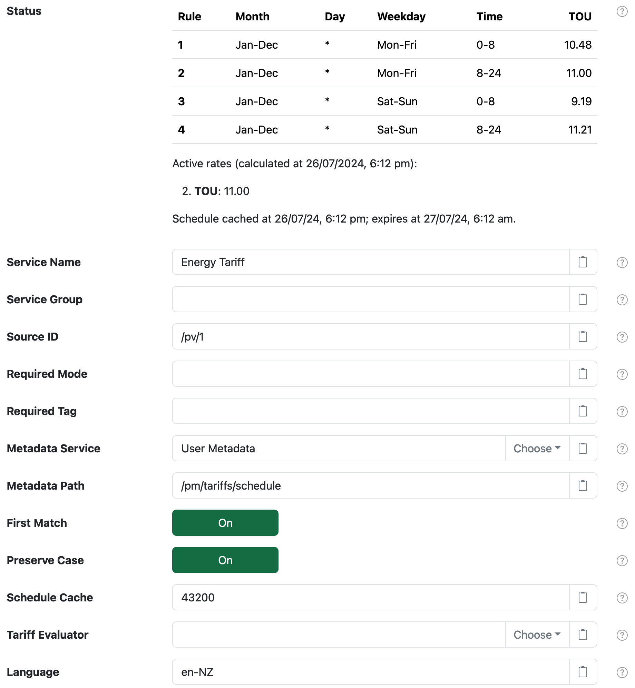
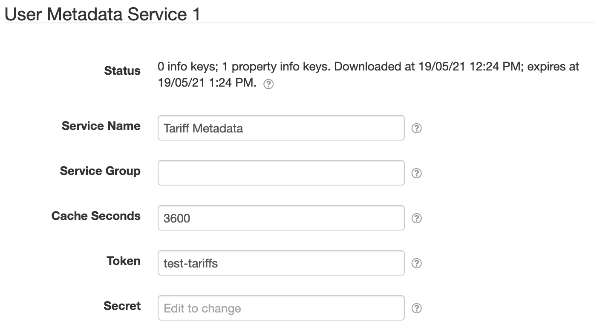
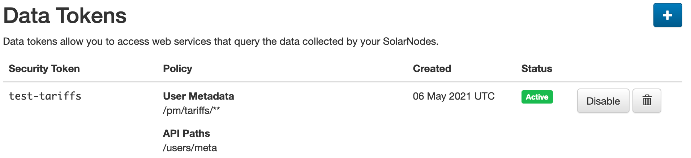
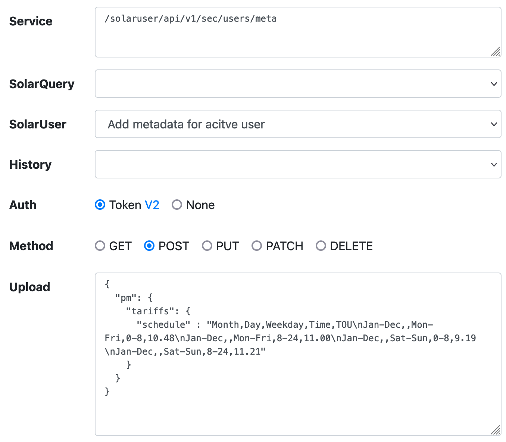

# SolarNode Time-based Tariff Datum Filter

Inject time-based tariff rates based on a flexible tariff schedule defined with various time
constraints.

# Install

The plugin can be installed via the **Plugins** page on your SolarNode. It appears under the
**Datum** category as **Tariff Datum Filter**. For more information, see the individual
documentation:

# Use

Once installed, a new **Time-based Tariff Datum Filter** component will appear on the 
**Settings > Datum Filter** page on your SolarNode. Click on the **Manage** button to configure 
filters.



# Settings

Each filter configuration contains the following overall settings:

| Setting            | Description                                                       |
|:-------------------|:------------------------------------------------------------------|
| Service Name       | A unique ID for the filter, to be referenced by other components. |
| Service Group      | An optional service group name to assign. |
| Source ID          | The source ID(s) to filter. |
| Required Mode      | If configured, an [operational mode](https://github.com/SolarNetwork/solarnetwork/wiki/SolarNode-Operational-Modes) that must be active for this filter to be applied. |
| Required Tag       | Only apply the filter on datum with the given tag. A tag may be prefixed with <code>!</code> to invert the logic so that the filter only applies to datum **without** the given tag. Multiple tags can be defined using a `,` delimiter, in which case **at least one** of the configured tags must match to apply the filter. |
| Metadata Service   | The **Service Name** of the Metadata Service to obtain the tariff schedule from. See [below](#metadata-service) for more information. |
| Metadata Path      | The metadata path that will resolve the tariff schedule from the configured Metadata Service. |
| Language           | A IETF BCP 47 language tag to parse the tariff data with. If not configured then the default system language will be assumed.
| First Match        | If enabled, then apply only the **first** tariff that matches a given datum date. If disabled, then apply **all** tariffs that match. |
| Preserve Case      | If enabled, then preserve the case in resolved datum property names. See [Rate columns](#rate-columns) below. |
| Schedule Cache     | The amount of seconds to cache the tariff schedule obtained from the configured Metadata Service.
| Tariff Evaluator   | The **Service Name** of a _Time-based Tariff Evaluator_ service to evaluate each tariff to determine if it should apply to a given datum. |

## Settings notes

<dl>
	<dt>Source ID</dt>
	<dd>This is a case-insensitive regular expression pattern to match against datum source ID values.
	<b>Only</b> datum with matching source ID values will be filtered. This is required.</dd>
	<dt>Tariff Evaluator</dt>
	<dd>If not configured a default algorithm is used that matches all non-empty constraints in an 
	inclusive manner, except for the time-of-day constraint which uses an exclusive upper bound.</dd>
</dl>

# Metadata Service

SolarNode provides **Node Metadata Service** and **User Metadata Service** components that this filter
can use for the **Metadata Service** setting. This allows you to configure the tariff schedule as either
node or user metadata in SolarNetwork and then SolarNode will download the schedule and use it as needed.

The **Node Metadata Service** does not require any configuration to use (its **Service Name** is simply
`Node Metadata Service`), but the **User Metadata Service** requires setting up.



You must configure a SolarNetwork security token to use the User Metadata Service. We recommend
that you create a **Data** security token in SolarNetwork with a limited security policy that includes an **API Path** of just `/users/meta` and a **User Metadata Path** of something granular like `/pm/tariffs/**`. This will give SolarNode access to just the tariff metadata under the `/pm/tariffs` metadata path.



The [SolarNetwork API Explorer][api-explorer] can be used to add the necessary tariff schedule
metadata to your account. For example:



# Tariff schedule format

The tariff schedule obtained from the configured Metadata Service uses a simple CSV-based format
that can be easily exported from a spreadsheet. Each row represents a rule that includes:

 * a set of time constraints that must be satisfied for the rule to be applied
 * a list of tariff rates to be added to datum when the constraints are satisfied

> :warning: **Note** a header row is **required** because the tariff rate names are defined there.
> The first 4 column names are ignored.

The schedule consists of 4 time constraint columns followed by one or more tariff rate columns. Each
constraint is represented as a range, in the form `start - end`. Multiple ranges can be specified by
adding a `,` between each range (see [Range sets](#range-sets) below). Whitespace is allowed around the
`-` character. If the `start` and `end` are the same, the range may be shortened to just `start`. A
range can be left empty to represent **all values**. The time constraint columns are:

| Column | Constraint | Description |
|:-------|:-----------|:------------|
| 1      | Month range | An inclusive month range. Months can be specified as numbers (1-12) or abbreviations (Jan-Dec) or full names (January - December). When using text names case does not matter and they will be parsed using the **Lanauage** setting. |
| 2      | Day range | An inclusive day-of-month range. Days are specified as numbers (1-31). |
| 3      | Weekday range | An inclusive day-of-week range. Weekdays can be specified as numbers (1-7) with Monday being `1` and Sunday being `7`, or abbreviations (Mon-Sun) or full names (Monday - Sunday). When using text names case does not matter and they will be parsed using the **Lanauage** setting. |
| 4      | Time range | An **inclusive - exclusive** time-of-day range. The time can be specified as whole hour numbers (0-24) or `HH:MM` style (`00:00` - `24:00`). |

## Range sets

All range values can be specified as a comma-delimited set of ranges, so disparate ranges can be used.
For example a Month range could be specified as `Jan-Mar,Oct-Dec` to represent the overall set of months
including January, February, March, October, November, and December.

## Rate columns

Starting on column 5 of the tariff schedule are arbitrary rate values to add to datum when the 
corresponding constraints are satisfied. The name of the datum property is derived from the **header
row** of the column, adapted according to the following rules:

 1. change to lower case (if **Preserve Case** is disabled)
 2. replacing any runs of non-alphanumeric or underscore with a single underscore
 3. removing any leading/trailing underscores
 
Here are some examples of the header name to the equivalent property name:

| Rate Header Name         | Datum Property Name | Datum Property Name with Preserve Case |
|:-------------------------|:--------------------|:---------------------------------------|
| TOU                      | `tou`               | `TOU` |
| Foo Bar                  | `foo_bar`           | `Foo_Bar` |
| This Isn't A Great Name! | `this_isn_t_a_great_name` | `This_Isn_t_A_Great_Name` |

## Example schedule

Here's an example schedule with 4 rules and a single **TOU** rate (the `*` stands for **all values**):

| Rule  | Month   | Day | Weekday | Time |   TOU |
|:------|:--------|:----|:--------|:-----|------:|
| **1** | Jan-Dec | *   | Mon-Fri | 0-8  | 10.48 |
| **2** | Jan-Dec | *   | Mon-Fri | 8-24 | 11.00 |
| **3** | Jan-Dec | *   | Sat-Sun | 0-8  |  9.19 |
| **4** | Jan-Dec | *   | Sat-Sun | 8-24 | 11.21 |


In CSV format the schedule would look like this:

```csv
Month,Day,Weekday,Time,TOU
Jan-Dec,,Mon-Fri,0-8,10.48
Jan-Dec,,Mon-Fri,8-24,11.00
Jan-Dec,,Sat-Sun,0-8,9.19
Jan-Dec,,Sat-Sun,8-24,11.21
```

When encoding into SolarNetwork metadata JSON, that same schedule would look like this when saved
at the `/pm/tariffs/schedule` path:

```json
{
  "pm": {
    "tariffs": {
      "schedule": "Month,Day,Weekday,Time,TOU\nJan-Dec,,Mon-Fri,0-8,10.48\nJan-Dec,,Mon-Fri,8-24,11.00\nJan-Dec,,Sat-Sun,0-8,9.19\nJan-Dec,,Sat-Sun,8-24,11.21"
    }
  }
}
```

[api-explorer]: https://go.solarnetwork.net/dev/api/
