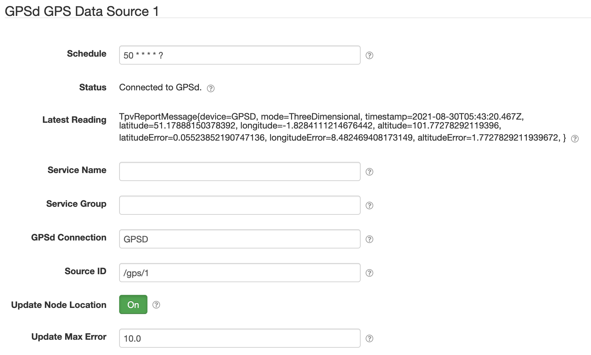

# SolarNode GPSd GPS Datum Data Source

This project provides SolarNode plugin that can collect data from `gpsd` daemons emitting GPS data.

# Install

The plugin can be installed via the **Plugins** page on your SolarNode. It appears under the
**Datum** category as **GPSd GPS Data Source**. The [SolarNode GPSd I/O][gps-conn] plugin must be
installed as well, to provide the connection to the GPSd server.

# Use

Once installed, a new **GPSd GPS Data Source** component will appear on the **Settings** page on
your SolarNode. Click on the **Manage** button to configure components. You'll need to add one
configuration for each GPSd server you want to collect data from.

> :round_pushpin: **NOTE:** the **Auto Watch** setting of the referenced [GPSd Connection][gps-conn]
> component must be enabled for this data source to receive GPS data.

Once configured, and GPSd has received a GPS fix, this plugin will produce a datum derived from the
most recently seen `TPV` report published by GPSd. Adjust the **Schedule** to capture the GPS data
at whatever frequency you need. Be aware that GPSd can emit `TPV` reports about once a second.

## Overall device settings

Each device configuration contains the following overall settings:

| Setting            | Description |
|--------------------|-------------|
| Schedule           | A cron schedule that determines when data is collected for posting to SolarNetwork. |
| Service Name       | A unique name to identify this data source with. |
| Service Group      | A group name to associate this data source with. |
| GPSd Connection    | The service name of the [GPSd Connection][gps-conn] component to use. |
| Source ID          | The SolarNetwork source ID to assign to captured datum. |

## Overall device settings notes

<dl>
	<dt>Source ID</dt>
	<dd>This value unique identifies the data collected from this device, by this node,
	 on SolarNetwork. Each configured device should use a different value.</dd>
</dl>

# Events

This plugin will listen for all GPSd "report" messages (`SKY` and `TPV` messages) and emit a
[`net/solarnetwork/node/DatumDataSource/DATUM_CAPTURED`][evt-datum-captured] event for each one
received. This means that other plugins can monitor the GPS data in real-time and do something
interesting with it. The [SolarFlux Upload][solarflux-upload] plugin, for example, will upload the
data to SolarFlux, providing client applications the ability to do real-time GPS tracking.

> :round_pushpin: **NOTE:** although this plugin will emit `DATUM_CAPTURED` events for each report
> it receives from GPSd, this is separate from the **Schedule** setting that determines how
> frequently GPS datum are posted to SolarNetwork.

[gps-conn]: ../net.solarnetwork.node.io.gpsd/
[evt-datum-captured]: https://github.com/SolarNetwork/solarnetwork/wiki/SolarNode-Events#datum-captured
[solarflux-upload]: ../net.solarnetwork.node.upload.flux/
