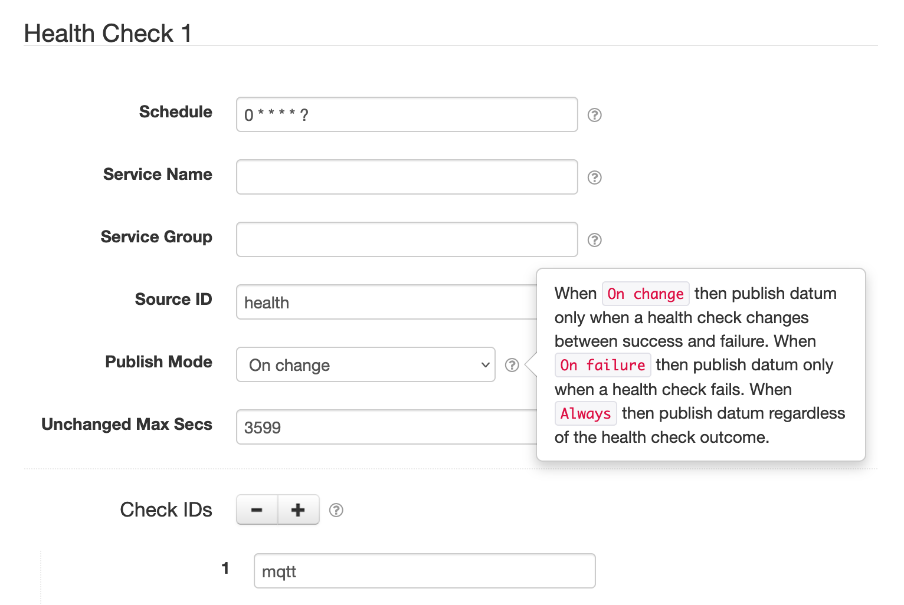

# SolarNode Health Check Datum Source

This project provides SolarNode plugin that publishes various internal health check metrics
as a datum stream. This can be used to monitor the health of SolarNode components.

# Install

The plugin can be installed via the **Plugins** page on your SolarNode. It appears under the
**Datum** category as **Health Check Datum Source**.

# Use

Once installed, a new **Health Check** component will appear on the **Settings** page on
your SolarNode. Click on the **Manage** button to configure individual components.

## Overall device settings

Each device configuration contains the following overall settings:

| Setting              | Description |
|----------------------|-------------|
| Schedule             | A cron schedule that determines when data is collected. |
| Service Name         | A unique name to identify this data source with. |
| Service Group        | A group name to associate this data source with. |
| Source ID            | The SolarNetwork unique source ID to assign to datum collected from this device. |
| Health Check IDs     | A comma-delimited list of Health Check ID regular expressions to filter on. |
