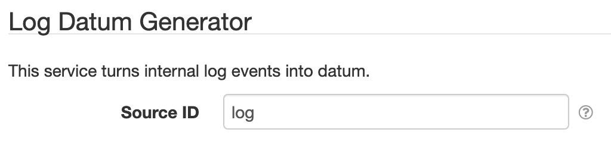

# SolarNode Log Datum Generator

This project provides SolarNode plugin that turns log events into datum.

# Install

The plugin can be installed via the **Plugins** page on your SolarNode. It appears under the
**Datum** category as **Log Datum Generator**.

# Use

Once installed, a new **Log Datum Generator** component will appear on the **Settings** page on your
SolarNode.

The generated datum stream consists of the following properties:

| Property | Class. | Type | Description |
|:---------|:-------|:-----|:------------|
| `level`    | `s` | String  | The log level name, e.g. `TRACE`, `DEBUG`, `INFO`, `WARN`, `ERROR`, or `FATAL`. |
| `priority` | `i` | Integer | The log level priority (lower values have more priority), e.g. `600`, `500`, `400`, `300`, `200`, or `100`. |
| `name`     | `s` | String  | The log name. |
| `msg`      | `s` | String  | The log message . |
| `exMsg`    | `s` | String  | An exception message, if an exception was included. |
| `exSt`     | `s` | String  | A newline-delimited list of stack trace element values, if an exception was included. |

# Settings

Each plugin offers the following settings:

| Setting            | Description |
|:-------------------|:------------|
| Source ID          | The SolarNetwork unique source ID to assign to the generated datum. [Placeholders][placeholders] are allowed. |

## Source ID Placeholders

In addition to the standard SolarNode [placeholders][placeholders] available in the Source ID setting,
the following additional placeholders are available:

| Placeholder | Description |
|:------------|:------------|
| `logLevel`       | The log level name, e.g. `TRACE`, `DEBUG`, `INFO`, `WARN`, `ERROR`, or `FATAL`. |
| `logPriority`    | The log level priority (lower values have more priority), e.g. `600`, `500`, `400`, `300`, `200`, or `100`. |
| `logName`        | The log name. |
| `logNameSlashed` | The log name, with period characters `.` replaced with slash characters `/`. | 

[eaa]: https://github.com/SolarNetwork/solarnetwork-common/tree/develop/net.solarnetwork.common.log4j2#eventadmin-appender
[placeholders]: https://github.com/SolarNetwork/solarnetwork/wiki/SolarNode-Placeholders
