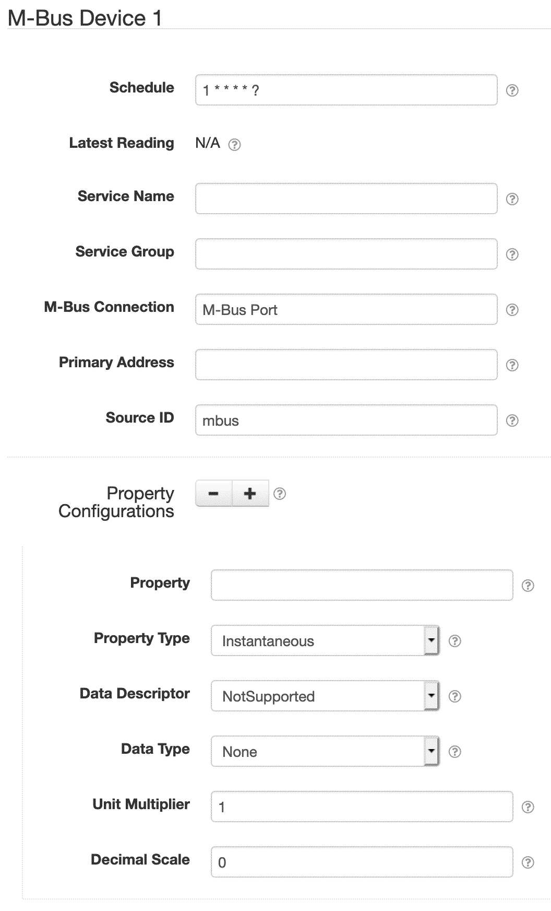
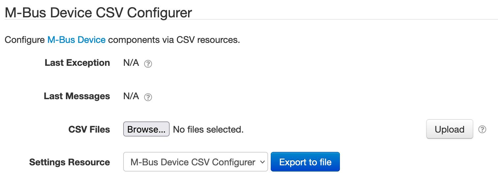
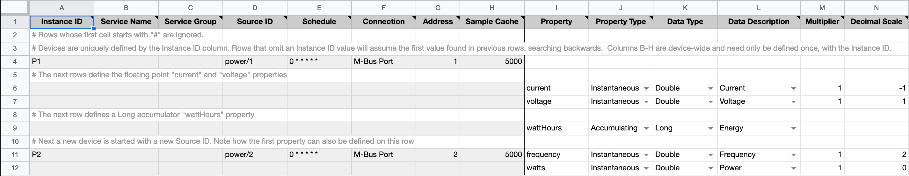
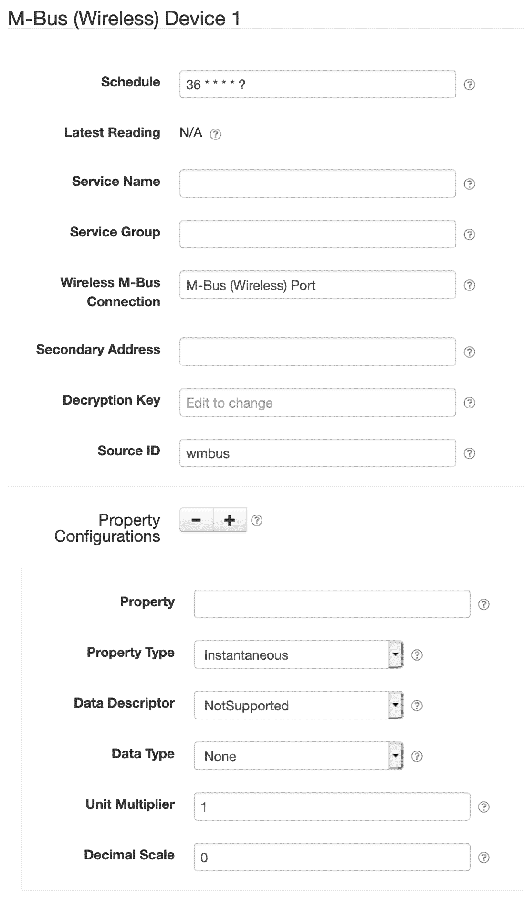
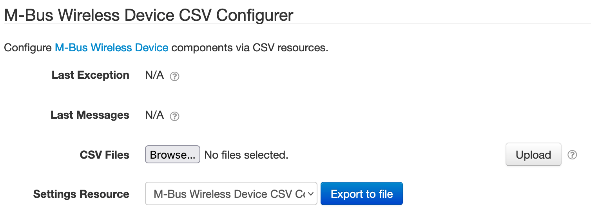
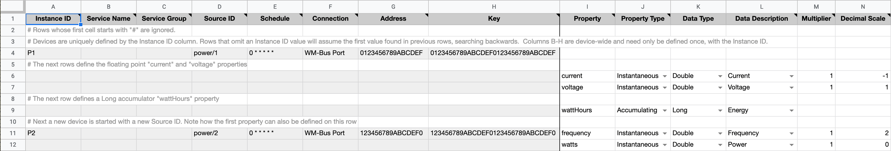

# SolarNode M-Bus Device Datum Source

This project provides SolarNode plugin that can collect arbitrary data from M-Bus (wired and
wireless) enabled devices. This is an advanced plugin that requires specific low-level knowledge of
the device you want to collect data from.

## Install

The plugin can be installed via the **Plugins** page on your SolarNode. It appears under the
**Datum** category as **Generic M-Bus Datum Source**. Note that some M-Bus connection plugin
must also be installed, like the [jMBus](../net.solarnetwork.node.io.mbus.jmbus/) one.

## Use

Once installed, two new components will appear on the **Settings** page on your SolarNode: **M-Bus
Device** and **M-Bus Wireless Device**. Click on the **Manage** button to configure devices.
You'll need to add one configuration for each M-Bus device you want to collect data from.

# M-Bus Device Datum Source

This component lets you collect from M-Bus devices physically connected to SolarNode via a serial 
network.



## M-Bus CSV Configurer

This plugin also provides an **M-Bus Device CSV Configurer** component that will appear on the main
settings page. This component lets you upload an M-Bus CSV Configuration file to configure all
M-Bus Device components, without having to use the settings form.



### M-Bus CSV Configuration Format

The M-Bus CSV Configuration uses the column structure detailed [below](#mbus-csv-column-definition),
with each row representing an individual datum property to read from the M-Bus device. A header row
is required. Comment lines are allowed, just start the line with a `#` character (i.e. the first
cell value). The entire comment line will be ignored.

Here's an example screen shot of a configuration in a spreadsheet application. It is for two devices:

 1. Device `P1` with 3 datum properties: `current`, `voltage`, and `wattHours`
 2. Device `P2` with 2 datum properties: `frequency` and `watts`

Spreadsheet applications generally allows you to export the sheet in the CSV format, which can
then be loaded into SolarNode via the CSV Configurer.



#### M-Bus Instance identifiers

Individual M-Bus Device components are defined by the first column (**Instance ID**). You can
assign any identifier you like (such as `Meter`, `Inverter`, and so on) or configure as a single
dash character `-` to have SolarNode assign a simple number identifier. Once an Instance ID has been
assigned on a given row, subsequent rows will use that value if the corresponding cell value is left
empty.

#### M-Bus CSV column definition

The following table defines all the CSV columns used by M-Bus Device CSV Configuration. Columns
**A - H** apply to the **entire M-Bus Device configuration**, and only the values from the row that
defines a new Instance ID will be used to configure the device. Thus you can omit the values from
these columns when defining more than one property for a given device.

Columns **I - N** define the mapping of M-Bus registers to datum properties: each row defines an
individual datum property.


| Col | Name | Type | Default | Description |
|:----|:-----|:-----|:--------|:------------|
| `A` | **Instance ID** | string |  | The unique identifier for a single M-Bus Device component. Can specify `-` to automatically assign a simple number value, which will start at `1`. |
| `B` | **Service Name** | string |  | An optional service identifier to assign to the component. |
| `C` | **Service Group** | string |  | An optional service group identifier to assign to the component. |
| `D` | **Source ID** | string |  | The SolarNetwork datum source ID to use for the datum stream generated by this device configuration. |
| `E` | **Schedule** | string | `0 * * * * *` | The schedule at which to poll the M-Bus device for data. Can be either a [cron][sn-cron-syntax] value or a millisecond frequency. |
| `F` | **Connection** | string | `M-Bus Port` | The **Service Name** of the **M-Bus Connection** component to use. |
| `G` | **Address** | integer | `1` | The M-Bus primary address of the device to collect data from (1 - 255). |
| `H` | **Sample Cache** | integer | `5000` | A minimum time to cache captured M-Bus data, in milliseconds. |
| `I` | **Property** | string |  | The name of the datum property to save the M-Bus value as. |
| `J` | **Property Type** | enum | `Instantaneous` |  The type of datum property to use. Must be one of `Instantaneous`, `Accumulating`, `Status`, or `Tag`, and can be shortened to just `i`, `a`, `s`, or `t`. |
| `K` | **Data Type** | enum |  | The M-Bus data data type.  Must be one of `Date`, `String`, `Double`, `Long`, `BCD`, or `None`. |
| `L` | **Data Description** | enum |  | The M-Bus data description. Must be one of `AccessCodeOperator`, `AccessCodeSystemDeveloper`, `AccessCodeSytemOperator`, `AccessCodeUser`, `ActualityDuration`, `Address`, `ApparentEnergy`, `AveragingDuration`, `BaudRate`, `ControlSignal`, `CumulationCounter`, `Current`, `Customer`, `CustomerLocation`, `Date`, `DateTime`, `DayOfWeek`, `DigitalInput`, `DigitalOutput`, `DurationLastReadout`, `Energy`, `ErrorFlags`, `ErrorMask`, `ExtendedIdentification`, `ExternalTemperature`, `FabricationNo`, `FirmwareVersion`, `FirstStorageNumberCyclic`, `FlowTemperature`, `Frequency`, `FutureValue`, `HardwareVersion`, `HCA`, `LastCumulationDuration`, `LastStorageNumberCyclic`, `ManufacturerSpecific`, `Mass`, `MassFlow`, `MaxPower`, `ModelVersion`, `NotSupported`, `NumberStops`, `OnTime`, `OperatingTime`, `OperatingTimeBattery`, `OperatorSpecificData`, `OtherSoftwareVersion`, `ParameterActivationState`, `ParameterSetId`, `Password`, `Phase`, `Power`, `Pressure`, `ReactiveEnergy`, `ReactivePower`, `RelativeHumidity`, `RemainingBatteryLifeTime`, `RemoteControl`, `Reserved`, `ResetCounter;`, `ResponseDelayTime`, `Retry`, `ReturnTemperature`, `RFLevel`, `SecurityKey`, `SizeStorageBlock`, `SpecialSupplierInformation`, `StorageInterval`, `TariffDuration`, `TariffPeriod`, `TariffStart`, `TemperatureDifference`, `TemperatureLimit`, `TimePoint`, `TimePointDayChange`, `UserDefined`, `Voltage`, `Volume`, `VolumeFlow`, `VolumeFlowExt`, or `WeekNumber`. |
| `M` | **Multiplier** | decimal | `1` | For numeric data types, a multiplier to apply to the M-Bus value to normalize it into a standard unit. |
| `N` | **Decimal Scale** | integer | `0` | For numeric data types, a maximum number of decimal places to round decimal numbers to, or `-1` to not do any rounding. |

### M-Bus CSV example

Here is the CSV as shown in the example configuration screen shot above (comments have been
removed for brevity):

```csv
Instance ID,Service Name,Service Group,Source ID,Schedule,Connection,Address,Sample Cache,Property,Property Type,Data Type,Data Description,Multiplier,Decimal Scale
P1,,,power/1,0 * * * * *,M-Bus Port,1,5000,,,,,,
,,,,,,,,current,Instantaneous,Double,Current,1,-1
,,,,,,,,voltage,Instantaneous,Double,Voltage,1,1
,,,,,,,,wattHours,Accumulating,Long,Energy,,
P2,,,power/2,0 * * * * *,M-Bus Port,2,5000,frequency,Instantaneous,Double,Frequency,1,2
,,,,,,,,watts,Instantaneous,Double,Power,1,0
```

## Overall device settings

Each device configuration contains the following overall settings:

| Setting            | Description                                                                      |
|--------------------|----------------------------------------------------------------------------------|
| Schedule           | A cron schedule that determines when data is collected.                          |
| Service Name       | A unique name to identify this data source with.                                 |
| Service Group      | A group name to associate this data source with.                                 |
| M-Bus Connection   | The service name of the M-Bus Connection to use.                                 |
| Primary Address    | The ID of the M-Bus device to collect data from, from 1 - 255.                   |
| Source ID          | The SolarNetwork unique source ID to assign to datum collected from this device. |

## Datum property settings

You must configure settings for each datum property you want to collect from each device. You can
configure as many property settings as you like, using the <kbd>+</kbd> and <kbd>-</kbd> buttons to
add/remove property configurations.

Each property configuration contains the following settings:

| Setting         | Description                                                |
|-----------------|------------------------------------------------------------|
| Property        | The name of the datum property to save the M-Bus value as. |
| Property Type   | The type of datum property to use. |
| Data Descriptor | The M-Bus data descriptor. |
| Data Type       | The M-Bus data type to read. |
| Unit Multiplier | For numeric data types, a multiplier to apply to the M-Bus value to normalize it into a standard unit. |
| Decimal Scale   | For numeric data types, a maximum number of decimal places to round decimal numbers to. |


# M-Bus Wireless Device Datum Source

This component lets you collect from a wireless M-Bus transceiver device physically connected to
SolarNode via a serial network; the transceiver communicates with M-Bus devices wirelessly.



## M-Bus Wireless CSV Configurer

This plugin also provides an **M-Bus Wireless Device CSV Configurer** component that will appear on
the main settings page. This component lets you upload an M-Bus CSV Configuration file to configure
all M-Bus Wireless Device components, without having to use the settings form.



### M-Bus Wireless CSV Configuration Format

The M-Bus Wireless CSV Configuration uses the column structure detailed
[below](#mbus-wirelss-csv-column-definition), with each row representing an individual datum
property to read from the M-Bus device. A header row is required. Comment lines are allowed, just
start the line with a `#` character (i.e. the first cell value). The entire comment line will be
ignored.

Here's an example screen shot of a configuration in a spreadsheet application. It is for two devices:

 1. Device `P1` with 3 datum properties: `current`, `voltage`, and `wattHours`
 2. Device `P2` with 2 datum properties: `frequency` and `watts`

Spreadsheet applications generally allows you to export the sheet in the CSV format, which can
then be loaded into SolarNode via the CSV Configurer.



#### M-Bus Wireless Instance identifiers

Individual M-Bus Wireless Device components are defined by the first column (**Instance ID**). You
can assign any identifier you like (such as `Meter`, `Inverter`, and so on) or configure as a single
dash character `-` to have SolarNode assign a simple number identifier. Once an Instance ID has been
assigned on a given row, subsequent rows will use that value if the corresponding cell value is left
empty.

#### M-Bus Wireless CSV column definition

The following table defines all the CSV columns used by M-Bus Wireless Device CSV Configuration.
Columns **A - H** apply to the **entire M-Bus Wireless Device configuration**, and only the values
from the row that defines a new Instance ID will be used to configure the device. Thus you can omit
the values from these columns when defining more than one property for a given device.

Columns **I - N** define the mapping of M-Bus registers to datum properties: each row defines an
individual datum property.


| Col | Name | Type | Default | Description |
|:----|:-----|:-----|:--------|:------------|
| `A` | **Instance ID** | string |  | The unique identifier for a single M-Bus Wireless Device component. Can specify `-` to automatically assign a simple number value, which will start at `1`. |
| `B` | **Service Name** | string |  | An optional service identifier to assign to the component. |
| `C` | **Service Group** | string |  | An optional service group identifier to assign to the component. |
| `D` | **Source ID** | string |  | The SolarNetwork datum source ID to use for the datum stream generated by this device configuration. |
| `E` | **Schedule** | string | `0 * * * * *` | The schedule at which to poll the M-Bus device for data. Can be either a [cron][sn-cron-syntax] value or a millisecond frequency. |
| `F` | **Connection** | string | `M-Bus Port` | The **Service Name** of the **M-Bus Connection** component to use. |
| `G` | **Address** | integer |  | The M-Bus secondary address of the device to collect data from, encoded as a hex string. |
| `H` | **Key** | integer |  | The decryption key, encoded as a hex string. |
| `I` | **Property** | string |  | The name of the datum property to save the M-Bus value as. |
| `J` | **Property Type** | enum | `Instantaneous` |  The type of datum property to use. Must be one of `Instantaneous`, `Accumulating`, `Status`, or `Tag`, and can be shortened to just `i`, `a`, `s`, or `t`. |
| `K` | **Data Type** | enum |  | The M-Bus data data type.  Must be one of `Date`, `String`, `Double`, `Long`, `BCD`, or `None`. |
| `L` | **Data Description** | enum |  | The M-Bus data description. Must be one of `AccessCodeOperator`, `AccessCodeSystemDeveloper`, `AccessCodeSytemOperator`, `AccessCodeUser`, `ActualityDuration`, `Address`, `ApparentEnergy`, `AveragingDuration`, `BaudRate`, `ControlSignal`, `CumulationCounter`, `Current`, `Customer`, `CustomerLocation`, `Date`, `DateTime`, `DayOfWeek`, `DigitalInput`, `DigitalOutput`, `DurationLastReadout`, `Energy`, `ErrorFlags`, `ErrorMask`, `ExtendedIdentification`, `ExternalTemperature`, `FabricationNo`, `FirmwareVersion`, `FirstStorageNumberCyclic`, `FlowTemperature`, `Frequency`, `FutureValue`, `HardwareVersion`, `HCA`, `LastCumulationDuration`, `LastStorageNumberCyclic`, `ManufacturerSpecific`, `Mass`, `MassFlow`, `MaxPower`, `ModelVersion`, `NotSupported`, `NumberStops`, `OnTime`, `OperatingTime`, `OperatingTimeBattery`, `OperatorSpecificData`, `OtherSoftwareVersion`, `ParameterActivationState`, `ParameterSetId`, `Password`, `Phase`, `Power`, `Pressure`, `ReactiveEnergy`, `ReactivePower`, `RelativeHumidity`, `RemainingBatteryLifeTime`, `RemoteControl`, `Reserved`, `ResetCounter;`, `ResponseDelayTime`, `Retry`, `ReturnTemperature`, `RFLevel`, `SecurityKey`, `SizeStorageBlock`, `SpecialSupplierInformation`, `StorageInterval`, `TariffDuration`, `TariffPeriod`, `TariffStart`, `TemperatureDifference`, `TemperatureLimit`, `TimePoint`, `TimePointDayChange`, `UserDefined`, `Voltage`, `Volume`, `VolumeFlow`, `VolumeFlowExt`, or `WeekNumber`. |
| `M` | **Multiplier** | decimal | `1` | For numeric data types, a multiplier to apply to the M-Bus value to normalize it into a standard unit. |
| `N` | **Decimal Scale** | integer | `0` | For numeric data types, a maximum number of decimal places to round decimal numbers to, or `-1` to not do any rounding. |

### M-Bus Wireless CSV example

Here is the CSV as shown in the example configuration screen shot above (comments have been
removed for brevity):

```csv
Instance ID,Service Name,Service Group,Source ID,Schedule,Connection,Address,Key,Property,Property Type,Data Type,Data Description,Multiplier,Decimal Scale
P1,,,power/1,0 * * * * *,WM-Bus Port,0123456789ABCDEF,0123456789ABCDEF0123456789ABCDEF,,,,,,
,,,,,,,,current,Instantaneous,Double,Current,1,-1
,,,,,,,,voltage,Instantaneous,Double,Voltage,1,1
,,,,,,,,wattHours,Accumulating,Long,Energy,,
P2,,,power/2,0 * * * * *,WM-Bus Port,123456789ABCDEF0,123456789ABCDEF0123456789ABCDEF0,frequency,Instantaneous,Double,Frequency,1,2
,,,,,,,,watts,Instantaneous,Double,Power,1,0
```

[sn-cron-syntax]: https://github.com/SolarNetwork/solarnetwork/wiki/SolarNode-Cron-Job-Syntax
