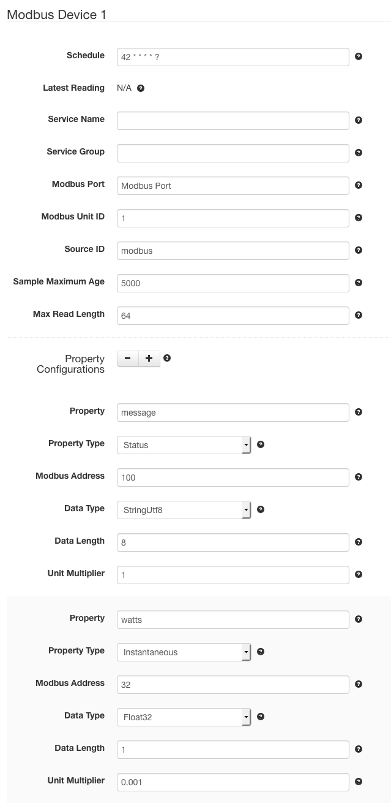
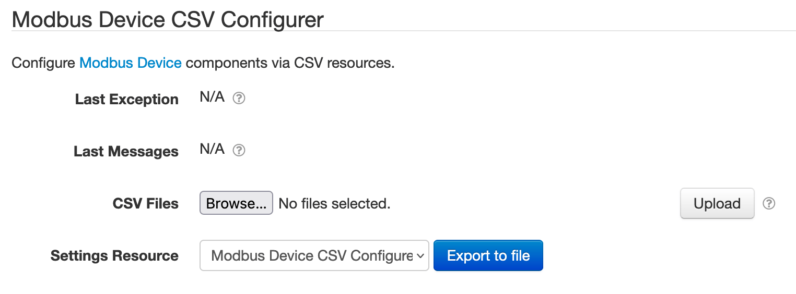
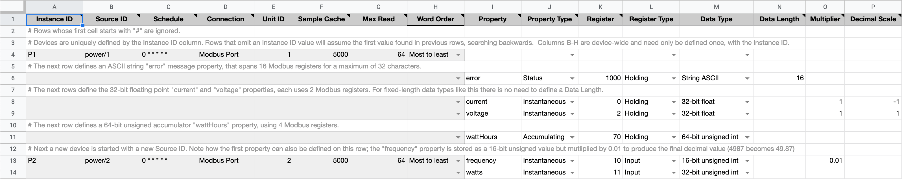
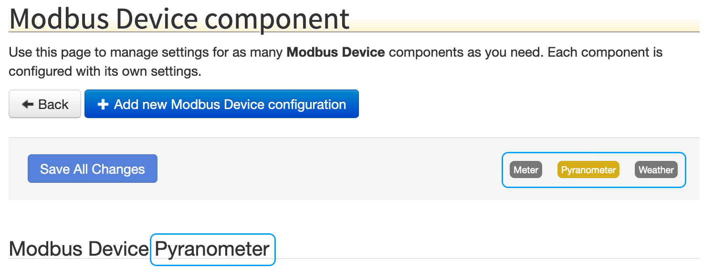
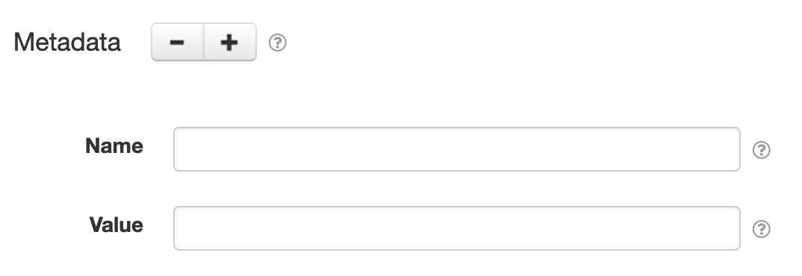
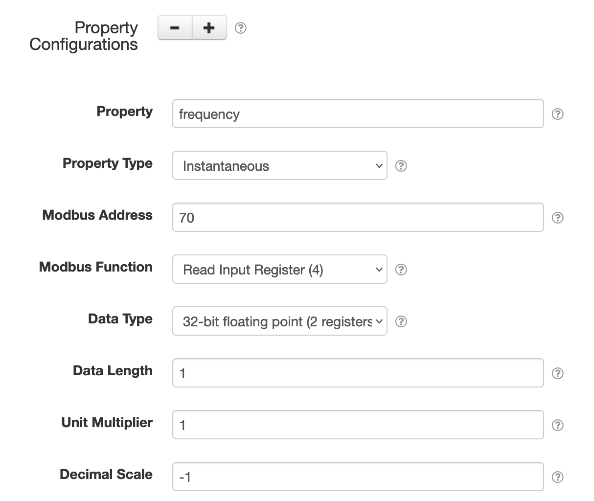
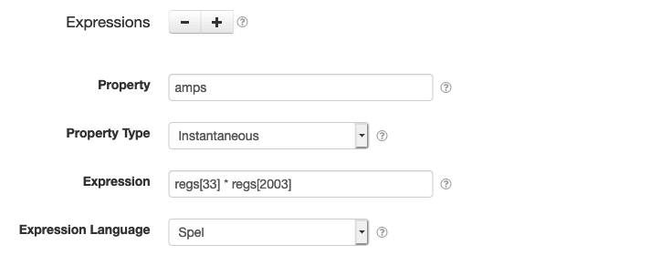

# SolarNode Modbus Device Datum Source

This project provides SolarNode plugin that can collect arbitrary data from
Modbus enabled devices. This is an advanced plugin that requires specific
low-level knowledge of the device you want to collect data from.



# Install

The plugin can be installed via the **Plugins** page on your SolarNode. It appears under the
**Datum** category as **Modbus Datum Source**.

# Use

Once installed, a new **Modbus Device** component will appear on the **Settings** page on your
SolarNode. Click on the **Manage** button to configure devices. You'll need to add one configuration
for each Modbus device you want to collect data from.

# CSV Configurer

This plugin also provides a **Modbus Device CSV Configurer** component will appear on the main
settings page. This component lets you upload a Modbus CSV Configuration file to configure all
Modbus Device components, without having to use the settings form.



## Modbus CSV Configuration Format

The Modbus CSV Configuration uses the column structure detailed [below](#csv-column-definition),
with each row representing an individual datum property to read from the Modbus device. A header row
is required. Comment lines are allowed, just start the line with a `#` character (i.e. the first
cell value). The entire comment line will be ignored.

Here's an example screen shot of a configuration in a spreadsheet application. It is for two devices:

 1. Device `P1` with 4 datum properties: `error`, `current`, `voltage`, and `wattHours`
 2. Device `P2` with 2 datum properties: `frequency` and `watts`

Spreadsheet applications generally allows you to export the sheet in the CSV format, which can
then be loaded into SolarNode via the CSV Configurer.



### Instance identifiers

Individual Modbus Device components are defined by the first column (**Instance ID**). You can
assign any identifier you like (such as `Meter`, `Inverter`, and so on) or configure as a single
dash character `-` to have SolarNode assign a simple number identifier. Once an Instance ID has been
assigned on a given row, subsequent rows will use that value if the corresponding cell value is left
empty.

Here's an example of how 3 custom instance IDs `Meter`, `Pyranometer`, and `Weather` appear in the
SolarNode UI:



### CSV column definition

The following table defines all the CSV columns used by Modbus Device CSV Configuration. Columns
**A - H** apply to the **entire Modbus Device configuration**, and only the values from the row that
defines a new Instance ID will be used to configure the device. Thus you can omit the values from
these columns when defining more than one property for a given device.

Columns **I - Q** define the mapping of Modbus registers to datum properties: each row defines an
individual datum property.


| Col | Name | Type | Default | Description |
|:----|:-----|:-----|:--------|:------------|
| `A` | **Instance ID** | string |  | The unique identifier for a single Modbus Device component. Can specify `-` to automatically assign a simple number value, which will start at `1`. |
| `B` | **Source ID** | string |  | The SolarNetwork datum source ID to use for the datum stream generated by this device configuration. |
| `C` | **Schedule** | string | `0 * * * * *` | The schedule at which to poll the Modbus device for data. Can be either a [cron][sn-cron-syntax] value or a millisecond frequency. |
| `D` | **Connection** | string | `Modbus Port` | The **service name** of the Modbus connection to use. |
| `E` | **Unit ID** | integer | `1` | The Modbus unit ID of the device to collect data from (1 - 255). |
| `F` | **Sample Cache** | integer | `5000` | A minimum time to cache captured Modbus data, in milliseconds. |
| `G` | **Max Read** | integer | `64` | The maximum number of Modbus registers to request at once. |
| `H` | **Word Order** | enum | `Most to least` |  For multi-register data types, the ordering to use when combining them. Must be either `Most to least` or `Least to most`, and can be shortened to just `m` or `l`. |
| `I` | **Property** | string |  | The name of the datum property to save the Modbus value as. |
| `J` | **Property Type** | enum | `Instantaneous` |  The type of datum property to use. Must be one of `Instantaneous`, `Accumulating`, `Status`, `Tag`, or `Metadata`, and can be shortened to just `i`, `a`, `s`, `t`, or `m`. |
| `K` | **Register** | integer |  | The register address to read Modbus data from (zero-based). For multi-register data types this is the _first_ register to read from. |
| `L` | **Register Type** | enum | `Holding` | The Modbus read function to execute. Must be one of `Coil`, `Discrete Input`, `Holding`, or `Input`. |
| `M` | **Data Type** | enum | `32-bit float` | The type of data to expect from the read Modbus register(s). Must be one of `Boolean` or `bit`, `16-bit float` or `f16`, `32-bit float` or `f32`, `16-bit signed int` or `i16`, `16-bit unsigned int` or `u16`, `32-bit signed int` or `i32`, `32-bit unsigned int` or `u32`, `64-bit signed int` or `i64`, `64-bit unsigned int` or `u16`, `Bytes` or `b`, `String UTF-8` or `s`, `String ASCII` or `a`. |
| `N` | **Data Length** | integer |  | For variable length data types such as strings, the number of Modbus registers to read. |
| `O` | **Multiplier** | decimal | `1` | For numeric data types, a multiplier to apply to the Modbus value to normalize it into a standard unit. |
| `P` | **Decimal Scale** | integer | `0` | For numeric data types, a maximum number of decimal places to round decimal numbers to, or `-1` to not do any rounding. |
| `Q` | **Expression** | string |  | An [expression](#expressions). If configured, columns K - P are ignored. |

## Example CSV

Here is the CSV as shown in the example configuration screen shot above (comments have been
removed for brevity):

```csv
Instance ID,Source ID,Schedule,Connection,Unit ID,Sample Cache,Max Read,Word Order,Property,Property Type,Register,Register Type,Data Type,Data Length,Multiplier,Decimal Scale,Expression
P1,power/1,0 * * * * *,Modbus Port,1,5000,64,Most to least,,,,,,,,,
,,,,,,,,error,Status,1000,Holding,String ASCII,16,,,
,,,,,,,,current,Instantaneous,0,Holding,32-bit float,,1,-1,
,,,,,,,,voltage,Instantaneous,2,Holding,32-bit float,,1,1,
,,,,,,,,wattHours,Accumulating,70,Holding,64-bit unsigned int,,,,
P2,power/2,0 * * * * *,Modbus Port,2,5000,64,Most to least,frequency,Instantaneous,10,Input,16-bit unsigned int,,0.01,,
,,,,,,,,watts,Instantaneous,11,Input,32-bit unsigned int,,,,
```


# Device settings

Each device configuration contains the following overall settings:

| Setting            | Description |
|:-------------------|:------------|
| Schedule           | A [cron schedule][sn-cron-syntax] that determines when data is collected, or millisecond frequency. |
| Service Name       | A unique name to identify this data source with. |
| Service Group      | A group name to associate this data source with. |
| Modbus Connection  | The **service name** of the Modbus connection to use. |
| Modbus Unit ID     | The ID of the Modbus device to collect data from, from 1 - 255. |
| Source ID          | The SolarNetwork unique source ID to assign to datum collected from this device. |
| Sample Maximum Age | A minimum time to cache captured Modbus data, in milliseconds. |
| Max Read Length    | The maximum number of Modbus registers to request at once. |
| Word Order         | For multi-register data types, the ordering to use when combining them. |
| Datum Filter Service | The **service name** of a datum filter to apply. |
| Sub-sample Frequency | If configured, the frequency at which samples should be collected from the device, in milliseconds. Set to `0` (or empty) to disable. Typically this would be combined with a **Datum Filter Service** to transform the sub-samples. See the [Sub-sampling](#sub-sampling) section for more information. |

## Overall device settings notes

<dl>
	<dt>Modbus Port</dt>
	<dd>This is the <i>service name</i> of the Modbus component configured elsewhere
	in SolarNode. You must configure that component with the proper connection settings
	for your Modbus network, configure a unique service name on that component, and then
	enter that same service name here.</dd>
	<dt>Source ID</dt>
	<dd>This value unique identifies the data collected from this device, by this node,
	 on SolarNetwork. Each configured device should use a different value.</dd>
	<dt>Sample Maximum Age</dt>
	<dd>SolarNode will cache the data collected from the Modbus device for at least
	this amount of time before refreshing data from the device again. Some devices
	do not refresh their values more than a fixed interval, so this setting can be
	used to avoid reading data unnecessarily. This setting also helps in highly
	dynamic configurations where other plugins request the current values from
	the device frequently.</dd>
	<dt>Max Read Length</dt>
	<dd>This plugin will try to read as many adjacent Modbus registers as possible
	when requesting data from the device. Some devices have trouble returning large
	numbers of registers at once, however. Configuring this setting to a smaller
	value will cause the plugin to make multiple smaller requests for data when
	necessary to work better with those devices.</dd>
</dl>

## Metadata settings

Since version **3.1**, metadata settings allow you to add datum source metadata to the configured
datum stream.



Each metadata configuration contains the following settings:

| Setting         | Description |
|:----------------|:------------|
| Name            | The metadata key. If starts with a `/` then will be treated as a [key-path][metadata-key-path]. Valid paths start with one of `/m/`, `/pm/`, and `/t`. |
| Value           | The metadata value. |


## Datum property settings

You must configure settings for each datum property you want to collect from each device. You can
configure as many property settings as you like, using the <kbd>+</kbd> and <kbd>-</kbd> buttons to
add/remove property configurations.



Each property configuration contains the following settings:

| Setting         | Description                                                                                             |
|:----------------|:--------------------------------------------------------------------------------------------------------|
| Property        | The name of the datum property to save the Modbus value as. Property names represent what the associated data value is, and SolarNetwork has many standardized names that you should consider using. For example the [EnergyDatum](https://github.com/SolarNetwork/solarnetwork-node/blob/master/net.solarnetwork.node/src/net/solarnetwork/node/domain/EnergyDatum.java) class defines properties such as `watts` and  `wattHours` for electrical energy. :warning: See the note about the **Metadata** property type for more information about the property name syntax for that type. |
| Property Type   | The type of datum property to use. Each property must be categorized as `Accumulating`, `Instantaneous`, `Status`, or `Metadata`. **Accumulating** is used for properties that record a value that accumulates over time, such as `wattHours` captured from a power meter. **Instantaneous** is used for properties that capture values that record independent values over time, such as `watts`. **Status** is used for non-numeric values such as string status messages. **Metadata** is for mostly unchanging data, like a device serial number or firmware version. The property names for metadata should be a [metadata path](https://github.com/SolarNetwork/solarnetwork/wiki/SolarNet-API-global-objects#metadata-filter-key-paths), for example `/pm/deviceInfo/serialNumber`. |
| Modbus Address  | The starting register address to read Modbus data from (zero-based). |
| Modbus Function | The Modbus read function to execute. |
| Data Type       | The type of data to expect from the read Modbus register(s). The data type to interpret the values captured from the Modbus registers as. **Note** that only the **Status** and **Metadata** property types can accept non-numeric data types such as strings. |
| Data Length     | For variable length data types such as strings, the number of Modbus registers to read.                 |
| Unit Multiplier | For numeric data types, a multiplier to apply to the Modbus value to normalize it into a standard unit. The property values stored in SolarNetwork should be normalized into standard base units if possible. For example if a power meter reports power in _kilowattts_ then a unit multiplier of `1000` can be used to convert the values into _watts_.|
| Decimal Scale   | For numeric data types, a maximum number of decimal places to round decimal numbers to, or `-1` to not do any rounding. This setting will round decimal numbers to at most this number of decimal places. Setting to `0` rounds decimals to whole numbers. Setting to `-1` disables rounding completely. |

## Expressions

Since version **1.5** properties can be defined using [expressions][expr]. Expressions allow you to
configure datum properties that are dynamically calculated from other properties or raw Modbus
register values.



### Expression root object

The root object is a `DatumExpressionRoot` that lets you treat all datum properties as expression
variables directly. See the [SolarNode Expressions][sn-expressions] guide for more information. In
addition, the following properties are available:

| Property | Type | Description |
|:---------|:-----|:------------|
| `datum` | `GeneralNodeDatum` | A [`GeneralNodeDatum`][GeneralNodeDatum] object, populated with data from all property and virtual meter configurations. |
| `props` | `Map<String,Object>` | Simple Map based access to the data in `datum`, to simplify expressions. |
| `sample` | `ModbusData` | A [`ModbusData`][ModbusData] object, populated with the raw Modbus holding register data read from the device. |
| `regs` | `Map<Integer,Integer>` | Simple Map based access to the register data in `sample`, to simplify expressions all register values are returned as unsigned 16-bit integers. |

Any Modbus registers referenced via `reg[x]` expressions will be automatically read via the Modbus
**read holding register** function, unless that same register is referenced also in a normal
property configuration, in which case the Modus function defined there will be used.

### Expression examples

Given raw Modbus holding register data like the following:

```
[000]: 0xfc1e, 0xf0c3, 0x02e3, 0x68e7, 0x0002, 0x1376, 0x1512, 0xdfee
[200]: 0x44f6, 0xc651, 0x4172, 0xd3d1, 0x6328, 0x8ce7
```

and assuming a property config that maps register **202** to a 64-bit floating point property `bigFloat`:

Then here are some example expressions and the results they would produce:

| Expression | Result | Comment |
|:-----------|:-------|:--------|
| `regs[0]` | `64542` | Returns register **0** directly, which is `0xfc1e`. |
| `sample.getInt32(2)` | `48457959` | Returns holding registers **2** and **3** combined as a unsigned 32-bit integer `0x02e368e7`. |
| `sample.getFloat32(200)` | `1974.1974` | Returns holding registers **200** and **201** as a IEEE-754 32-bit floating point: `0x44f6c651`. |
| `props['bigFloat'] - regs[0]` | `19677432.1974` | Returns difference of register **0** (`0xfc1e`) from datum property `bigFloat` (`0x4172d3d163288ce7`). |

# Sub-sampling

The **Sub-sample Frequency** setting allows you to configure the datum source to generate datum
(referred to as a _sample_ here) at a higher rate than the normal **Schedule** dictates. This would
typically be combined with the **Datum Filter Service** setting, to enable filtering the sub-sample
datum into some sort of aggregate at the "normal" sample rate.

For example, you might want to collect datum at a rate of **once per minute** but achieve better
accuracy in each property value by capturing several values per minute and only saving the average
of those captured values in SolarNetwork.

> **Note** that this type of average sub-sampling can be achieved more simply by just configuring
> the **Schedule** of this (or any datum source) to the desired "sub-sample" rate and adding a
> [Downsample Filter][DownsampleFilter] with an appropriate **Count** value to reduce the frequency
> to your desired "normal" rate.

Here is an example of the settings you would configure to do this, with a sub-sample rate of
**once per second**:

| Setting | Value | Description |
|:--------|:------|:------------|
| **Schedule** | `60000` | Capture "normal" datum once per **minute** |
| **Sub-sample Frequency** | `1000` | Capture "sub-sample" datum once per **second** |
| **Datum Filter Service** | `My Sub-Sample Downsample Filter` | The service name of the filter to apply. |

In this example, **My Sub-Sample Throttle Filter** is a [Downsample Filter][DownsampleFilter]
configured with these settings:

| Setting | Value | Description |
|:--------|:------|:------------|
| **Service Name** | `My Sub-Sample Downsample Filter` | Same service name used also in the Modbus Device settings |
| **Sample Count** | `60` | Aggregate 60 samples into 1 output, because we expect 60 samples per minute |

## Sub-sample filter properties

The configured **Datum Filter Service** will be passed every datum captured, both sub-samples and
"normal" samples. Each sub-sample datum will be passed a special `subsample=true` parameter,
however, so the filter "knows" which datum are sub-samples and which are "normal" samples.


[expr]: https://github.com/SolarNetwork/solarnetwork/wiki/Expression-Languages
[DownsampleFilter]: https://github.com/SolarNetwork/solarnetwork-node/blob/develop/net.solarnetwork.node.datum.filter.standard/README-Downsample.md
[ExpressionRoot]: https://github.com/SolarNetwork/solarnetwork-node/tree/develop/net.solarnetwork.node.datum.modbus/src/net/solarnetwork/node/datum/modbus/ExpressionRoot.java
[GeneralNodeDatum]: https://github.com/SolarNetwork/solarnetwork-node/blob/develop/net.solarnetwork.node/src/net/solarnetwork/node/domain/GeneralNodeDatum.java
[ModbusData]: https://github.com/SolarNetwork/solarnetwork-node/blob/develop/net.solarnetwork.node.io.modbus/src/net/solarnetwork/node/io/modbus/ModbusData.java
[meta-api]: https://github.com/SolarNetwork/solarnetwork/wiki/SolarQuery-API#add-node-datum-metadata
[metadata-key-path]: https://github.com/SolarNetwork/solarnetwork/wiki/SolarNet-API-global-objects#metadata-filter-key-paths
[sn-cron-syntax]: https://github.com/SolarNetwork/solarnetwork/wiki/SolarNode-Cron-Job-Syntax
[sn-expressions]: https://github.com/SolarNetwork/solarnetwork/wiki/SolarNode-Expressions
